# Robotic Suite
Advantech Robotic Suite is an integrated software environment designed to accelerate the development, deployment, and management of robotic applications.

It reduces integration complexity by providing pre-validated software stacks, containerized environments, and ready-to-use workflows for modern AMR development.

It is more than just an SDK – it is a complete development and execution ecosystem.

  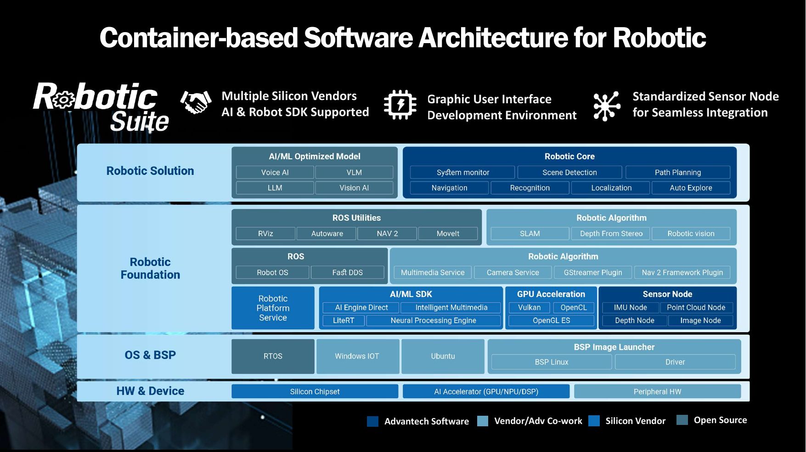

# What’s Included
Robotic Suite bundles the key software components typically needed for modern AMR development:  

* **[ROS 2](https://docs.ros.org/en/humble/index.html)** – Core middleware for robotic applications,
including:
  `ros2_control`, `rqt`, `rviz2`, `robot_localization`, `imu_tools`, `Navigation2`,
  `rtabmap_ros`, `LIO-SAM`, `cartographer`, `slam_toolbox`  
  These provide motion control, visualization, sensor fusion, SLAM, and autonomous navigation out of the box.

* **[Isaac ROS](https://github.com/NVIDIA-ISAAC-ROS)** – NVIDIA GPU–accelerated perception and robotics pipelines, including:
  `isaac_ros_nvblox`, `isaac_ros_visual_slam`,
  `isaac_ros_unet`, `isaac_ros_centerpose`, `isaac_ros_occupancy_grid_localizer`  
  These packages cover 3D reconstruction, visual SLAM, object detection, segmentation, pose estimation, and local occupancy mapping for high-performance perception workloads.
  

    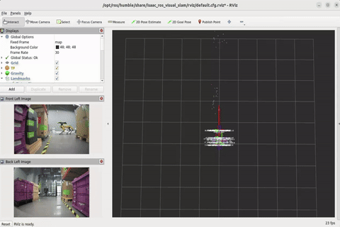
    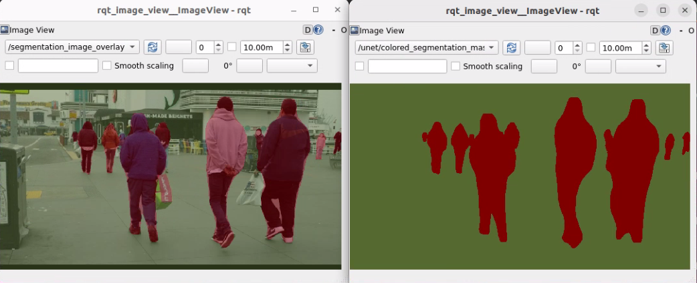
    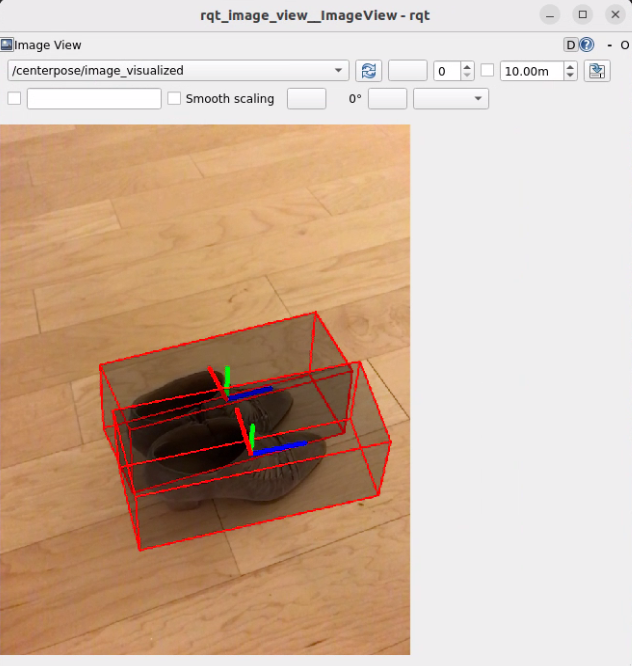
  

* **[Autoware](https://github.com/autowarefoundation/autoware)** – Open-source stack for autonomous driving and advanced applications  
  

    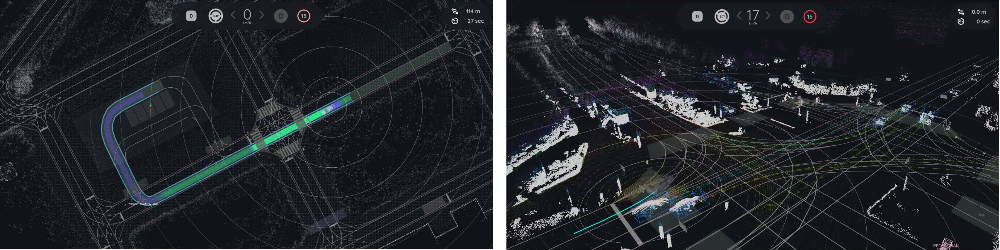
  

* **Containerized runtime** – Pre-integrated and version-controlled environments to simplify setup, and ensure reproducibility. 

This allows you to focus on building your application logic instead of spending time on basic integration and environment setup.  

# Download
- [Installer](./installer)

# Compatible Products  
Robotic Suite is optimized and validated on selected Advantech platforms, including:  
**NVIDIA:**
- [AFE-R750](https://www.advantech.com/zh-tw/products/8d5aadd0-1ef5-4704-a9a1-504718fb3b41/afe-r750/mod_779d2a74-61d9-4d78-a4e0-2ca07afbd64b)  
    NVIDIA® Jetson Orin™ NX / AGX Orin™ AMR Control System

  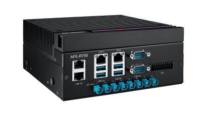
  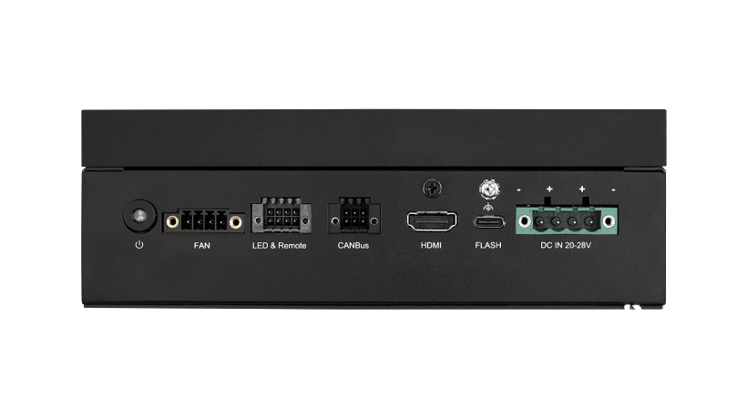

- [ASR-A701](https://www.advantech.com/zh-tw/products/8d5aadd0-1ef5-4704-a9a1-504718fb3b41/asr-a701/mod_b4f55de6-c9b6-43a0-b4bf-374fff8fbd46)  
    NVIDIA® Jetson Orin™ NX / AGX Orin™ AMR Control Board
  

    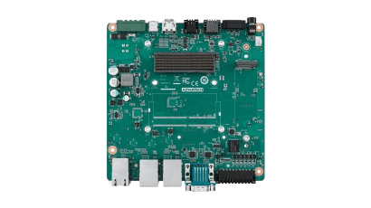
  

# Development Utilities

## Example Workflows
Robotic Suite provides  examples that demonstrate common AMR workflows.
They can be used as:

* Interactive demos to understand the concepts.
* Reference configurations when starting your own projects.

### ISAAC ROS
- [Multi-Sensor Function](./development_utilities/example/isaac_ros/multi_sensor_function)  
  Combine multiple sensors into a unified perception pipeline using Isaac ROS.
  

    
  

- [3D Scene Persistence](./development_utilities/example/isaac_ros/3d_scene_persistence)  
  Build and maintain a 3D representation of the environment for long-term perception.
  

    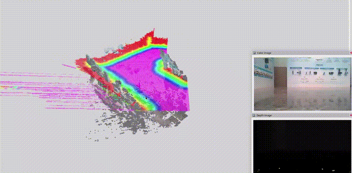
  

- [3D Camera Obstacle Avoidance](./development_utilities/example/isaac_ros/3d_camera_obstacle_avoidance)  
  Use 3D cameras and Isaac ROS to detect obstacles and plan safe motion around them.
  

    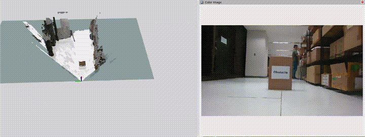
  

---

### ROS Base
- [2D Mapping with LiDAR](./development_utilities/example/ros2/2d_mapping_with_lidar)  
  Create a 2D occupancy grid map from a 2D LiDAR using slam_toolbox, and visualize it in RViz.  
  

    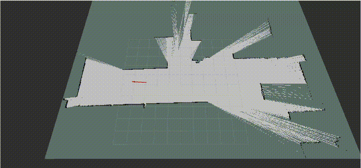
  

  
- [2D LiDAR Navigation (AMR)](./development_utilities/example/ros2/2d_lidar_navigation)  
  Learn the basic concepts of Nav2-based navigation and obstacle avoidance with a 2D LiDAR.
  

    
  

  
- [3D Mapping with LiDAR](./development_utilities/example/ros2/3d_mapping_with_lidar)  
  Generate a 3D map from a 3D LiDAR using `lidarslam_ros2`, and inspect the result in RViz.
  

    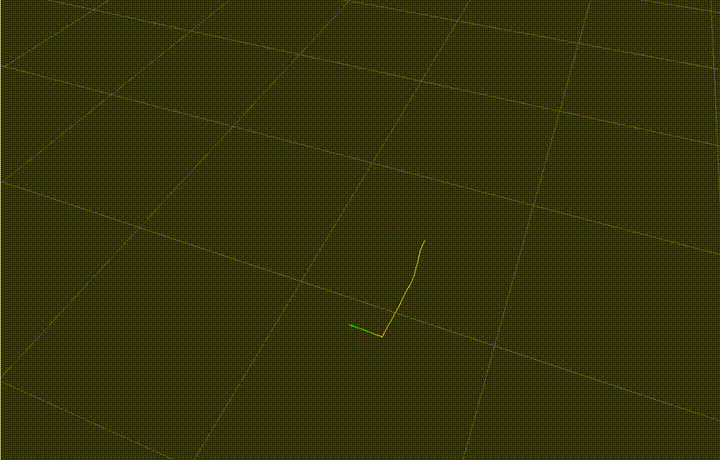
  

## Development Environment  
Robotic Suite provides pre-configured development environments to help users quickly get started with robotics application development.
- [ROS Humble](https://docs.ros.org/en/humble/index.html)  
ROS 2 Humble is pre-installed and configured on the host system, providing a stable and ready-to-use foundation for ROS-based development.
- [ISAAC ROS](https://github.com/NVIDIA-ISAAC-ROS)  
A fully integrated Docker-based environment is provided, including pre-installed ISAAC ROS dependencies.
This allows users to quickly build and run GPU-accelerated perception and AI applications without complex setup.
- [Autoware](https://github.com/autowarefoundation/autoware)  
A containerized Autoware environment is provided, enabling users to explore autonomous driving workflows such as perception, planning, and control with minimal setup effort.

## Typical Workflow with Robotic Suite

1. **Create a map** – Use the 2D or 3D mapping examples to generate an initial map of the environment.  
2. **Configure navigation** – Use the Nav2 example as a reference to set up localization, planning, and control.  
3. **Extend with perception** – Add Isaac ROS examples to enhance obstacle detection and scene understanding.  
4. **Deploy on Advantech platforms** – Run your validated configuration on compatible Advantech platforms.

