# Robotic Suite
Advantech Robotic Suite is an integrated software environment designed to accelerate the development, deployment, and management of robotic applications.

It reduces integration complexity by providing pre-validated software stacks, containerized environments, and ready-to-use workflows for modern Robot development.

It is more than just an SDK – it is a complete development and execution ecosystem.

  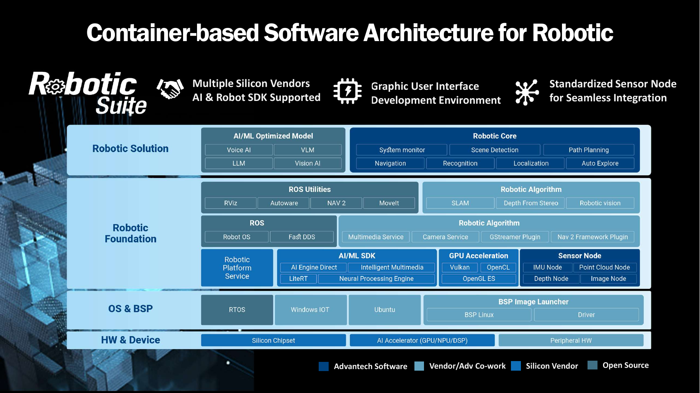

## Support & Community
- Advantech AIM-Linux Community: https://forum.aim-linux.advantech.com/c/robotics-autonomous-systems-ros-ros2/40 
- Robotics Suite is thumbs up or down? Fork, use and take polls while getting your chance to win a developer grand prize. 
https://forum.aim-linux.advantech.com/t/fork-test-and-critique-good-or-bad-tell-us-what-you-think-about-the-robotics-suite/1479 

# What’s Included
Robotic Suite brings together the software stacks, containerized environments, example workflows, and learning resources needed for modern AMR and manipulator application development: 

* **[Core Techniques](#core-techniques)** – Focused, code-level tutorials covering reusable robotics building blocks, including HSV color-profile creation, color-block detection and camera-frame position estimation.  
  Each technique can be studied independently and integrated into larger AMR or manipulator applications.

* **[ROS 2](https://docs.ros.org/en/humble/index.html)** – Core middleware for robotic applications,
including:
  `ros2_control`, `rqt`, `rviz2`, `robot_localization`, `imu_tools`, `Navigation2`,
  `rtabmap_ros`, `LIO-SAM`, `cartographer`, `slam_toolbox`  
  These provide motion control, visualization, sensor fusion, SLAM, and autonomous navigation out of the box.

* **[Isaac ROS](https://github.com/NVIDIA-ISAAC-ROS)** – NVIDIA GPU–accelerated perception and robotics pipelines, including:
  `isaac_ros_nvblox`, `isaac_ros_visual_slam`, `isaac_ros_yolov8`,
  `isaac_ros_unet`, `isaac_ros_centerpose`, `isaac_ros_occupancy_grid_localizer`, `isaac_ros_cumotion_moveit`  
  These packages cover 3D reconstruction, visual SLAM, object detection, segmentation, pose estimation, local occupancy mapping and arm control for high-performance perception workloads.
  

    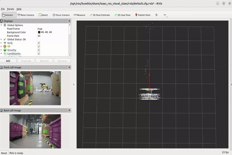
    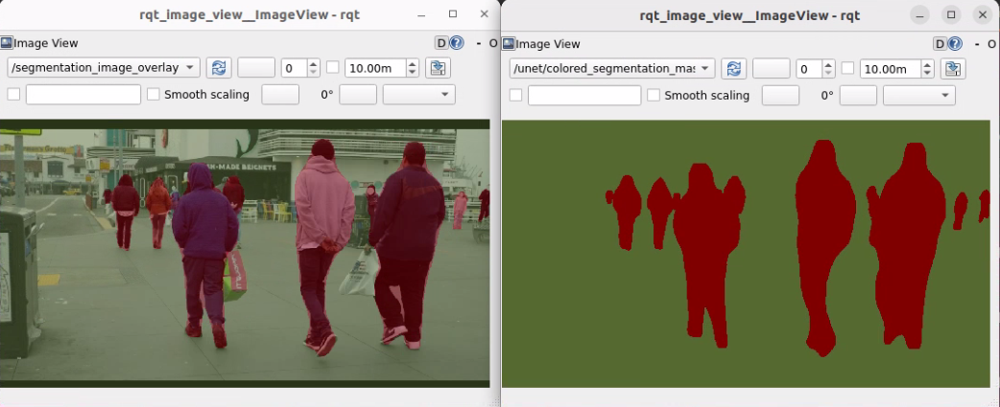
    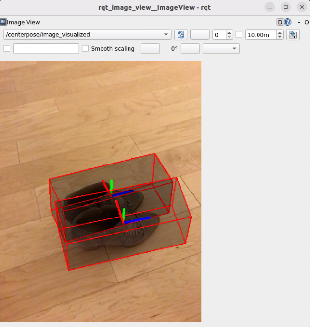
  

* **[QIR ROS SDK](https://github.com/qualcomm-linux/meta-qcom-robotics-sdk)** – Qualcomm NPU–accelerated perception and robotics pipelines, including:
  `ocr_service`, `sample_object_detection`, `sample_object_segmentation`,
  `sample_depth_estimation`, `simulation_sample_pick_and_place`, `simulation_follow_me`  
  These packages and examples cover OCR, object detection, segmentation, depth estimation,  simulation, and follow-me workflows using Qualcomm NPU acceleration.

  

    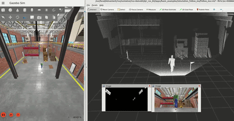
    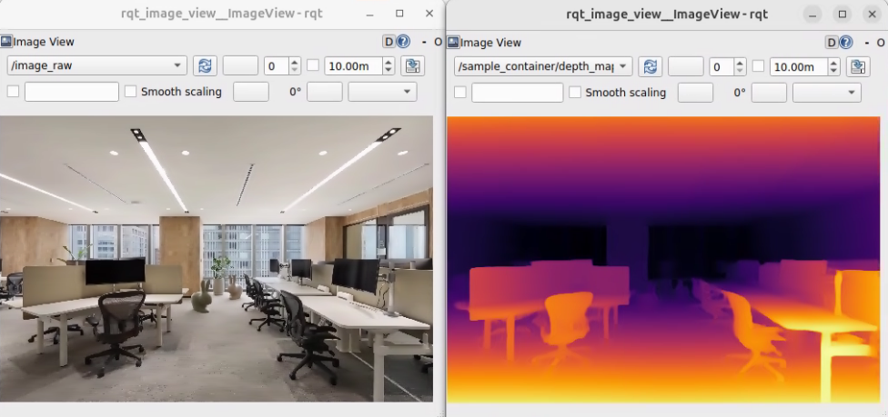
    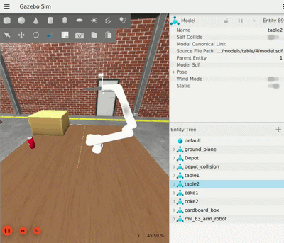
  

* **[Autoware](https://github.com/autowarefoundation/autoware)** – Open-source stack for autonomous driving and advanced applications  
  

    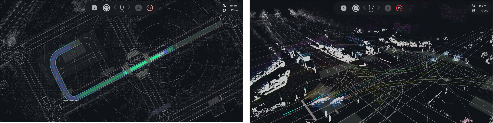
  

* **Containerized runtime** – Pre-integrated and version-controlled environments to simplify setup, and ensure reproducibility. 

This allows you to focus on building your application logic instead of spending time on basic integration and environment setup.  

# Download
- [Installer](./installer)

# Compatible Products  
Robotic Suite is optimized and validated on selected Advantech platforms, including:  
**NVIDIA:**
- [AFE-A702](https://www.advantech.com/zh-tw/products/8d5aadd0-1ef5-4704-a9a1-504718fb3b41/afe-a702/mod_13487539-d213-4c8f-a027-4be489e0fe1a) /  [ASR-A702](https://www.advantech.com/zh-tw/products/8d5aadd0-1ef5-4704-a9a1-504718fb3b41/asr-a702/mod_233cbd00-fd2c-4352-ad5f-7ffbea3f475b)  
    NVIDIA® Jetson Thor™ AMR Control System & Control Board

  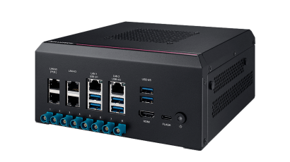
  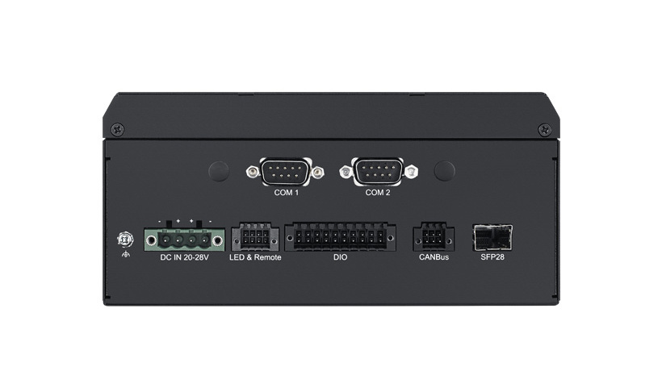
  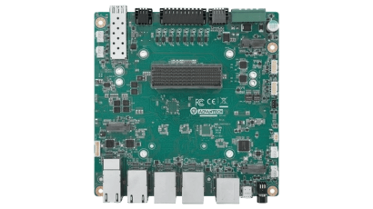

- [AFE-R750](https://www.advantech.com/zh-tw/products/8d5aadd0-1ef5-4704-a9a1-504718fb3b41/afe-r750/mod_779d2a74-61d9-4d78-a4e0-2ca07afbd64b) /  [ASR-A701](https://www.advantech.com/zh-tw/products/8d5aadd0-1ef5-4704-a9a1-504718fb3b41/asr-a701/mod_b4f55de6-c9b6-43a0-b4bf-374fff8fbd46)  
    NVIDIA® Jetson Orin™ NX / AGX Orin™ AMR Control System & Control Board

  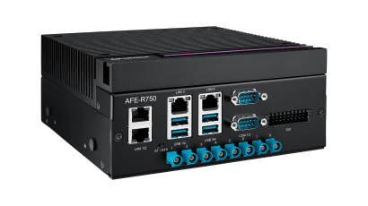
  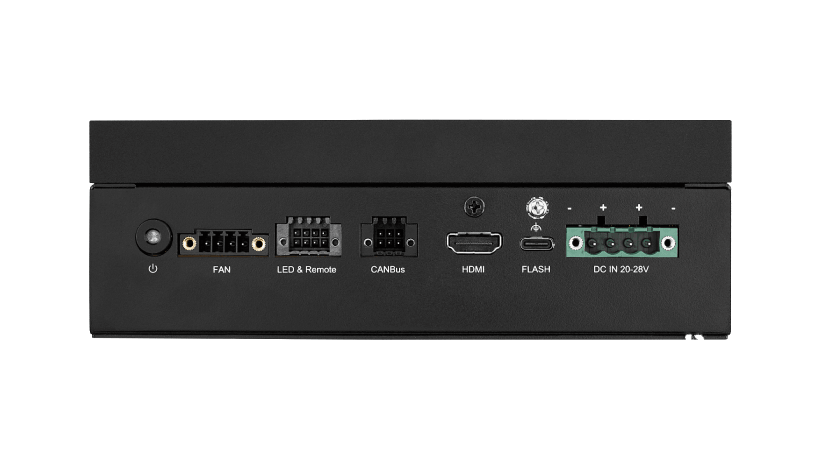
  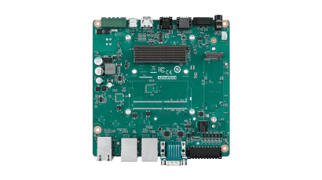

**Qualcomm:**
- [AFE-A503](https://www.advantech.com/zh-tw/products/8d5aadd0-1ef5-4704-a9a1-504718fb3b41/afe-a503/mod_12fdad30-7018-42b3-8d55-4b463f90166b) /  [ASR-A503](https://www.advantech.com/zh-tw/products/8d5aadd0-1ef5-4704-a9a1-504718fb3b41/asr-a503/mod_4731e789-4afa-4bd5-9e4e-188315e198ba)  
    Qualcomm® IQ9075M Robot Control System & Control Board

  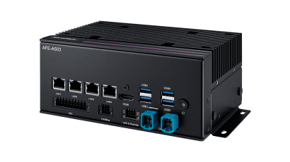
  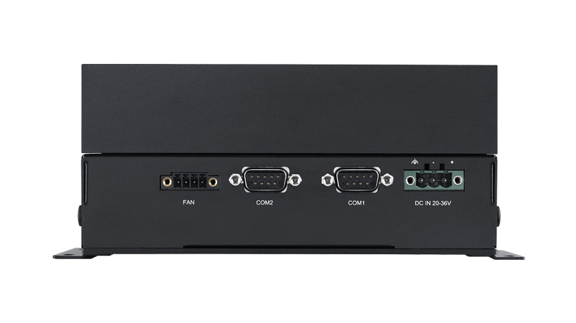
  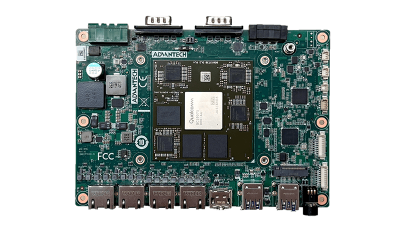

- [ASR-D501](https://www.advantech.com/zh-tw/products/8d5aadd0-1ef5-4704-a9a1-504718fb3b41/asr-d501/mod_63b146af-58b3-422f-a7e2-d1984f53b698)  
    Qualcomm® QCS6490 Compact companion/mission computer

  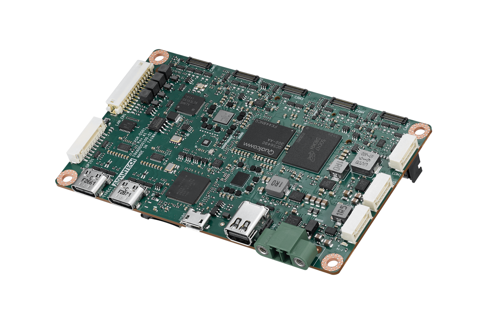
  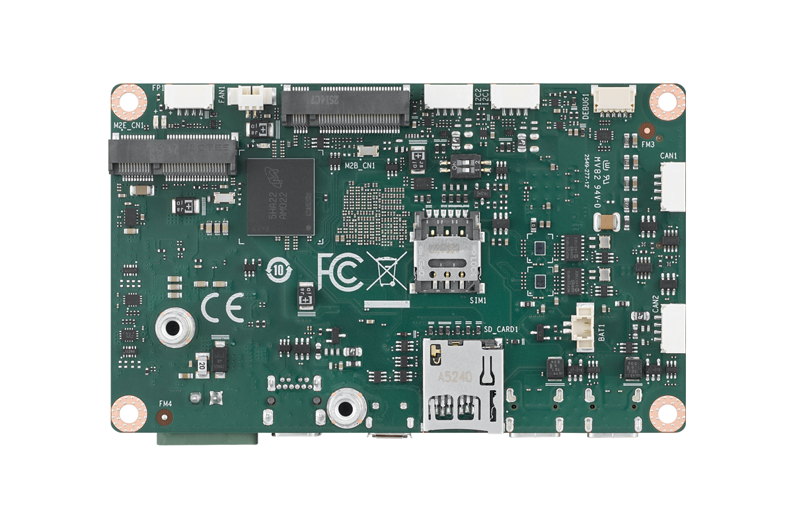
  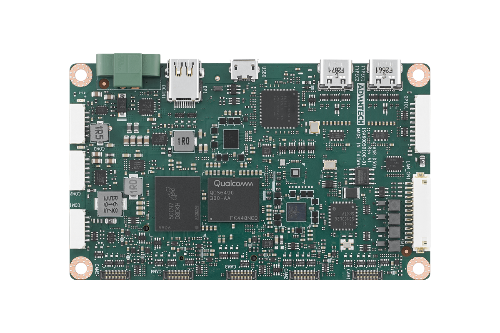

# Development Utilities

Robotic Suite provides learning and development resources organized into three main categories:

- **Example Workflows** – Ready-to-run perception, AMR, and  examples for understanding complete robotics application workflows.
- **Core Techniques** – Code-level tutorials covering reusable robotics techniques that can be integrated into your own applications.
- **Development Environment** – Pre-configured ROS 2, Isaac ROS, QIR ROS SDK, and Autoware environments for application development.

## Core Techniques

- [Color Profile Creation](./development_utilities/core_techniques/color_profile_creation)  
  Collect HSV samples from a live RGB image and create reusable color profiles for color-based detection.

- [Color Block Detection & Position Estimation](./development_utilities/core_techniques/color_block_detection_position_estimation)  
  Detect colored blocks and estimate their camera-frame position and approximate orientation using RGB, aligned depth, and camera information.

  
  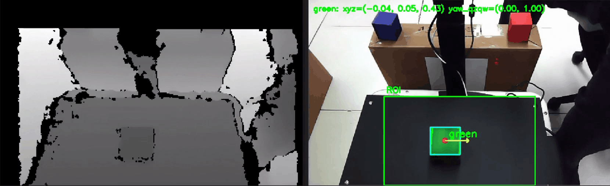

---

## Example Workflows

### ROS Base

#### Manipulation

- [Manipulator](./development_utilities/example/ros2/manipulator)  
  Explore a recorded vision-based manipulator workflow that connects color-block perception and camera-frame position estimation with robot-arm motion visualization.

  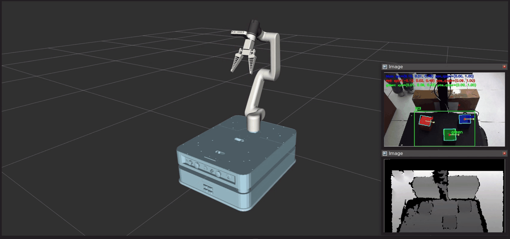

#### Mobility

- [2D LiDAR Mapping](./development_utilities/example/ros2/2d_mapping_with_lidar)  
  Create a 2D occupancy grid map from a 2D LiDAR using slam_toolbox, and visualize it in RViz.

- [2D LiDAR Navigation](./development_utilities/example/ros2/2d_lidar_navigation)  
  Learn the basic concepts of Nav2-based navigation and obstacle avoidance with a 2D LiDAR.

- [3D LiDAR Mapping](./development_utilities/example/ros2/3d_mapping_with_lidar)  
  Generate a 3D map from a 3D LiDAR using `lidarslam_ros2`, and inspect the result in RViz.

  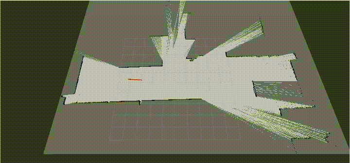
  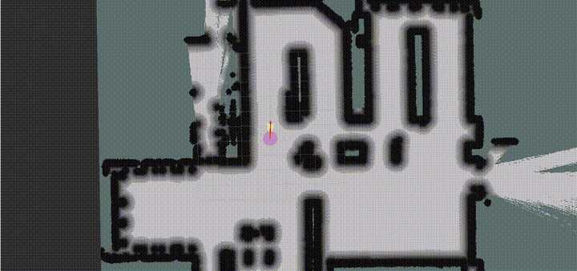
  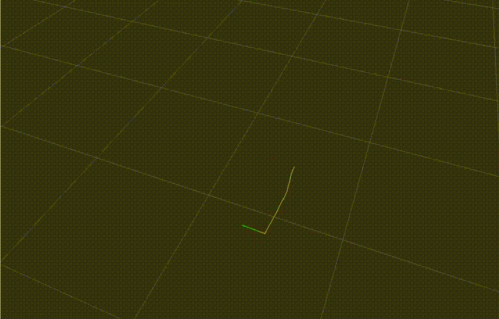

---

### ISAAC ROS

- [Multi-Sensor Function](./development_utilities/example/isaac_ros/multi_sensor_function)  
  Combine multiple sensors into a unified perception pipeline using Isaac ROS.

- [3D Scene Persistence](./development_utilities/example/isaac_ros/3d_scene_persistence)  
  Build and maintain a 3D representation of the environment for long-term perception.

- [3D Camera Obstacle Avoidance](./development_utilities/example/isaac_ros/3d_camera_obstacle_avoidance)  
  Use 3D cameras and Isaac ROS to detect obstacles and plan safe motion around them.

  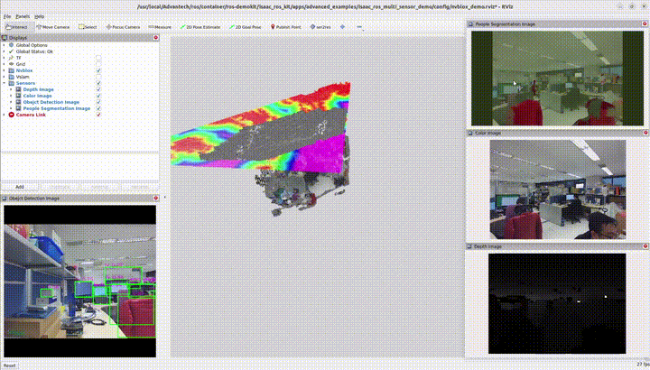
  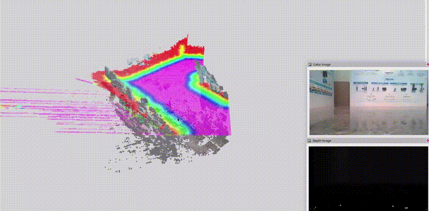
  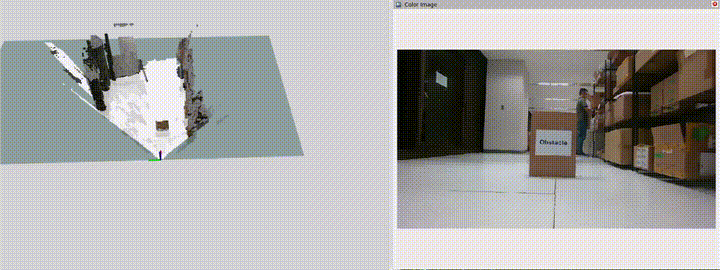

---

### QIR ROS

- [2D Object Depth Estimation](./development_utilities/example/qir_ros/2d_object_depth_estimation)  
  Use a recorded 2D camera stream to run `sample_depth_estimation` and `sample_apriltag` simultaneously, demonstrating how multiple QIR ROS SDK packages can share the same sensor input.

  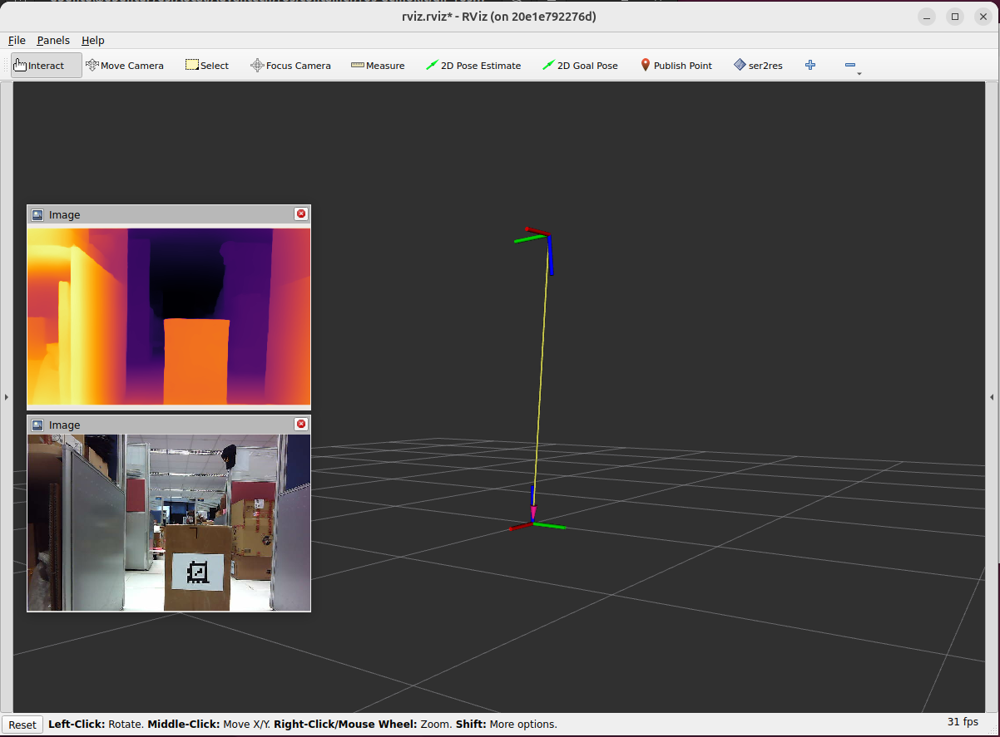

## Development Environment  

Robotic Suite provides pre-configured development environments to help users quickly get started with robotics application development.

- [ROS Jazzy](https://docs.ros.org/en/jazzy/index.html)  
ROS 2 Jazzy is pre-installed and configured on the host system, providing a stable and ready-to-use foundation for ROS-based development.

- [ROS Humble](https://docs.ros.org/en/humble/index.html)  
ROS 2 Humble is pre-installed and configured on the host system, providing a stable and ready-to-use foundation for ROS-based development.

- [ISAAC ROS](https://github.com/NVIDIA-ISAAC-ROS)  
A fully integrated Docker-based environment is provided, including pre-installed ISAAC ROS dependencies.  
This allows users to quickly build and run GPU-accelerated perception and AI applications without complex setup.

- [QIR ROS SDK](https://github.com/qualcomm-linux/meta-qcom-robotics-sdk)  
A fully integrated Docker-based environment is provided, including pre-installed QIR ROS SDK dependencies.  
This allows users to quickly build and run applications without complex setup.

- [Autoware](https://github.com/autowarefoundation/autoware)  
A containerized Autoware environment is provided, enabling users to explore autonomous driving workflows such as perception, planning, and control with minimal setup effort.

## Typical Workflow with Robotic Suite

1. **Explore a ready-to-run example** – Use the provided ROS bag–based perception, AMR, or manipulator examples to understand the application workflow without requiring physical sensors or robots.  
2. **Build the robot workflow** – Learn the main components for your application:
   - **Perception** – Multi-function camera processing, depth estimation, detection, segmentation, and scene understanding.
   - **AMR** – Mapping, localization, navigation, and obstacle avoidance.
   - **Manipulator** – Perception, position estimation, motion planning, and robot-arm action.
3. **Extend with platform SDKs and Core Techniques** – Use Isaac ROS, QIR ROS SDK, or reusable Core Techniques to add accelerated perception and application-specific functions.  
4. **Adapt the example to your hardware** – Replace the provided ROS bag with real sensor data and configure the required topics, TF relationships, robot description, drivers, and parameters.  
5. **Deploy and validate on Advantech platforms** – Run the customized application in the provided containerized environment and verify its behavior on the target platform.

