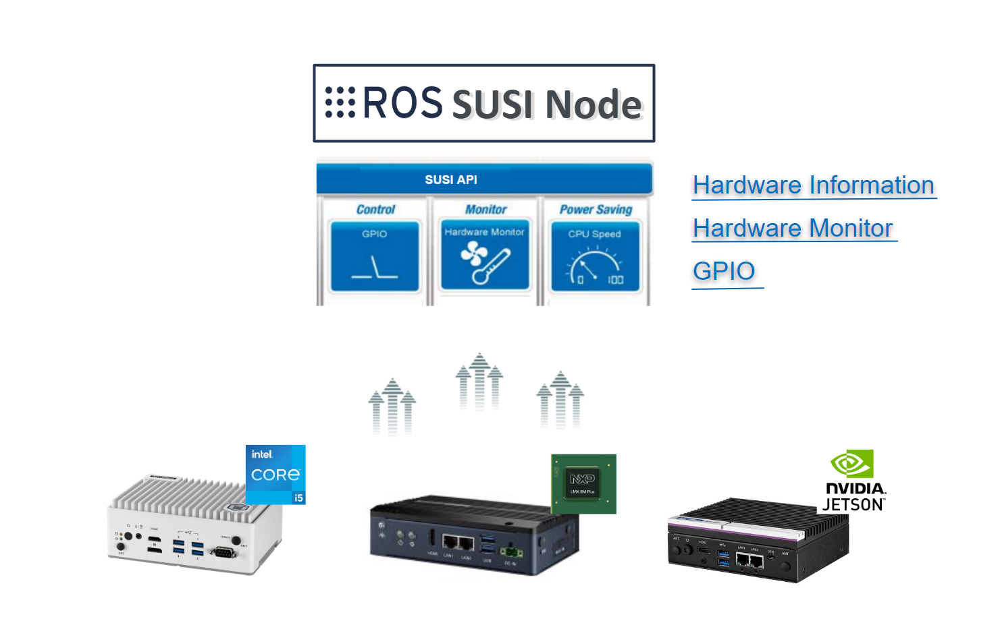
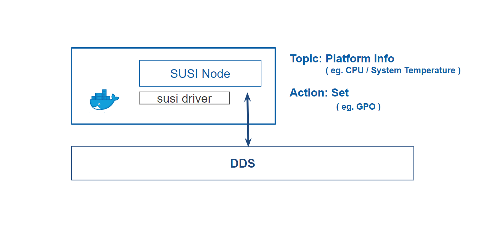
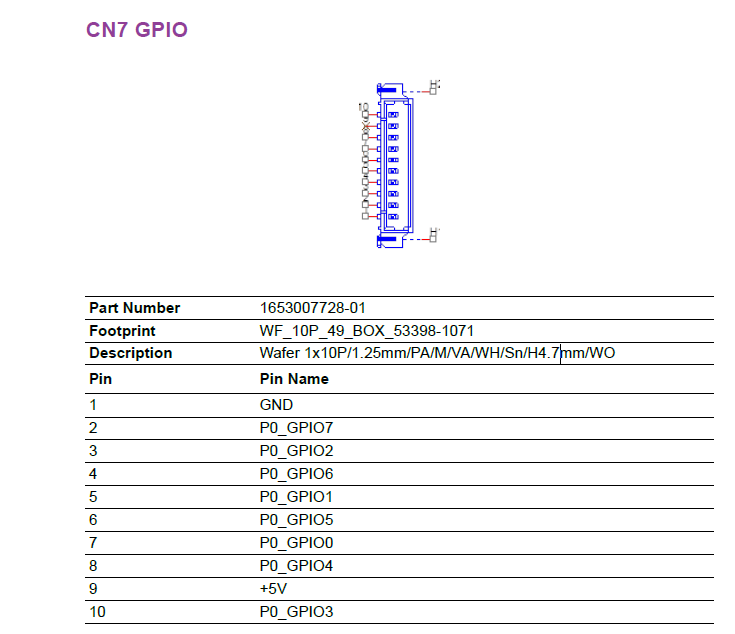
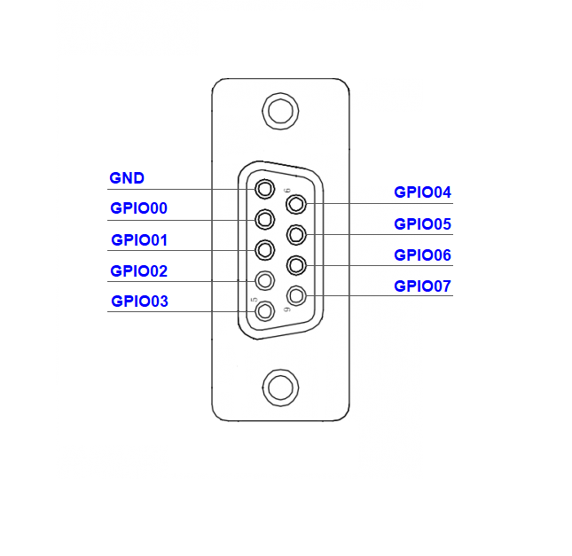

# Brief

Advantech has created SUSI APIs to simplify application development and
offer exclusive services with Advantech's embedded platforms. SUSI APIs
make it easier for customers to program and configure features while
integrating solutions.

 

 

SUSI node get Advantech hardware data ( includes Intel x86, RISC NXP and
Nvidia Jetson ) through SUSI API, the data will be converter to ROS DDS
data format and be published by pre-defined topic \"/adv/susicontrol\",
client node can subscribe the topic to receive hardware data that SUSI
node published. SUSI node also support set command to change writable
sensor through ROS service, ROS developer can easy to set and control
platform info with SUSI Node.

 

 

## SUSI Data Category: {#susi_data_category}

\
\

# Topic definition {#topic_definition}

The topic of SUSIControl node is defined as below:

    /adv/susicontrol

 

# Message definition {#message_definition}

The messages definition of SUSI node is defined in below link:

[<http://ess-wiki.advantech.com.tw/view/Advantech_Robotic_Suite/Advantech_ROS2_Data_Format>](http://ess-wiki.advantech.com.tw/view/Advantech_Robotic_Suite/Advantech_ROS2_Data_Format)

 

# Message update {#message_update}

The message is updated periodically in 10 seconds, you can use ROS2
utility to verify the data update:

#### Subscribe Sensor using ROS2 utility {#subscribe_sensor_using_ros2_utility}

Step1. Setup ROS2 environmant variables:

    $ source /opt/ros/${ROS_DISTRO}/setup.bash

Step2. Setup SUSI Node message:

    $ source /usr/local/Advantech/ros/${ROS_DISTRO}/include/edge-converter-ros2/adv_msgs/install/local_setup.bash

Step3. List all topics:

    $ ros2 topic list

output:

    /adv/parameter_events
    /adv/susicontrol
    /parameter_events
    /rosout

 

Step4. Subscribe node data

    $ ros2 topic echo /adv/susicontrol

output:

    sensor: SUSIControl/DiskInfo/Disk C Total Disk Space
    type: v
    bv: false
    v: 60039.0
    sv: ''
    ts: 1677659397728
    ---
    sensor: SUSIControl/Platform Information/BIOS revision
    type: sv
    bv: false
    v: 0.0
    sv: V1.13
    ts: 1677659397728
    ---
    sensor: SUSIControl/Hardware Monitor/Voltage/5V
    type: v
    bv: false
    v: 5.216
    sv: ''
    ts: 1677659397728
    ---
    sensor: SUSIControl/Hardware Monitor/Fan Speed/CPU
    type: v
    bv: false
    v: 0.0
    sv: ''
    ts: 1677659397728
    ---
    sensor: SUSIControl/GPIO/GPIO00/Dir
    type: bv
    bv: true
    v: 0.0
    sv: ''
    ts: 1677659397728
    ---
    sensor: SUSIControl/GPIO/GPIO01/Dir
    type: bv
    bv: true
    v: 0.0
    sv: ''
    ts: 1677659397728
    ---
    sensor: SUSIControl/GPIO/GPIO06/Level
    type: bv
    bv: true
    v: 0.0
    sv: ''
    ts: 1677659397728
    ---
    sensor: SUSIControl/GPIO/GPIO07/Dir
    type: bv
    bv: true
    v: 0.0
    sv: ''
    ts: 1677659397728
    ---
    sensor: SUSIControl/GPIO/GPIO07/Level
    type: bv
    bv: true
    v: 0.0
    sv: ''
    ts: 1677659397728
    ---
    sensor: SUSIControl/Backlight/Backlight 1/Brightness
    type: v
    bv: false
    v: 255.0
    sv: ''
    ts: 1677659397728
    ---
    sensor: SUSIControl/Backlight/Backlight 1/Frequency
    type: v
    bv: false
    v: 18780.0
    sv: ''
    ts: 1677659397728
    ---
    sensor: SUSIControl/Backlight/Backlight 1/Polarity
    type: bv
    bv: false
    v: 0.0
    sv: ''
    ts: 1677659397728
    ---

 

# Sample Client {#sample_client}

This session describe how to subscribe SUSIControl node data by
SUSIControl node topic.

### Node.js

The program rclnodejs_edge_data_client is a node.js example for user to
understand how to use rclnodejs to subscribe SUSI node\'s data. Please
follow below steps to run the program, when the program launched, it
will subscribe SUSI node\'s sensor and print the data in the console
screen.

#### Subscribe Sensor {#subscribe_sensor}

Step1. Setup ROS2 environmant variables, replace \${ROS_DISTRO} with
your ROS2 distribution (foxy, humble) to run this command:

    $ source /opt/ros/${ROS_DISTRO}/setup.bash

Step2. Setup SUSI Node message:

    $ source /usr/local/Advantech/ros/${ROS_DISTRO}/include/edge-converter-ros2/adv_msgs/install/local_setup.bash

Step3. Go to node.js SUSIControl node sample client path:

    $ cd /usr/local/Advantech/ros/${ROS_DISTRO}/sample_code/edge-data-client/rclnodejs_edge_data_client/

Step4. Run node.js SUSIControl client:

    $  node example_SubscribeSensor.js "rclnodejs_SUSIControl_subscriber" "/adv/susicontrol"

Step5. Verify received data:

    [INFO] [1666244753.823296758] [rclnodejs_SUSIControl_subscriber]: Data: sensor = SUSIControl/SUSIIoT Information/version, sv = 1.0.14327
    [INFO] [1666244753.824233548] [rclnodejs_SUSIControl_subscriber]: Data: sensor = SUSIControl/DiskInfo/Disk C Total Disk Space, v = 60039
    [INFO] [1666244753.825679860] [rclnodejs_SUSIControl_subscriber]: Data: sensor = SUSIControl/DiskInfo/Disk C Free Disk Space, v = 2573
    [INFO] [1666244753.826547529] [rclnodejs_SUSIControl_subscriber]: Data: sensor = SUSIControl/Platform Information/Board manufacturer, sv = Advantech
    [INFO] [1666244753.827426338] [rclnodejs_SUSIControl_subscriber]: Data: sensor = SUSIControl/Platform Information/Board name, sv = AIMB-285
    [INFO] [1666244753.828303175] [rclnodejs_SUSIControl_subscriber]: Data: sensor = SUSIControl/Platform Information/BIOS revision, sv = V1.13
    [INFO] [1666244753.829165104] [rclnodejs_SUSIControl_subscriber]: Data: sensor = SUSIControl/Platform Information/Driver version, sv = 4.0.14326
    [INFO] [1666244753.830043506] [rclnodejs_SUSIControl_subscriber]: Data: sensor = SUSIControl/Platform Information/Library version, sv = 4.0.14326
    [INFO] [1666244753.830895635] [rclnodejs_SUSIControl_subscriber]: Data: sensor = SUSIControl/Hardware Monitor/Voltage/Vcore, v = 0.464
    [INFO] [1666244753.831752533] [rclnodejs_SUSIControl_subscriber]: Data: sensor = SUSIControl/Hardware Monitor/Voltage/3.3V, v = 3.36
    [INFO] [1666244753.832659914] [rclnodejs_SUSIControl_subscriber]: Data: sensor = SUSIControl/Hardware Monitor/Voltage/5V, v = 5.184
    [INFO] [1666244753.833530130] [rclnodejs_SUSIControl_subscriber]: Data: sensor = SUSIControl/Hardware Monitor/Voltage/12V, v = 12.021
    [INFO] [1666244753.834384115] [rclnodejs_SUSIControl_subscriber]: Data: sensor = SUSIControl/Hardware Monitor/Voltage/5V Standby, v = 5.216
    [INFO] [1666244753.835268840] [rclnodejs_SUSIControl_subscriber]: Data: sensor = SUSIControl/Hardware Monitor/Voltage/CMOS Battery, v = 3.152
    [INFO] [1666244753.836147029] [rclnodejs_SUSIControl_subscriber]: Data: sensor = SUSIControl/Hardware Monitor/Fan Speed/CPU, v = 0
    [INFO] [1666244753.837019121] [rclnodejs_SUSIControl_subscriber]: Data: sensor = SUSIControl/Hardware Monitor/Fan Speed/System, v = 2528
    [INFO] [1666244753.837897563] [rclnodejs_SUSIControl_subscriber]: Data: sensor = SUSIControl/Hardware Monitor/Temperature/CPU, v = 34.7
    [INFO] [1666244753.838757469] [rclnodejs_SUSIControl_subscriber]: Data: sensor = SUSIControl/GPIO/GPIO05/Dir, bv = true
    [INFO] [1666244753.839612342] [rclnodejs_SUSIControl_subscriber]: Data: sensor = SUSIControl/GPIO/GPIO05/Level, bv = true
    [INFO] [1666244753.841073336] [rclnodejs_SUSIControl_subscriber]: Data: sensor = SUSIControl/GPIO/GPIO00/Level, bv = true
    [INFO] [1666244753.841963148] [rclnodejs_SUSIControl_subscriber]: Data: sensor = SUSIControl/GPIO/GPIO02/Level, bv = true
    [INFO] [1666244753.842830913] [rclnodejs_SUSIControl_subscriber]: Data: sensor = SUSIControl/GPIO/GPIO01/Dir, bv = true
    [INFO] [1666244753.843763644] [rclnodejs_SUSIControl_subscriber]: Data: sensor = SUSIControl/GPIO/GPIO03/Dir, bv = true
    [INFO] [1666244753.844590639] [rclnodejs_SUSIControl_subscriber]: Data: sensor = SUSIControl/GPIO/GPIO03/Level, bv = true
    [INFO] [1666244753.845344403] [rclnodejs_SUSIControl_subscriber]: Data: sensor = SUSIControl/GPIO/GPIO04/Dir, bv = true
    [INFO] [1666244753.846105225] [rclnodejs_SUSIControl_subscriber]: Data: sensor = SUSIControl/GPIO/GPIO04/Level, bv = true
    [INFO] [1666244753.846631442] [rclnodejs_SUSIControl_subscriber]: Data: sensor = SUSIControl/GPIO/GPIO06/Dir, bv = true
    [INFO] [1666244753.847148533] [rclnodejs_SUSIControl_subscriber]: Data: sensor = SUSIControl/GPIO/GPIO06/Level, bv = true
    [INFO] [1666244753.847914130] [rclnodejs_SUSIControl_subscriber]: Data: sensor = SUSIControl/GPIO/GPIO07/Dir, bv = true
    [INFO] [1666244753.848709254] [rclnodejs_SUSIControl_subscriber]: Data: sensor = SUSIControl/GPIO/GPIO07/Level, bv = true
    [INFO] [1666244753.849491291] [rclnodejs_SUSIControl_subscriber]: Data: sensor = SUSIControl/Backlight/Backlight 1/Brightness, v = 255
    [INFO] [1666244753.850278964] [rclnodejs_SUSIControl_subscriber]: Data: sensor = SUSIControl/Backlight/Backlight 1/Frequency, v = 18780
    [INFO] [1666244753.851031430] [rclnodejs_SUSIControl_subscriber]: Data: sensor = SUSIControl/Backlight/Backlight 1/Polarity, bv = false

\
 

#### Set sensor {#set_sensor}

This session describe how to set SUSI node data by set action. To run
the set sensor sample, your device need have writable sensor supported
for SUSI driver.

Step1. Setup ROS2 environmant variables, replace \${ROS_DISTRO} with
your ROS2 distribution (foxy, humble) to run this command:

    $ source /opt/ros/${ROS_DISTRO}/setup.bash

Step2. Setup SUSI Node ROS message:

    $ source /usr/local/Advantech/ros/${ROS_DISTRO}/include/edge-converter-ros2/adv_msgs/install/local_setup.bash

Step3. Go to node.js SUSIControl node sample client path:

    $ cd /usr/local/Advantech/ros/${ROS_DISTRO}/sample_code/edge-data-client/rclnodejs_edge_data_client/

Step4. Run SUSIControl set sensor sample client:

Command:

    node example_SetSensor.js [node name] [action] [sensor] [type] [value]

Example:

    $ node example_SetSensor.js "rclnodejs_SUSIControl_setter" "adv_susicontrol_set" "SUSIControl/GPIO/GPIO00/Dir" "bv" false

Step5. Received data:

    [INFO] [1665541698.282173185] [adv.SUSIControl_Client]: Waiting for action server...
    [INFO] [1665541698.317823807] [adv.SUSIControl_Client]: Sending goal request...
    [INFO] [1665541698.350790289] [adv.SUSIControl_Client]: Received feedback: status = {&quot;status&quot;:200,&quot;sensor&quot;:&quot;SUSIControl/GPIO/GPIO00/Dir&quot;,&quot;info&quot;:&quot;Success&quot;,&quot;ts&quot;:1665541699007}
    [INFO] [1665541698.389403371] [adv.SUSIControl_Client]: Goal accepted
    [INFO] [1665541698.849897490] [adv.SUSIControl_Client]: Goal suceeded with result: 202

\
 

#### Use Case: EPC-R3720 GPIO Usage {#use_case_epc_r3720_gpio_usage}

This case is a demonstration to instruct EPC-R3720 GPIO configuration
and usage.

\- GPIO Pins definition:

{width="320"
height="240"}

\- GPIO Mapping Table:

**NOTE:**GPIO2 and GPIO4 are not connected to D-sub connector

 

\- Hardware Config:

In this demonstraction, we would like to do a loopback test from DO to
DI, before start below steps, we need to wire-connect from DO to DI for
each:

DO1 (GPIO6)    \-\--   DI1 (GPIO5)

DO2 (GPIO8)    \-\--   DI2 (GPIO7)

DO3 (GPIO10)  \-\--   DI3 (GPIO9)

DO4 (GPIO12)  \-\--   DI4 (GPIO11)

 

\- Steps:

Step1. Setup ROS2 environmant variables, replace \${ROS_DISTRO} with
your ROS2 distribution (foxy, humble) to run this command:

    $ source /opt/ros/${ROS_DISTRO}/setup.bash

Step2. Setup SUSI Node\'s ROS message:

    $ source /usr/local/Advantech/ros/${ROS_DISTRO}/include/edge-converter-ros2/adv_msgs/install/local_setup.bash

Step3. Go to node.js SUSIControl node sample client path:

    $ cd /usr/local/Advantech/ros/${ROS_DISTRO}/sample_code/edge-data-client/rclnodejs_edge_data_client/

Step4. Config GPIO6, GPIO8, GPIO10 and GPIO12 as output pins:

    $ node example_SetSensor.js "rclnodejs_SUSIControl_setter" "adv_susicontrol_set" "SUSIControl/GPIO/GPIO6/Dir" "bv" false
    $ node example_SetSensor.js "rclnodejs_SUSIControl_setter" "adv_susicontrol_set" "SUSIControl/GPIO/GPIO8/Dir" "bv" false
    $ node example_SetSensor.js "rclnodejs_SUSIControl_setter" "adv_susicontrol_set" "SUSIControl/GPIO/GPIO10/Dir" "bv" false
    $ node example_SetSensor.js "rclnodejs_SUSIControl_setter" "adv_susicontrol_set" "SUSIControl/GPIO/GPIO12/Dir" "bv" false

Step5. Config GPIO5, GPIO7, GPIO9 and GPI11 as input pins:

    $ node example_SetSensor.js "rclnodejs_SUSIControl_setter" "adv_susicontrol_set" "SUSIControl/GPIO/GPIO5/Dir" "bv" true
    $ node example_SetSensor.js "rclnodejs_SUSIControl_setter" "adv_susicontrol_set" "SUSIControl/GPIO/GPIO7/Dir" "bv" true
    $ node example_SetSensor.js "rclnodejs_SUSIControl_setter" "adv_susicontrol_set" "SUSIControl/GPIO/GPIO9/Dir" "bv" true
    $ node example_SetSensor.js "rclnodejs_SUSIControl_setter" "adv_susicontrol_set" "SUSIControl/GPIO/GPIO11/Dir" "bv" true

Step6. Set GPIO6, GPIO8, GPIO10 and GPIO12 output Level to 1 (Logical
high):

After GPIO6, GPIO8, GPIO10 and GPIO12 are config to output pins, than
you can set their Level to true/false by \"adv_susicontrol_set\"
command.

**Note:** Please do not set value to the pins GPIO5, GPIO7, GPIO9 and
GPIO11 because these pins are configured as input pins, set value action
is not allow.

    $ node example_SetSensor.js "rclnodejs_SUSIControl_setter" "adv_susicontrol_set" "SUSIControl/GPIO/GPIO6/Level" "bv" true
    $ node example_SetSensor.js "rclnodejs_SUSIControl_setter" "adv_susicontrol_set" "SUSIControl/GPIO/GPIO8/Level" "bv" true
    $ node example_SetSensor.js "rclnodejs_SUSIControl_setter" "adv_susicontrol_set" "SUSIControl/GPIO/GPIO10/Level" "bv" true
    $ node example_SetSensor.js "rclnodejs_SUSIControl_setter" "adv_susicontrol_set" "SUSIControl/GPIO/GPIO12/Level" "bv" true

Step7. Run node.js SUSIControl client:

    $  node example_SubscribeSensor.js "rclnodejs_SUSIControl_subscriber" "/adv/susicontrol"

Step8. Verify received data:

    You have entered arguments:
    node name: rclnodejs_SUSIControl_subscriber
    message topic: /adv/susicontrol
    ----------------------------------------------
    Data: sensor = "SUSIControl/GPIO/GPIO5/Dir", v = 1.00
    Data: sensor = "SUSIControl/GPIO/GPIO5/Level", v = 1.00
    Data: sensor = "SUSIControl/GPIO/GPIO6/Dir", v = 0.00
    Data: sensor = "SUSIControl/GPIO/GPIO6/Level", v = 1.00
    Data: sensor = "SUSIControl/GPIO/GPIO7/Dir", v = 1.00
    Data: sensor = "SUSIControl/GPIO/GPIO7/Level", v = 1.00
    Data: sensor = "SUSIControl/GPIO/GPIO8/Dir", v = 0.00
    Data: sensor = "SUSIControl/GPIO/GPIO8/Level", v = 1.00
    Data: sensor = "SUSIControl/GPIO/GPIO9/Dir", v = 1.00
    Data: sensor = "SUSIControl/GPIO/GPIO9/Level", v = 1.00
    Data: sensor = "SUSIControl/GPIO/GPIO10/Dir", v = 0.00
    Data: sensor = "SUSIControl/GPIO/GPIO10/Level", v = 1.00
    Data: sensor = "SUSIControl/GPIO/GPIO11/Dir", v = 1.00
    Data: sensor = "SUSIControl/GPIO/GPIO11/Level", v = 1.00
    Data: sensor = "SUSIControl/GPIO/GPIO12/Dir", v = 0.00
    Data: sensor = "SUSIControl/GPIO/GPIO12/Level", v = 1.00

\
\

#### Use Case: MIO-5375 GPIO Usage {#use_case_mio_5375_gpio_usage}

This case is a demonstration to instruct MIO-5375 GPIO configuration and
usage.

\- GPIO Pins definition:

 

\- GPIO cable definition:

 

 

\- GPIO Mapping Table:

 

**NOTE:**All GPIO direction are configable.

 

\- Hardware Config:

In this demonstraction, we would like to do a loopback test from DO to
DI, before start below steps, we need to wire-connect from DO to DI for
each:

DO1 (GPIO00)    \-\--    DI1 (GPIO04)

DO2 (GPIO01)    \-\--    DI2 (GPIO05)

DO3 (GPIO02)    \-\--    DI3 (GPIO06)

DO4 (GPIO03)    \-\--    DI4 (GPIO07)

 

\- Steps:

Step1. Setup ROS2 environmant variables, replace \${ROS_DISTRO} with
your ROS2 distribution (foxy, humble) to run this command:

    $ source /opt/ros/${ROS_DISTRO}/setup.bash

Step2. Setup SUSI Node message:

    $ source /usr/local/Advantech/ros/${ROS_DISTRO}/include/edge-converter-ros2/adv_msgs/install/local_setup.bash

Step3. Go to node.js SUSIControl node sample client path:

    $ cd /usr/local/Advantech/ros/${ROS_DISTRO}/sample_code/edge-data-client/rclnodejs_edge_data_client/

Step4. Config GPIO00, GPIO01, GPIO02 and GPIO03 as output pins:

    $ node example_SetSensor.js "rclnodejs_SUSIControl_setter" "adv_susicontrol_set" "SUSIControl/GPIO/GPIO00/Dir" "bv" false
    $ node example_SetSensor.js "rclnodejs_SUSIControl_setter" "adv_susicontrol_set" "SUSIControl/GPIO/GPIO01/Dir" "bv" false
    $ node example_SetSensor.js "rclnodejs_SUSIControl_setter" "adv_susicontrol_set" "SUSIControl/GPIO/GPIO02/Dir" "bv" false
    $ node example_SetSensor.js "rclnodejs_SUSIControl_setter" "adv_susicontrol_set" "SUSIControl/GPIO/GPIO03/Dir" "bv" false

Step5. Config GPIO04, GPIO05, GPIO06 and GPIO07 as input pins:

    $ node example_SetSensor.js "rclnodejs_SUSIControl_setter" "adv_susicontrol_set" "SUSIControl/GPIO/GPIO04/Dir" "bv" true
    $ node example_SetSensor.js "rclnodejs_SUSIControl_setter" "adv_susicontrol_set" "SUSIControl/GPIO/GPIO05/Dir" "bv" true
    $ node example_SetSensor.js "rclnodejs_SUSIControl_setter" "adv_susicontrol_set" "SUSIControl/GPIO/GPIO06/Dir" "bv" true
    $ node example_SetSensor.js "rclnodejs_SUSIControl_setter" "adv_susicontrol_set" "SUSIControl/GPIO/GPIO07/Dir" "bv" true

Step6. Set GPIO00, GPIO01, GPIO02 and GPIO03 output Level to 1 (Logical
high):

After GPIO00, GPIO01, GPIO02 and GPIO03 are config to output pins, than
you can set their Level to true (logical high) by
\"adv_susicontrol_set\" command.

**Note:** Please do not set value to the pins GPIO04, GPIO05, GPIO06 and
GPIO07 because these pins are configured as input pins, set value action
is not allow.

    $ node example_SetSensor.js "rclnodejs_SUSIControl_setter" "adv_susicontrol_set" "SUSIControl/GPIO/GPIO00/Level" "bv" true
    $ node example_SetSensor.js "rclnodejs_SUSIControl_setter" "adv_susicontrol_set" "SUSIControl/GPIO/GPIO01/Level" "bv" true
    $ node example_SetSensor.js "rclnodejs_SUSIControl_setter" "adv_susicontrol_set" "SUSIControl/GPIO/GPIO02/Level" "bv" true
    $ node example_SetSensor.js "rclnodejs_SUSIControl_setter" "adv_susicontrol_set" "SUSIControl/GPIO/GPIO03/Level" "bv" true

Step7. Run node.js SUSIControl client:

    $  node example_SubscribeSensor.js "rclnodejs_SUSIControl_subscriber" "/adv/susicontrol"

Step8. Verify received data:

    You have entered arguments:
    node name: rclnodejs_SUSIControl_subscriber
    message topic: /adv/susicontrol
    ----------------------------------------------
    Data: sensor = "SUSIControl/GPIO/GPIO00/Dir", v = 0.00
    Data: sensor = "SUSIControl/GPIO/GPIO00/Level", v = 1.00
    Data: sensor = "SUSIControl/GPIO/GPIO01/Dir", v = 0.00
    Data: sensor = "SUSIControl/GPIO/GPIO01/Level", v = 1.00
    Data: sensor = "SUSIControl/GPIO/GPIO02/Dir", v = 0.00
    Data: sensor = "SUSIControl/GPIO/GPIO02/Level", v = 1.00
    Data: sensor = "SUSIControl/GPIO/GPIO03/Dir", v = 0.00
    Data: sensor = "SUSIControl/GPIO/GPIO03/Level", v = 1.00
    Data: sensor = "SUSIControl/GPIO/GPIO04/Dir", v = 1.00
    Data: sensor = "SUSIControl/GPIO/GPIO04/Level", v = 1.00
    Data: sensor = "SUSIControl/GPIO/GPIO05/Dir", v = 1.00
    Data: sensor = "SUSIControl/GPIO/GPIO05/Level", v = 1.00
    Data: sensor = "SUSIControl/GPIO/GPIO06/Dir", v = 1.00
    Data: sensor = "SUSIControl/GPIO/GPIO06/Level", v = 1.00
    Data: sensor = "SUSIControl/GPIO/GPIO07/Dir", v = 1.00
    Data: sensor = "SUSIControl/GPIO/GPIO07/Level", v = 1.00

\
 

 

\
 

## Python

The program rclpy_edge_data_client is a Python client example for user
to understand how to use rclpy to subscribe SUSIControl node\'s data.
Please follow below steps to run the program, when the program launched,
it will subscribe OPCUAClient node\'s sensor and print the data in the
console screen.

**Steps - Subscribe Sensor**

Step1. Setup ROS2 environmant variables, replace \${ROS_DISTRO} with
your ROS2 distribution (foxy, humble) to run this command:

    $ source /opt/ros/${ROS_DISTRO}/setup.bash

Step2. Setup SUSI Node message:

    $ source /usr/local/Advantech/ros/${ROS_DISTRO}/include/edge-converter-ros2/adv_msgs/install/local_setup.bash

Step3. Setup SUSIControl variables:

    $ source /usr/local/Advantech/ros/${ROS_DISTRO}/sample_code/edge-data-client/install/local_setup.bash

Step4. Run Python SUSIControl sample client:

    $ ros2 run rclpy_edge_data_client listener "rclcpp_SUSIControl_subscriber" "/adv/susicontrol"

Step5. Verify received data:

    [INFO] [1668419166.970557368] [rclpy_SUSIControl_subscriber]: Data: sensor = "SUSIControl/Hardware Monitor/Voltage/Vcore", v = 1.13
    [INFO] [1668419166.971275797] [rclpy_SUSIControl_subscriber]: Data: sensor = "SUSIControl/Hardware Monitor/Voltage/3.3V", v = 3.36
    [INFO] [1668419166.971889153] [rclpy_SUSIControl_subscriber]: Data: sensor = "SUSIControl/Hardware Monitor/Voltage/5V", v = 5.22
    [INFO] [1668419166.972484995] [rclpy_SUSIControl_subscriber]: Data: sensor = "SUSIControl/Hardware Monitor/Voltage/12V", v = 12.13
    [INFO] [1668419166.973073717] [rclpy_SUSIControl_subscriber]: Data: sensor = "SUSIControl/Hardware Monitor/Voltage/5V Standby", v = 5.22
    [INFO] [1668419166.973724029] [rclpy_SUSIControl_subscriber]: Data: sensor = "SUSIControl/Hardware Monitor/Voltage/CMOS Battery", v = 3.15
    [INFO] [1668419166.974310688] [rclpy_SUSIControl_subscriber]: Data: sensor = "SUSIControl/Hardware Monitor/Voltage/VCC3", v = 3.34
    [INFO] [1668419166.974895174] [rclpy_SUSIControl_subscriber]: Data: sensor = "SUSIControl/Hardware Monitor/Temperature/CPU", v = 43.20
    [INFO] [1668419166.975476661] [rclpy_SUSIControl_subscriber]: Data: sensor = "SUSIControl/Hardware Monitor/Temperature/System", v = 36.50
    [INFO] [1668419166.976056322] [rclpy_SUSIControl_subscriber]: Data: sensor = "SUSIControl/Hardware Monitor/Fan Speed/CPU", v = 0.00
    [INFO] [1668419166.976637793] [rclpy_SUSIControl_subscriber]: Data: sensor = "SUSIControl/Hardware Monitor/Fan Speed/System", v = 2513.00
    [INFO] [1668419166.977217676] [rclpy_SUSIControl_subscriber]: Data: sensor = "SUSIControl/Hardware Monitor/Fan Speed/System 2", v = 2410.00
    [INFO] [1668419166.977840176] [rclpy_SUSIControl_subscriber]: Data: sensor = "SUSIControl/DiskInfo/Disk C Total Disk Space", v = 60039.00
    [INFO] [1668419166.978420960] [rclpy_SUSIControl_subscriber]: Data: sensor = "SUSIControl/DiskInfo/Disk C Free Disk Space", v = 1482.00
    [INFO] [1668419166.979005895] [rclpy_SUSIControl_subscriber]: Data: sensor = "SUSIControl/Platform Information/Board manufacturer", sv = "Advantech"
    [INFO] [1668419166.979585125] [rclpy_SUSIControl_subscriber]: Data: sensor = "SUSIControl/Platform Information/Board name", sv = "AIMB-285"
    [INFO] [1668419166.980164289] [rclpy_SUSIControl_subscriber]: Data: sensor = "SUSIControl/Platform Information/BIOS revision", sv = "V1.13"
    [INFO] [1668419166.980741273] [rclpy_SUSIControl_subscriber]: Data: sensor = "SUSIControl/Platform Information/Driver version", sv = "4.0.14326"
    [INFO] [1668419166.981320076] [rclpy_SUSIControl_subscriber]: Data: sensor = "SUSIControl/Platform Information/Library version", sv = "4.0.14326"
    [INFO] [1668419166.981936635] [rclpy_SUSIControl_subscriber]: Data: sensor = "SUSIControl/GPIO/GPIO00/Dir", bv = False
    [INFO] [1668419166.982513742] [rclpy_SUSIControl_subscriber]: Data: sensor = "SUSIControl/GPIO/GPIO00/Level", bv = False
    [INFO] [1668419166.983092131] [rclpy_SUSIControl_subscriber]: Data: sensor = "SUSIControl/GPIO/GPIO04/Dir", bv = True
    [INFO] [1668419166.983668132] [rclpy_SUSIControl_subscriber]: Data: sensor = "SUSIControl/GPIO/GPIO04/Level", bv = True
    [INFO] [1668419166.984246338] [rclpy_SUSIControl_subscriber]: Data: sensor = "SUSIControl/GPIO/GPIO02/Dir", bv = True
    [INFO] [1668419166.984820603] [rclpy_SUSIControl_subscriber]: Data: sensor = "SUSIControl/GPIO/GPIO02/Level", bv = True
    [INFO] [1668419166.985397629] [rclpy_SUSIControl_subscriber]: Data: sensor = "SUSIControl/GPIO/GPIO01/Dir", bv = True
    [INFO] [1668419166.986005697] [rclpy_SUSIControl_subscriber]: Data: sensor = "SUSIControl/GPIO/GPIO01/Level", bv = True
    [INFO] [1668419166.986585734] [rclpy_SUSIControl_subscriber]: Data: sensor = "SUSIControl/GPIO/GPIO03/Dir", bv = True
    [INFO] [1668419166.987160259] [rclpy_SUSIControl_subscriber]: Data: sensor = "SUSIControl/GPIO/GPIO03/Level", bv = True
    [INFO] [1668419166.987738015] [rclpy_SUSIControl_subscriber]: Data: sensor = "SUSIControl/GPIO/GPIO05/Dir", bv = True
    [INFO] [1668419166.988313746] [rclpy_SUSIControl_subscriber]: Data: sensor = "SUSIControl/GPIO/GPIO05/Level", bv = True
    [INFO] [1668419166.988890908] [rclpy_SUSIControl_subscriber]: Data: sensor = "SUSIControl/GPIO/GPIO06/Dir", bv = True
    [INFO] [1668419166.989482096] [rclpy_SUSIControl_subscriber]: Data: sensor = "SUSIControl/GPIO/GPIO06/Level", bv = True
    [INFO] [1668419166.990074224] [rclpy_SUSIControl_subscriber]: Data: sensor = "SUSIControl/GPIO/GPIO07/Dir", bv = True
    [INFO] [1668419166.990648950] [rclpy_SUSIControl_subscriber]: Data: sensor = "SUSIControl/GPIO/GPIO07/Level", bv = True
    [INFO] [1668419166.991224271] [rclpy_SUSIControl_subscriber]: Data: sensor = "SUSIControl/Backlight/Backlight 1/Brightness", v = 255.00
    [INFO] [1668419166.991803378] [rclpy_SUSIControl_subscriber]: Data: sensor = "SUSIControl/Backlight/Backlight 1/Frequency", v = 18780.00
    [INFO] [1668419166.992393882] [rclpy_SUSIControl_subscriber]: Data: sensor = "SUSIControl/Backlight/Backlight 1/Polarity", bv = False
    [INFO] [1668419166.992984235] [rclpy_SUSIControl_subscriber]: Data: sensor = "SUSIControl/SUSIIoT Information/version", sv = "1.0.14327"

\
 

## C++

The program rclcpp_edge_data_client is a C++ example for user to
understand how to use rclcpp to subscribe SUSI node\'s data. Please
follow below steps to run the program, when the program launched, it
will subscribe SUSI node\'s sensor and print the data in the console
screen.

**Steps - Subscribe Sensor**

Step1. Setup ROS2 environmant variables, replace \${ROS_DISTRO} with
your ROS2 distribution (foxy, humble) to run this command:

    $ source /opt/ros/${ROS_DISTRO}/setup.bash

Step2. Setup SUSI Node message:

    $ source /usr/local/Advantech/ros/${ROS_DISTRO}/include/edge-converter-ros2/adv_msgs/install/local_setup.bash

Step3. Setup SUSIControl node variables:

    $ source /usr/local/Advantech/ros/${ROS_DISTRO}/sample_code/edge-data-client/install/local_setup.bash

Step4. Run C++ SUSIControl sample client:

    $ ros2 run rclcpp_edge_data_client listener "rclcpp_SUSIControl_subscriber" "/adv/susicontrol"

Step5. Verify received data:

    [INFO] [1665992194.487803681] [rclcpp_SUSIControl_subscriber]: Data: sensor = 'SUSIControl/SUSIIoT Information/version', sv = '1.0.14327'
    [INFO] [1665992194.488662535] [rclcpp_SUSIControl_subscriber]: Data: sensor = 'SUSIControl/DiskInfo/Disk C Total Disk Space', v = 60039.00
    [INFO] [1665992194.489943911] [rclcpp_SUSIControl_subscriber]: Data: sensor = 'SUSIControl/DiskInfo/Disk C Free Disk Space', v = 2282.00
    [INFO] [1665992194.490802091] [rclcpp_SUSIControl_subscriber]: Data: sensor = 'SUSIControl/Platform Information/Board manufacturer', sv = 'Advantech'
    [INFO] [1665992194.490963569] [rclcpp_SUSIControl_subscriber]: Data: sensor = 'SUSIControl/Platform Information/Board name', sv = 'AIMB-285'
    [INFO] [1665992194.491036637] [rclcpp_SUSIControl_subscriber]: Data: sensor = 'SUSIControl/Platform Information/BIOS revision', sv = 'V1.13'
    [INFO] [1665992194.491086609] [rclcpp_SUSIControl_subscriber]: Data: sensor = 'SUSIControl/Platform Information/Driver version', sv = '4.0.14326'
    [INFO] [1665992194.491176944] [rclcpp_SUSIControl_subscriber]: Data: sensor = 'SUSIControl/Platform Information/Library version', sv = '4.0.14326'
    [INFO] [1665992194.491815332] [rclcpp_SUSIControl_subscriber]: Data: sensor = 'SUSIControl/Hardware Monitor/Voltage/Vcore', v = 0.29
    [INFO] [1665992194.492036608] [rclcpp_SUSIControl_subscriber]: Data: sensor = 'SUSIControl/Hardware Monitor/Voltage/3.3V', v = 3.36
    [INFO] [1665992194.492213936] [rclcpp_SUSIControl_subscriber]: Data: sensor = 'SUSIControl/Hardware Monitor/Voltage/5V', v = 5.22
    [INFO] [1665992194.492377116] [rclcpp_SUSIControl_subscriber]: Data: sensor = 'SUSIControl/Hardware Monitor/Voltage/12V', v = 12.18
    [INFO] [1665992194.492529694] [rclcpp_SUSIControl_subscriber]: Data: sensor = 'SUSIControl/Hardware Monitor/Voltage/5V Standby', v = 5.22
    [INFO] [1665992194.492846390] [rclcpp_SUSIControl_subscriber]: Data: sensor = 'SUSIControl/Hardware Monitor/Voltage/CMOS Battery', v = 3.15
    [INFO] [1665992194.492928825] [rclcpp_SUSIControl_subscriber]: Data: sensor = 'SUSIControl/Hardware Monitor/Voltage/VCC3', v = 3.34
    [INFO] [1665992194.493060224] [rclcpp_SUSIControl_subscriber]: Data: sensor = 'SUSIControl/Hardware Monitor/Fan Speed/CPU', v = 0.00
    [INFO] [1665992194.493217407] [rclcpp_SUSIControl_subscriber]: Data: sensor = 'SUSIControl/Hardware Monitor/Fan Speed/System', v = 2556.00
    [INFO] [1665992194.493377706] [rclcpp_SUSIControl_subscriber]: Data: sensor = 'SUSIControl/Hardware Monitor/Fan Speed/System 2', v = 2419.00
    [INFO] [1665992194.493532012] [rclcpp_SUSIControl_subscriber]: Data: sensor = 'SUSIControl/Hardware Monitor/Temperature/CPU', v = 35.00
    [INFO] [1665992194.493736784] [rclcpp_SUSIControl_subscriber]: Data: sensor = 'SUSIControl/Hardware Monitor/Temperature/System', v = 32.50
    [INFO] [1665992194.493923784] [rclcpp_SUSIControl_subscriber]: Data: sensor = 'SUSIControl/GPIO/GPIO05/Dir', bv = true
    [INFO] [1665992194.494074865] [rclcpp_SUSIControl_subscriber]: Data: sensor = 'SUSIControl/GPIO/GPIO05/Level', bv = true
    [INFO] [1665992194.494192822] [rclcpp_SUSIControl_subscriber]: Data: sensor = 'SUSIControl/GPIO/GPIO00/Dir', bv = true
    [INFO] [1665992194.494377938] [rclcpp_SUSIControl_subscriber]: Data: sensor = 'SUSIControl/GPIO/GPIO00/Level', bv = true
    [INFO] [1665992194.494536223] [rclcpp_SUSIControl_subscriber]: Data: sensor = 'SUSIControl/GPIO/GPIO02/Dir', bv = true
    [INFO] [1665992194.494715595] [rclcpp_SUSIControl_subscriber]: Data: sensor = 'SUSIControl/GPIO/GPIO02/Level', bv = true
    [INFO] [1665992194.494872167] [rclcpp_SUSIControl_subscriber]: Data: sensor = 'SUSIControl/GPIO/GPIO01/Dir', bv = true
    [INFO] [1665992194.495035704] [rclcpp_SUSIControl_subscriber]: Data: sensor = 'SUSIControl/GPIO/GPIO01/Level', bv = true
    [INFO] [1665992194.495239010] [rclcpp_SUSIControl_subscriber]: Data: sensor = 'SUSIControl/GPIO/GPIO03/Dir', bv = true
    [INFO] [1665992194.495405399] [rclcpp_SUSIControl_subscriber]: Data: sensor = 'SUSIControl/GPIO/GPIO03/Level', bv = true
    [INFO] [1665992194.495561419] [rclcpp_SUSIControl_subscriber]: Data: sensor = 'SUSIControl/GPIO/GPIO04/Dir', bv = true
    [INFO] [1665992194.495740410] [rclcpp_SUSIControl_subscriber]: Data: sensor = 'SUSIControl/GPIO/GPIO04/Level', bv = true
    [INFO] [1665992194.495901148] [rclcpp_SUSIControl_subscriber]: Data: sensor = 'SUSIControl/GPIO/GPIO06/Dir', bv = true
    [INFO] [1665992194.496102220] [rclcpp_SUSIControl_subscriber]: Data: sensor = 'SUSIControl/GPIO/GPIO06/Level', bv = true
    [INFO] [1665992194.496270253] [rclcpp_SUSIControl_subscriber]: Data: sensor = 'SUSIControl/GPIO/GPIO07/Dir', bv = true
    [INFO] [1665992194.496458663] [rclcpp_SUSIControl_subscriber]: Data: sensor = 'SUSIControl/GPIO/GPIO07/Level', bv = true
    [INFO] [1665992194.496639251] [rclcpp_SUSIControl_subscriber]: Data: sensor = 'SUSIControl/Backlight/Backlight 1/Brightness', v = 255.00
    [INFO] [1665992194.496767970] [rclcpp_SUSIControl_subscriber]: Data: sensor = 'SUSIControl/Backlight/Backlight 1/Frequency', v = 18780.00
    [INFO] [1665992194.496951618] [rclcpp_SUSIontrol_subscriber]: Data: sensor = 'SUSIControl/Backlight/Backlight 1/Polarity', bv = false
