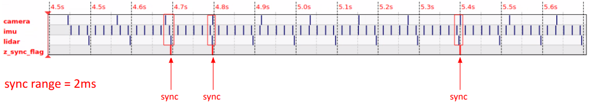
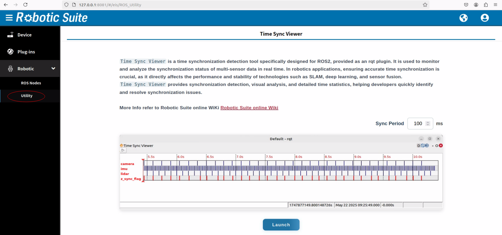
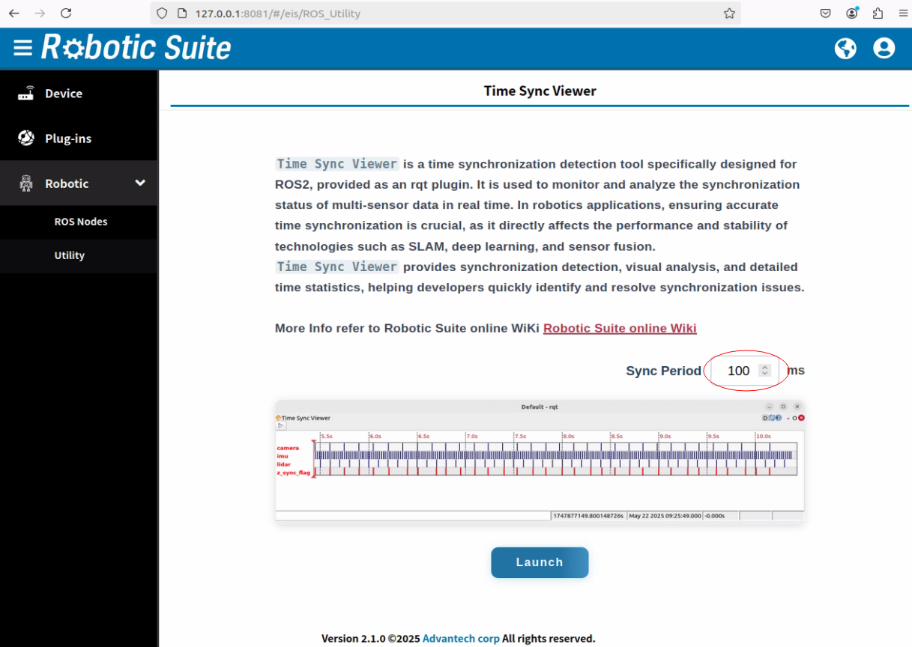
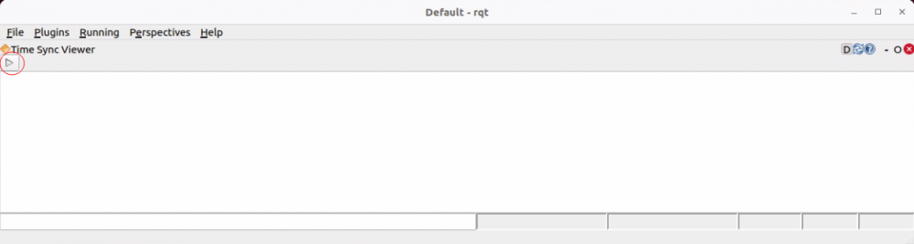
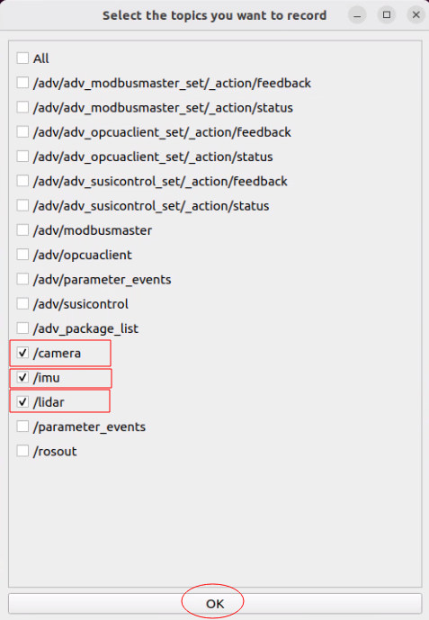
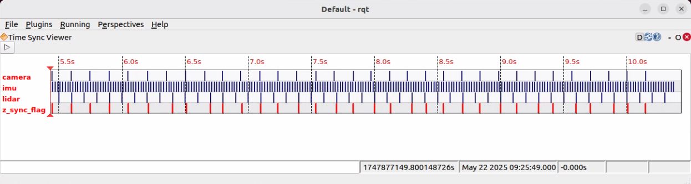

# Time Sync Viewer

Time Sync Viewer is a time synchronization detection tool specifically designed for ROS2, provided as an rqt plugin. It is used to monitor and analyze the synchronization status of multi-sensor data in real time. In robotics applications, ensuring accurate time synchronization is crucial, as it directly affects the performance and stability of technologies such as SLAM, deep learning, and sensor fusion. Time Sync Viewer provides synchronization detection, visual analysis, and detailed time statistics, helping developers quickly identify and resolve synchronization issues.

### Time Synchronization Scope

- **Maintaining a Unified Clock Across Sensors and Compute Units**  
  It's essential to ensure that all sensors and computing components reference and stay synchronized to the same clock source, such as GPS. Several technologies can be used for this purpose:  
  1. **Network Time Protocol (NTP):** A standard protocol for synchronizing clocks over a network.  
  2. **Precision Time Protocol (PTP):** Offers higher accuracy than NTP, making it suitable for industrial and embedded systems.  
  3. **Utilizing Jetson’s NvPPS Module:** The NvPPS module within the Jetson kernel can be leveraged for precise time synchronization. It accepts an external 1PPS (Pulse Per Second) signal—typically from a GPS device connected via a GPIO pin—and uses it to timestamp events. This enables synchronization with other time domains such as the Time Stamp Counter (TSC) or PTP.

- **Timestamping Sensor Data Upon Arrival**  
  It’s important to ensure that every piece of sensor data is assigned a fresh timestamp when it reaches the computing unit. While some systems use an external MCU or FPGA for this purpose, relying solely on such a solution can be risky. It may overlook various latencies introduced during data transmission from the sensor to the compute unit.

- **Ensuring Consistent Data Reception Intervals**  
  Sensor data from different sources should be received by the computing system at consistent and acceptable intervals—for example, every 100 milliseconds. Advantech's Time Sync Viewer in Robotic Suite helps visualize the frequency and distribution of incoming data. If all sensor data is received within the expected 100 ms window, a flag is raised. By monitoring the spacing between these flags, developers can detect anomalies and determine whether adjustments are needed.

### Features and Advantages

- **Multi-Sensor Timestamps Visualization:** Visually displays the timestamps of multiple sensors to help users check data alignment.  
- **Time Synchronization Flag (sync_flag):** Automatically triggers a flag when synchronization conditions are met, providing instant confirmation.  
- **Sensor Check:** Assists users in identifying hardware delays, network jitter, and data loss that may result in incomplete data.  
- **Improved Sensor Fusion:** Enhances data consistency and stability for applications such as SLAM, robotic arms, drones, and AMRs.  

> **Note:** Time Sync Viewer is only supported on Ubuntu 22.04  

---

# GUI Description

**Example Using Camera, IMU, and LiDAR**

1. **Time Axis Display**  
   The image displays the timestamps of different data streams (topics), where each horizontal line represents a topic. Examples include:  
   - camera (camera image)  
   - imu (IMU data)  
   - lidar (LiDAR scan)  
   - z_sync_flag (sync flag)  

2. **Synchronization Range**  
   - In this example, the `sync_range` is set to 2 milliseconds. All data points that arrive within this 2-millisecond window are considered synchronized.  
   - On the time axis, when a synchronization event is triggered, a `sync_flag` is marked. At the moment of triggering, the timestamp of the flag aligns with that of the last received data point. This set of data will not be used for the next synchronization detection.  

3. **Synchronization Analysis**  
   - When all sensor data points fall within the 2-ms range, they are considered synchronized (sync).  
   - The image displays multiple sync points, indicating that at those moments, the sensor data is properly synchronized.  



---

# How to

## Step

**Step 1:** Publish fake sensor data, including camera, IMU, and LiDAR (you can also use actual sensors).  

Terminal 1 – publish camera topic:
```bash
cd /usr/local/Advantech/ros/humble/ros2-timesync-viewer/test/fake_sensor
python3 camera.py
```

Terminal 2 – publish lidar topic:
```bash
cd /usr/local/Advantech/ros/humble/ros2-timesync-viewer/test/fake_sensor
python3 lidar.py
```

Terminal 3 – publish imu topic:
```bash
cd /usr/local/Advantech/ros/humble/ros2-timesync-viewer/test/fake_sensor
python3 imu.py
```

**Step 2:** Enter `127.0.0.1:8081` in a web browser. The account is **root**, the password is **P@ssw0rd**. Run Time Sync Viewer in Web UI, select *Utility* from the list on the left.  



**Step 3:** Set `Sync Period` to a value between 1ms and 2000ms (default: 100ms).  



**Step 4:** Click launch button, then the **Time Sync Viewer** window will open.  


**Step 5:** Click start button.  



**Step 6:** Select the topics that you want to view, then click OK.  



**Result:**  



---

## Note

1. Recommended to reopen the UI after using it for more than 5 hours to avoid lag.  
2. To verify a custom or specialized topic, you must first add a source command for the corresponding environment to the `.bashrc` file. This is a mechanism in ROS2 to ensure that the system loads the correct development environment and package paths, allowing the topic to function properly.  
3. If the Time Sync Viewer UI fails to display, first check whether the current environment's `DISPLAY` parameter is set to `:0`. If not, update the `DISPLAY` variable in `/usr/local/Advantech/E2I/robotic-node-client/run.sh`, save the file, and then rerun the app.  
