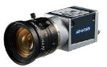
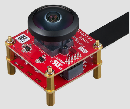
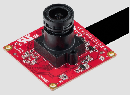
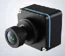

# 2D Camera

| Type | Sensor | Brand | Model | Image | Specification | Interface | Info | Note |
| :--- | :--- | :--- | :--- | :--- | :--- | :--- | :--- | :--- |
| Camera | 2D | Basler | QCAM-UM4024 |  | Resolution: 4024 x 3036, Frame Rate Up to 31 fps Color: Mono CMOS | USB 3.0 | [Official website](https://www.baslerweb.com/) [Official github](https://github.com/basler/pylon-ros-camera) |  |
| Camera | 2D | Basler | QCAM-GM-2440 |  | Resolution: 2448 x 2048 Frame Rate Up to 23 fps Color: Mono CMOS | PoE | [Official website](https://www.baslerweb.com/) [Official github](https://github.com/basler/pylon-ros-camera) |  |
| Camera | 2D | Innodisk | EV2M-GOM1 |  | ../img/Robotic_Suite_EV2M-GOM1.png) | Resolution: 2MP Frame Rate: 30 fps Lens FOV (D / H / V): 230° | MIPI CSI-2 | [Official website](https://www.innodisk.com/cht/products/camera/mipi-csi-2/ev2m-gom1-muca) | * humble_x86:   [camera driver](https://www.advantech.com/zh-tw/support/details/%E9%A9%85%E5%8B%95%E7%A8%8B%E5%BC%8F?id=1-2LWZCX2)   [ros2 node](https://iedgeblob.blob.core.windows.net/iedge-public/ros2-sensor-extension/innodisk_ev2m_oom1/innodisk_ev2m_oom1-node-1.0.0-humble-x64.tar.gz) |
| Camera | 2D | Innodisk | EV2M-OOM1 |  | Resolution: 2.3MP Frame Rate: 60 fps Lens FOV (D / H / V): 104° / 86° / 46° | MIPI CSI-2 | [Official website](https://www.innodisk.com/cht/products/camera/mipi-csi-2/ev2m-oom1-uhca) | * humble_x86:   [camera driver](https://www.advantech.com/zh-tw/support/details/%E9%A9%85%E5%8B%95%E7%A8%8B%E5%BC%8F?id=1-2LWZCX2)   [ros2 node](https://iedgeblob.blob.core.windows.net/iedge-public/ros2-sensor-extension/innodisk_ev2m_oom1/innodisk_ev2m_oom1-node-1.0.0-humble-x64.tar.gz) |
| Camera | 2D | oToBrite | oToCAM222 |  | Waterproof: IP67/IP69K View angle(H): 120.6° | GMSL | [Official website](https://www.otobrite.com/zh-TW/product/automotive-camera/isx021_gmsl2_otocam222-c120m) | * humble_x86:   [camera driver](https://www.advantech.com/zh-tw/support/details/%E9%A9%85%E5%8B%95%E7%A8%8B%E5%BC%8F?id=1-32TMJ6S)   [ros2 node](https://iedgeblob.blob.core.windows.net/iedge-public/ros2-sensor-extension/oToBrite_otocam222/oToBrite_otocam222-node-1.0.0-humble-x64.tar.gz)   * [oneAPI dependencies issus](https://ess-wiki.advantech.com.tw/view/Advantech_Robotic_Suite/Q%26A#oneAPI_package_dependencies_issue) |

