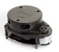
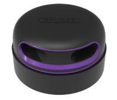
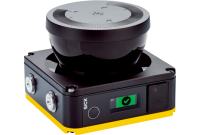
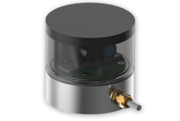

## 2D Lidar

| Type | Sensor | Brand | Model | Image | Specification | Interface | Info | Note |
| :--- | :--- | :--- | :--- | :--- | :--- | :--- | :--- | :--- |
| Lidar | 360 lidar | Slamtec | A1M8 |  | Scan speed: 8 KHz Range: 0.15–6 Meters Horizontal scan angle: 360° Horizontal scan speed: 2-10Hz For SLAM or Navigation | USB | [Official website](https://www.slamtec.com/en/Lidar/A1) [Official github](https://github.com/Slamtec/rplidar_ros) |  |
| Lidar | 360 lidar | Slamtec | A2M12 |  | Scan speed: 8-16 KHz Range: 0.2–16 Meters Horizontal scan angle: 360° Horizontal scan speed: 5-15Hz For SLAM or Navigation | USB | [Official website](https://www.slamtec.ai/home/rplidar_a2/) [Official github](https://github.com/Slamtec/rplidar_ros) |  |
| Lidar | 2D lidar | SICK | NanoScan3 |  | Scanning angle: 275° Protective field range: 3m Warning field range: 10m Response time: ≥70ms | USB | [Official website](https://www.sick.com/tw/en/safety-laser-scanners/safety-laser-scanners/nanoscan3/c/g507056) [Official github](https://github.com/SICKAG/sick_safetyscanners2) |  |
| Lidar | 2D lidar | AOCI | SapphireS_S |  | Horizontal angle: 360° Range: 30m Scanning frequency: 10Hz Angular resolution: 0.5° | Ethernet | [Official website](https://www.asia-optical.com/product_detail_2.php?serial=409&lang=en) | Please contact AOCI for more ROS driver information and assistance. |