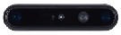

## 3D Camera

| Type | Sensor | Brand | Model | Image | Specification | Interface | Info | Note |
| :--- | :--- | :--- | :--- | :--- | :--- | :--- | :--- | :--- |
| Camera | 3D Stereo | eYs3D | G53 |  | Optimal Range 10cm – 1.5M Depth FOV (H x V) H50 x V32.5 Depth Output Resolution Up to 640 x 400p Frame Rate Up to 30FPS | USB 3.0 | [Official website](https://www.ecapturecamera.com/g53) [Official github](https://github.com/eYs3D/HD-DM-ROS2-SDK-Release) |  |
| Camera | Depth camera | Intel | D435i |  | RGB: 1920×1080 30fps Depth: Up to 1280x720 90fps 6-axis IMU | USB 3.0 | [Official website](https://www.intelrealsense.com/depth-camera-d435i/) [Official github](https://github.com/IntelRealSense/realsense-ros) | [Known issues of realsense camera](Advantech_Robotic_Suite/Q&A#Known_issues_of_realsense_camera) |
| Camera | Depth camera | Intel | D457 |  | RGB: 1280×800 30fps Depth: Up to 1280x720 90fps 6-axis IMU | GMSL | [Official website](https://www.intelrealsense.com/depth-camera-d457/) [Official github](https://github.com/IntelRealSense/realsense-ros) | * humble_x86:   [camera driver](https://www.advantech.com/zh-tw/support/details/%E9%A9%85%E5%8B%95%E7%A8%8B%E5%BC%8F?id=1-32TMJ6S) |
| Camera | 3D Stereo | Orbbec | gemini-335l |  | RGB: 1280x800 60fps Depth: 1280x800 30fps Depth Range: *0.17 - 20m+ (Optimal Range: 0.5 - 6m) | USB 3.0 | [Official website](https://www.orbbec.com/products/stereo-vision-camera/gemini-335l/) [Official github](https://github.com/orbbec/OrbbecSDK_ROS2) |  |