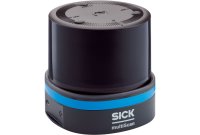

## 3D Lidar

| Type | Sensor | Brand | Model | Image | Specification | Interface | Info | Note |
| :--- | :--- | :--- | :--- | :--- | :--- | :--- | :--- | :--- |
| Lidar | 3D lidar | SICK | MultiScan |  | Horizontal angle: 360° Range: 60m Scanning frequency: 20Hz Angular resolution: 0.125° | USB | [Official website](https://www.sick.com/tw/en/lidar-sensors/3d-lidar-sensors/multiscan100/c/g574914) [Official github](https://github.com/SICKAG/sick_scan_xd) |  |