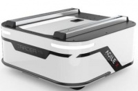
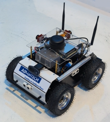

## AGV

| Type | Brand | Model | Image | Specification | Interface | Info | Note |
| :--- | :--- | :--- | :--- | :--- | :--- | :--- | :--- |
| AGV | playrobot | TRACER MINI |  | Size: 380*380*182mm Wheelbase: 245mm weight:18~20Kg weight capacity: 80Kg battery endurance:12hr Charging time: 4hr Voltage: 24V Maximum speed: 6KM/H | CAN bus RS232 | [Official website](https://shop.playrobot.com/products/amr-tracer-mini) |  |
| AGV | playrobot | 科研機器人 |  | Size: 445x331x184mm Wheelbase: weight: 11Kg weight capacity: battery endurance: Charging time: Voltage: Maximum speed: | CAN bus RS232 | [Official website](https://shop.playrobot.com/products/ros2) |  |