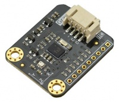
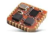

## IMU

| Type | Sensor | Brand | Model | Image | Specification | Interface | Info | Note |
| :--- | :--- | :--- | :--- | :--- | :--- | :--- | :--- | :--- |
| IMU | 9-axis imu | Bosch | Bno055 |  | 16bit Gyroscope ±2g/±4g/±8g/±16 14bit Accelerometer ±125°/s~2000°/s Magnetometer ±1300uT(x-,y-axis);±2500uT(z-axis) Temperature sensor 0℃~65℃ | USB | [Official website](https://www.bosch-sensortec.com/products/smart-sensors/bno055/) [Unofficial github](https://github.com/flynneva/bno055) |  |
| IMU | 9-axis imu | Xsens | MTi-320-3A |  | Gyro ±2000°/s Acc ±16g, Mag ±8G Roll/Pitch 0.5° Temp -40~85°C | RS232 | [Official website](https://www.movella.com/products/sensor-modules/xsens-mti-320) [official github](https://github.com/xsenssupport/Xsens_MTi_ROS_Driver_and_Ntrip_Client/tree/ros2) |  |
| IMU | 9-axis imu | Xsens | MTi-3-5A-T |  | Gyro ±2000°/s Acc ±16g, Mag ±8G Roll/Pitch 0.5°, Yaw 2° Temp -40~85°C | UART/SPI/I2C | [Official website](https://www.movella.com/products/sensor-modules/xsens-mti-3-ahrs) [official github](https://github.com/xsenssupport/Xsens_MTi_ROS_Driver_and_Ntrip_Client/tree/ros2) |  |
