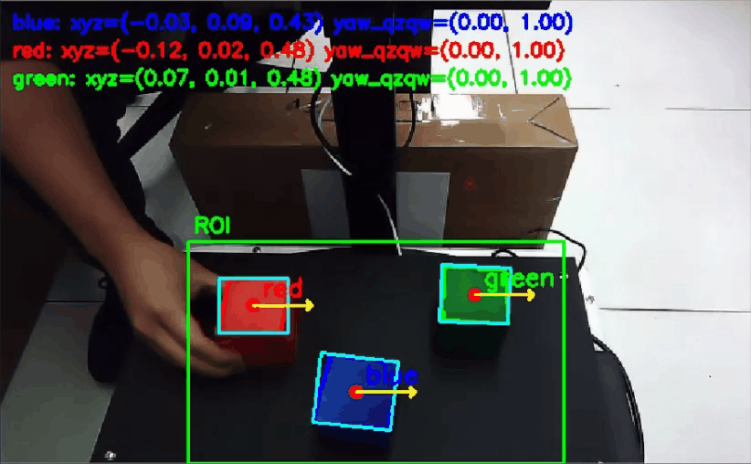
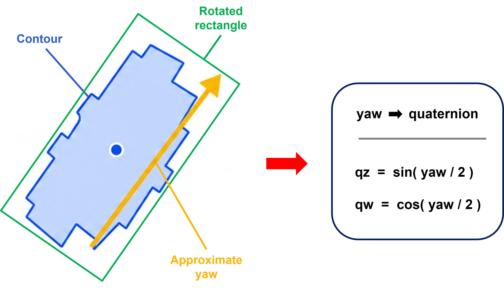

# Color Block Detection & Position Estimation

This sample demonstrates how to detect colored blocks from an RGB-D camera and estimate their 3D position in the camera coordinate frame.

It is designed as the next step after **Color Profile Creation**. The previous tool creates HSV color profiles and saves them into `color_profiles.json`. This detector loads those HSV profiles, finds matching color regions in the RGB image, reads aligned depth data around each detected block center, and converts the 2D image position into a 3D position.

<p align="center">
  
</p>

> [!NOTE]
> This is a teaching-oriented sample. The current implementation publishes the result as an `AprilTagDetectionArray` message for compatibility with existing downstream workflows. The detected object is a color block, not a real AprilTag.

---

## Overview

The detector performs the following steps:

```text
RGB Image + Aligned Depth Image + CameraInfo
        |
        v
Load HSV profiles from color_profiles.json
        |
        v
Convert BGR image to HSV
        |
        v
Create color mask from HSV ranges
        |
        v
Apply ROI and contour filtering
        |
        v
Find block center in image coordinates
        |
        v
Read median depth around the center point
        |
        v
Convert pixel + depth to 3D camera-frame position
        |
        v
Estimate approximate 2D yaw from the contour
        |
        v
Publish debug image and detection result
```

---

## What you will learn

After reading and running this sample, you will understand how to:

- Load HSV color profiles from a JSON file.
- Detect a selected color block using OpenCV color thresholding.
- Use `cv2.inRange()` to create a binary mask.
- Use `cv2.findContours()` to find candidate block regions.
- Filter detection results using ROI, contour area, and depth range.
- Use aligned depth data to estimate object distance.
- Use camera intrinsics from `CameraInfo` to convert image coordinates into 3D coordinates.
- Estimate an approximate yaw angle from a rotated rectangle.
- Publish a debug image and detection result for downstream robot-arm planning.

---

## Relationship with Color Profile Creation

This sample depends on the output of the previous tool:

```text
Color Profile Creation
        |
        v
color_profiles.json
        |
        v
Color Block Detection & Position Estimation
```

Expected JSON format:

```json
{
  "profiles": {
    "blue": {
      "ranges": [
        {
          "lower": [95, 80, 60],
          "upper": [125, 255, 255]
        }
      ],
      "created_from": {
        "rgb_topic": "/camera/color/image_raw",
        "samples": 8
      }
    }
  }
}
```

Each profile contains one or more HSV ranges. Multiple ranges are useful for colors such as red, where the hue value may wrap around the OpenCV hue boundary near `0 / 180`.

The detector automatically reloads `color_profiles.json` when the file modification time changes. This means you can update the profile file and continue testing without restarting the node.

---

## Why HSV is used here

The detector does not compare raw RGB values directly. Instead, it converts the camera image to HSV and applies HSV thresholds from `color_profiles.json`.

HSV is useful because it separates color information from brightness:

| Channel | Meaning | Why it helps |
| --- | --- | --- |
| H | Hue / color type | Helps identify the main color, such as red, green, blue, or yellow. |
| S | Saturation / color purity | Helps reject gray, white, or weak-color regions. |
| V | Value / brightness | Helps handle bright and dark regions of the same object. |

OpenCV uses the following HSV ranges:

```text
H: 0 to 180
S: 0 to 255
V: 0 to 255
```

This is different from many online HSV tools, where Hue is often shown as `0 to 360` degrees.

---

## Main processing flow

### 1. Subscribe to RGB, depth, and camera information

The node subscribes to three input topics:

| Input | Default topic | Purpose |
| --- | --- | --- |
| RGB image | `/camera/color/image_raw` | Used for color detection. |
| Aligned depth image | `/camera/aligned_depth_to_color/image_raw` | Used to estimate distance. |
| CameraInfo | `/camera/color/camera_info` | Used to get camera intrinsics. |

The depth image should be aligned to the RGB image. This means the RGB pixel coordinate and depth pixel coordinate should refer to the same scene point.

---

### 2. Load the target color profile

The node loads HSV ranges from:

```text
./color_profiles.json
```

By default, the target profile is:

```text
blue
```

The target color can be changed by ROS 2 parameter:

```bash
-p target_color:=green
```

The node also supports:

```bash
-p target_color:=all
```

When `target_color` is set to `all`, the detector loads all profiles from the JSON file and tries to detect all configured colors.

---

### 3. Convert BGR image to HSV

OpenCV images are handled in BGR format. The detector converts the image to HSV before applying the color profile:

```python
hsv = cv2.cvtColor(bgr_for_detection, cv2.COLOR_BGR2HSV)
```

Then each HSV range is applied with:

```python
mask = cv2.inRange(hsv, lower, upper)
```

If a profile contains multiple ranges, the masks are merged using bitwise OR.

---

### 4. Apply ROI filtering

The detector applies a configurable region of interest in normalized image coordinates:

```text
roi_x_min, roi_x_max
roi_y_min, roi_y_max
```

Default ROI:

```text
x = 20% to 80% of image width
y = 48% to 100% of image height
```

<p align="center">
  
</p>

Only pixels inside this ROI are used for detection. This is useful for a robot-arm demo where blocks are placed on a table in a known working area.

The debug image draws the same ROI used by the algorithm, so users can clearly see where detection is active.

---

### 5. Find color regions

After creating the mask and applying the ROI, the node uses contours to find connected color regions:

```python
contours, _ = cv2.findContours(mask, cv2.RETR_EXTERNAL, cv2.CHAIN_APPROX_SIMPLE)
```

Small regions are ignored using:

```text
min_contour_area
```

This helps remove noise and tiny false-positive regions.

In `target_color:=all` mode, the detector also tracks used mask regions to reduce duplicated detections across different color profiles.

---

### 6. Estimate the block center

For each valid contour, the detector computes image moments and uses the contour center as the block center:

```text
u = center x in image coordinates
v = center y in image coordinates
```

The center point is drawn on the debug image.

---

### 7. Read depth around the center point

Instead of using only one depth pixel, the node reads a small patch around the center point:

```text
depth_patch_radius = 2
```

This means the default patch size is:

```text
5 x 5 pixels
```

It filters invalid depth values and uses the median depth value.

This is more stable than using a single depth pixel, because depth images can contain noise or missing values.

The accepted depth range is configurable:

```text
depth_min_m = 0.30
depth_max_m = 0.60
```

A detected block is ignored if its depth is outside this range.

---

### 8. Convert pixel and depth to 3D position

<p align="center">
  
</p>

The detector uses the camera intrinsics from `CameraInfo`:

```text
fx, fy, cx, cy
```

Then it converts the center pixel and depth into 3D camera-frame coordinates:

```text
X = (u - cx) * Z / fx
Y = (v - cy) * Z / fy
Z = depth
```

Where:

| Symbol | Meaning |
| --- | --- |
| `u` | Pixel x coordinate |
| `v` | Pixel y coordinate |
| `Z` | Depth in meters |
| `fx`, `fy` | Camera focal length |
| `cx`, `cy` | Camera optical center |

The output position is in the camera coordinate frame.

The published pose also adds a small configurable Z offset:

```text
pose_z_offset_m = 0.03
```

This can be useful when the target pose should be slightly above the measured block surface.

---

### 9. Estimate approximate 2D yaw

The node estimates an approximate 2D yaw angle from the detected contour using:

```python
rect = cv2.minAreaRect(contour)
```

This creates a rotated rectangle around the contour. The yaw angle is estimated from the long side of that rectangle.

This is useful for teaching the idea of orientation estimation, but it is not a replacement for a full 6D object pose estimator.

The yaw angle is converted into a yaw-only quaternion:

```text
qx = 0
qy = 0
qz = sin(yaw / 2)
qw = cos(yaw / 2)
```

<p align="center">
  
</p>

---

### 10. Publish debug image and detection result

The node publishes:

| Output | Default topic | Purpose |
| --- | --- | --- |
| Debug image | `/color_block/debug_image` | Shows ROI, contours, center points, rotated boxes, yaw arrows, and estimated position text. |
| Detection result | `/tag_detections` | Publishes detected block pose using `AprilTagDetectionArray`. |

The output parameter is named:

```text
detection_topic
```

The default topic is still `/tag_detections` for compatibility with existing workflows.

---

## How to run

### 1. Prepare a color profile

Run the Color Profile Creation tool first and save a profile file:

```text
color_profiles.json
```

Make sure the profile name matches the target color used by this detector, for example:

```text
blue
```

---

### 2. Start the RGB-D camera

Start your camera driver and make sure the following topics are available:

```bash
ros2 topic list
```

Expected topics:

```text
/camera/color/image_raw
/camera/aligned_depth_to_color/image_raw
/camera/color/camera_info
```

---

### 3. Run the detector

Example:

```bash
python3 ros2_color_block_detector.py \
  --ros-args \
  -p rgb_topic:=/camera/color/image_raw \
  -p depth_topic:=/camera/aligned_depth_to_color/image_raw \
  -p camera_info_topic:=/camera/color/camera_info \
  -p profile_file:=./color_profiles.json \
  -p target_color:=blue
```

To detect all configured color profiles:

```bash
python3 ros2_color_block_detector.py \
  --ros-args \
  -p profile_file:=./color_profiles.json \
  -p target_color:=all
```

To adjust the detection ROI:

```bash
python3 ros2_color_block_detector.py \
  --ros-args \
  -p profile_file:=./color_profiles.json \
  -p target_color:=blue \
  -p roi_x_min:=0.20 \
  -p roi_x_max:=0.80 \
  -p roi_y_min:=0.48 \
  -p roi_y_max:=1.00
```

To adjust the valid depth range:

```bash
python3 ros2_color_block_detector.py \
  --ros-args \
  -p profile_file:=./color_profiles.json \
  -p target_color:=blue \
  -p depth_min_m:=0.30 \
  -p depth_max_m:=0.60
```

---

## ROS 2 parameters

| Parameter | Default value | Description |
| --- | --- | --- |
| `rgb_topic` | `/camera/color/image_raw` | RGB image input topic. |
| `depth_topic` | `/camera/aligned_depth_to_color/image_raw` | Aligned depth image input topic. |
| `camera_info_topic` | `/camera/color/camera_info` | Camera intrinsics input topic. |
| `debug_image_topic` | `/color_block/debug_image` | Debug image output topic. |
| `detection_topic` | `/tag_detections` | Detection result output topic. |
| `target_color` | `blue` | Target color profile name. Use `all` to detect all profiles. |
| `profile_file` | `./color_profiles.json` | Path to the HSV profile JSON file. |
| `depth_unit` | `mm` | Depth image unit. Use `mm` for millimeters or `m` for meters. |
| `depth_min_m` | `0.30` | Minimum valid depth in meters. |
| `depth_max_m` | `0.60` | Maximum valid depth in meters. |
| `depth_patch_radius` | `2` | Radius of the depth patch around the center point. `2` means a `5 x 5` patch. |
| `min_contour_area` | `1000.0` | Minimum contour area used to filter small noise. |
| `roi_x_min` | `0.20` | ROI left boundary, normalized by image width. |
| `roi_x_max` | `0.80` | ROI right boundary, normalized by image width. |
| `roi_y_min` | `0.48` | ROI top boundary, normalized by image height. |
| `roi_y_max` | `1.00` | ROI bottom boundary, normalized by image height. |
| `output_frame_id` | `camera_link` | Frame ID used in the published detection header. |
| `pose_z_offset_m` | `0.03` | Z offset added to the published pose position. |
| `enable_preprocess` | `false` | Enables optional image preprocessing for difficult . |
| `process_period_s` | `0.05` | Processing timer period in seconds. |

---

## Visualizing the result

You can view the debug image with `rqt_image_view`:

```bash
rqt_image_view /color_block/debug_image
```

The debug image shows:

- Detection ROI.
- Color contours.
- Detected color name.
- Center point of the block.
- Rotated rectangle around the contour.
- Yaw direction arrow.
- Estimated 3D position.

---

## Example output concept

The detector publishes a message to the configured `detection_topic`.

Conceptually, each detection contains:

```text
color name
image center point
2D rotated box corners
3D position: X, Y, Z
orientation: yaw-only quaternion
```

The current implementation stores the color profile name in:

```text
det.family
```

For example:

```text
family: blue
pose.position.x: X
pose.position.y: Y
pose.position.z: Z + pose_z_offset_m
pose.orientation.z: qz
pose.orientation.w: qw
```

---

## Troubleshooting

### No block is detected

Check:

- The `target_color` matches a profile name in `color_profiles.json`.
- The profile file path is correct.
- The block is inside the ROI.
- The contour area is larger than `min_contour_area`.
- The block is inside the valid depth range.
- The lighting conditions is similar to the one used during profile creation.

---

### The debug image shows `WAITING FOR DEPTH`

This means the RGB image is received, but the depth image is not ready yet.

Check:

```bash
ros2 topic echo /camera/aligned_depth_to_color/image_raw --once
```

Also make sure the depth topic is aligned to the RGB image.

---

### The debug image shows `WAITING FOR CAMERA INFO`

This means the node has not received camera intrinsics yet.

Check:

```bash
ros2 topic echo /camera/color/camera_info --once
```

---

### The debug image shows `NO VALID COLOR PROFILE`

This usually means the profile file cannot be loaded or the target profile does not exist.

Check:

- The `profile_file` path.
- The JSON format.
- The `target_color` name.
- The top-level JSON field is named `profiles`.

---

### The position looks incorrect

Check:

- The depth unit is correct.
- The camera info topic matches the RGB camera.
- The depth image is aligned to the color image.
- The block center is not on an invalid or missing depth pixel.
- The target block is within `depth_min_m` and `depth_max_m`.

---

### Too many false detections

Try:

- Re-create the HSV color profile under the current lighting condition.
- Increase `min_contour_area`.
- Use a cleaner background.
- Reduce the HSV margins in the color profile.
- Limit detection to a smaller ROI.
- Try `enable_preprocess:=true` if lighting is difficult.

---

## Notes for teaching

This sample is useful for explaining the perception part of a robot-arm workflow:

```text
Color Profile
    -> HSV Color Detection
    -> Contour Filtering
    -> Center Point Estimation
    -> Depth Lookup
    -> 3D Position Estimation
    -> Approximate Orientation Estimation
    -> Robot Arm Planning
```

It is intentionally simple and easy to modify. For more advanced use cases, you may want to add:

- Better synchronization between RGB and depth images.
- Morphological operations for mask cleanup.
- More robust contour filtering.
- A custom detection message instead of `AprilTagDetectionArray`.
- Full 6D pose estimation.
- TF transform from camera frame to robot base frame.

---

## Next step

The estimated 3D position and yaw orientation can be sent to a motion-planning module such as MoveIt.

In a robot-arm demo, this allows the system to:

1. Detect the requested color block.
2. Estimate the block pose.
3. Send the target pose to the planner.
4. Move the robot arm to pick or stack the block.
