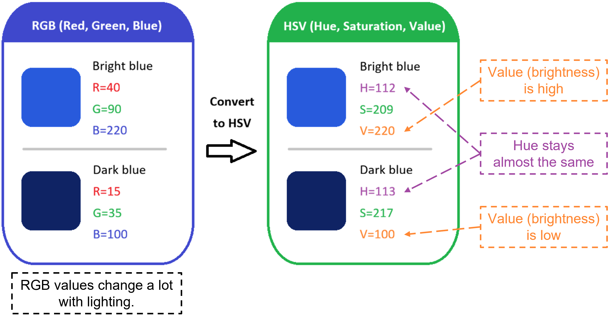

# Color Profile Creation

This tutorial shows how to create an HSV color profile from a live RGB camera stream.
The generated profile can be reused by a color-based detection program, such as **Color Block Detection & Position Estimation**.

A color profile describes the HSV range of a target color. For example, it can describe the color range of a red, green, or blue block under the current lighting conditions.

<p align="center">
  
</p>

# Overview

In a robot arm block-stacking application, the system needs to detect the target block before it can estimate the block position and plan the arm motion.

This tutorial focuses on the first step: **creating a color profile**.

The tool opens a camera image in an OpenCV window. The user clicks several points on the target color block. The program collects HSV samples from the clicked areas, calculates one or more HSV ranges, and saves the result to a JSON file.

The saved JSON file can then be used by the next module to detect the block color in real time.

# What you will learn

After completing this tutorial, you will understand how to:

* Receive an RGB image from a ROS 2 image topic
* Select target color samples from a live camera image
* Understand why HSV is preferred over RGB for simple color thresholding
* Convert image pixels from BGR to HSV color space
* Generate an HSV threshold range from multiple samples
* Save the HSV range as a reusable JSON color profile
* Use the profile as input for a later color block detection pipeline

# Concept

Color Profile Creation converts a human-selected target color into parameters that a program can use.

The basic workflow is:

1. Start a camera node that publishes a color image topic.
2. Run the color profile picker.
3. Click several points on the target color block.
4. Convert the clicked image patches from BGR to HSV, so color and brightness can be handled more clearly.
5. Estimate the HSV range of the selected color.
6. Save the HSV range to `color_profiles.json`.
7. Reuse the profile in the color detection program.

# Why HSV?

Many users may first think about detecting colors directly in RGB. However, RGB is not ideal for simple color thresholding because color and brightness are mixed together.

For example, the same blue block can have very different RGB values when the lighting changes:

```text
Bright blue area: R=40,  G=90,  B=220
Dark blue area:   R=15,  G=35,  B=100
```

Both pixels are still blue to a human, but the RGB numbers are very different. If we only use RGB thresholds, the detection range often becomes hard to tune. It may miss the target in shadows, or it may include background pixels under different lighting.

HSV is easier to understand for this task because it separates color information into three parts:

| Channel | Meaning | Why it is useful |
| --- | --- | --- |
| `H` Hue | The main color type, such as red, green, or blue | Useful for selecting the target color |
| `S` Saturation | How strong or pure the color is | Helps reject gray, white, or weak-color regions |
| `V` Value | How bright or dark the pixel is | Helps tolerate shadows and lighting changes |

For color block detection, we usually care most about the **Hue** value. Then we use **Saturation** and **Value** ranges to remove weak colors, shadows, or background noise.

<p align="center">
  
</p>

This is why this tool converts the clicked image patch from BGR to HSV before creating the profile. The generated profile stores HSV lower and upper bounds, which can later be used with OpenCV `cv2.inRange()` for fast color segmentation.

> [!NOTE]
> HSV does not completely solve all lighting problems. Strong reflection, very dark images, automatic exposure changes, or similar background colors can still affect detection. For better results, create the profile under the same lighting conditions as the real robot demo.

OpenCV uses the following HSV value ranges:

```text
Hue:        0 to 180
Saturation: 0 to 255
Value:      0 to 255
```

This is different from the common Hue range of 0 to 360 degrees. When using OpenCV, always remember that Hue is scaled to 0 to 180.

# File

This tutorial uses the following script:

```text
color_profile_creation.py
```

The script is an interactive ROS 2 tool. It subscribes to a color image topic and displays the image in an OpenCV window.

# Prerequisites

Before running this tutorial, make sure the following items are available:

* ROS 2 environment
* A camera node that publishes `sensor_msgs/msg/Image`
* Python 3
* OpenCV for Python
* NumPy
* `cv_bridge`

You should also confirm that the RGB image topic is available:

```bash
ros2 topic list
```

The default topic used by this tool is:

```text
/camera/color/image_raw
```

# Run the tutorial

Navigate to the Color Profile Creation folder:

```bash
cd development_utilities/core_techniques/color_profile_creation
```

Run the tool with the default settings:

```bash
python3 color_profile_creation.py
```

Or run it with explicit parameters:

```bash
python3 color_profile_creation.py \
  --ros-args \
  -p rgb_topic:=/camera/color/image_raw \
  -p profile_file:=./color_profiles.json \
  -p profile_name:=blue \
  -p note:="blue block under lab lighting"
```

When the program starts, an OpenCV window will appear.

# User controls

| Control | Description |
| --- | --- |
| Left mouse click | Collect one HSV sample from the clicked image patch |
| `s` | Save the current color profile to JSON |
| `c` | Clear all collected samples |
| `q` | Quit the tool |

Recommended usage:

1. Click multiple points on the target color block.
2. Include bright areas, dark areas, and different viewing angles.
3. Check the HSV range shown on the image.
4. Press `s` to save the profile.

> [!TIP]
> Collect at least three samples for a more stable profile. More samples usually make the profile more tolerant to lighting changes.

# Parameters

The tool can be configured with ROS 2 parameters.

| Parameter | Default value | Description |
| --- | --- | --- |
| `rgb_topic` | `/camera/color/image_raw` | ROS 2 image topic used as the RGB camera input |
| `profile_file` | `./color_profiles.json` | Output JSON file path |
| `profile_name` | `blue` | Name of the color profile to save |
| `note` | `""` | Optional note stored in the JSON file |
| `patch_radius` | `4` | Half-size of the clicked patch in pixels. `4` means a 9x9 patch |
| `h_margin` | `10` | Extra tolerance added to Hue |
| `s_margin` | `40` | Extra tolerance added to Saturation |
| `v_margin` | `40` | Extra tolerance added to Value |
| `use_percentiles` | `True` | Use percentiles instead of min/max when enough samples are available |
| `low_percentile` | `10.0` | Lower percentile used for robust range estimation |
| `high_percentile` | `90.0` | Upper percentile used for robust range estimation |

Example: create a red profile and save it to a custom file:

```bash
python3 color_profile_creation.py \
  --ros-args \
  -p profile_name:=red \
  -p profile_file:=./my_color_profiles.json
```

# Input and output

## Input

The input is a live ROS 2 RGB image topic:

```text
sensor_msgs/msg/Image
```

The image is converted to OpenCV BGR format internally for display and processing.

## Output

The output is a JSON file containing one or more HSV color profiles.

Example output:

```json
{
  "profiles": {
    "blue": {
      "ranges": [
        {
          "lower": [90, 80, 80],
          "upper": [130, 255, 255]
        }
      ],
      "created_from": {
        "rgb_topic": "/camera/color/image_raw",
        "note": "blue block under lab lighting",
        "samples": 8
      }
    }
  }
}
```

Each profile contains:

* `ranges`: HSV lower and upper bounds used for color thresholding
* `created_from`: metadata about how the profile was created
* `samples`: number of clicked samples used to generate the profile

> [!NOTE]
> The values above are only an example. The actual HSV range depends on the camera, lighting condition, object material, and environment.

# How it works

## 1. Receive the camera image

The tool subscribes to the configured ROS 2 image topic and converts the image to OpenCV BGR format.

## 2. Collect HSV samples

The camera image is received as an RGB image topic and converted to OpenCV BGR format for display. When the user clicks on the image, the selected patch is converted from BGR to HSV before sampling.

The tool does not use only one pixel. Instead, it samples a small patch around the clicked point.

For example, when `patch_radius` is `4`, the tool uses a 9x9 pixel patch.

The median HSV value of the patch is used as one sample. This makes the sample more stable against image noise and small highlights.

## 3. Estimate the HSV range

After collecting multiple samples, the tool estimates the HSV range of the selected color.

If `use_percentiles` is enabled and enough samples are available, the tool uses percentile values to reduce the effect of outlier samples.

Then it adds margins:

```text
Hue range        +/- h_margin
Saturation range +/- s_margin
Value range      +/- v_margin
```

This creates a more tolerant profile for real camera images.

## 4. Handle Hue wrap-around

OpenCV uses the following HSV ranges:

```text
Hue:        0 to 180
Saturation: 0 to 255
Value:      0 to 255
```

Hue is circular. Some colors, especially red, may appear near both ends of the Hue range.

For example, a red profile may need two ranges:

```json
"ranges": [
  {"lower": [0, 120, 80], "upper": [10, 255, 255]},
  {"lower": [170, 120, 80], "upper": [180, 255, 255]}
]
```

The tool handles this case automatically when the computed Hue range crosses the 0/180 boundary.

## 5. Save the profile

Press `s` to save the current profile to the JSON file.

If the JSON file already exists, the new profile will be added to the same file. If a profile with the same `profile_name` already exists, it will be overwritten.

# How to use the generated profile

The generated JSON file can be loaded by the next module, such as **Color Block Detection & Position Estimation**.

A typical detection flow is:

1. Load `color_profiles.json`.
2. Select the target profile, for example `blue`.
3. Convert the live camera image to HSV.
4. Apply each HSV range with `cv2.inRange()`.
5. Combine the masks if the profile has multiple ranges.
6. Find the color block from the mask.
7. Estimate the block position using image coordinates and depth information.
8. Send the estimated pose to the robot planning module.

# Tips for better profiles

* Create the profile under the same lighting conditions as the real demo.
* Avoid strong reflection on the object surface.
* Click both bright and dark regions of the target object.
* Click different sides or angles of the object if the color changes with lighting.
* Use different profile names for different colors, such as `red`, `green`, and `blue`.
* Save different profiles for different environments if the lighting changes a lot.
* If detection is too strict, increase `h_margin`, `s_margin`, or `v_margin` slightly.
* If detection includes too much background, reduce the margins or collect better samples.

# Troubleshooting

## No image is shown

Check that the camera node is running and that the image topic name is correct.

```bash
ros2 topic list
ros2 topic echo /camera/color/image_raw --once
```

Then run the tool again with the correct topic:

```bash
python3 color_profile_creation.py \
  --ros-args \
  -p rgb_topic:=<your_rgb_topic>
```

## The saved profile cannot detect the object well

Try the following actions:

* Collect more samples from the target object.
* Recreate the profile under the same lighting conditions as the robot demo.
* Adjust `h_margin`, `s_margin`, and `v_margin`.
* Make sure the camera exposure is stable.

## Too much background is detected

Try the following actions:

* Reduce the HSV margins.
* Avoid clicking background pixels.
* Use a cleaner background during profile creation.
* Recreate the profile with samples only from the target object.

# Reusable concept

This tutorial is not limited to color blocks. The same idea can be reused in other robotics applications that need simple color-based object detection.

For example, you can use this method to detect:

* Colored blocks
* Buttons or markers
* Product labels
* Visual guides for robot manipulation
* Simple inspection targets

By separating color profile creation from object detection, users can tune the color settings once and reuse them across multiple applications.

# Next step

After creating the color profile, continue to:

```text
Color Block Detection & Position Estimation
```

That module uses the generated HSV profile to detect the target block and estimate its position for robot arm manipulation.
