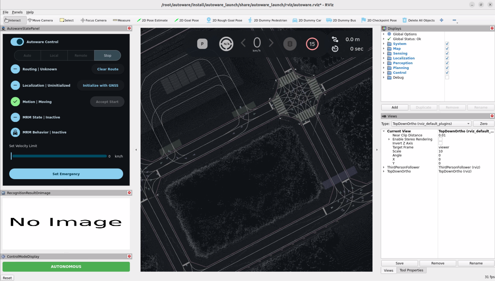

# Autoware

<p align="center">
  
</p>

This document describes the **Autoware development container**.
It helps users quickly run Autoware Universe on Advantech platforms and extend the same framework to build their own autonomous driving applications.

> [!NOTE]
> - When running an example for the first time, it may automatically download/install required resources (e.g., maps, datasets, dependencies). This is expected and may take longer.

> [!TIP]
> **Version Information (Default Environment)**
> - Autoware: **Universe v1.5.0**
> - ROS 2: **Humble**

---

## 1. Autoware Overview

**Autoware** is an open-source software stack for autonomous driving built on ROS 2.
It provides a modular architecture that includes perception, localization, planning, and control components required for autonomous vehicle systems.

The Autoware Universe project is the modern ROS 2-based implementation maintained by the Autoware Foundation and community. It integrates many robotics and autonomous driving algorithms, enabling developers to build and evaluate autonomous driving pipelines. 

Typical Autoware modules include:
* Sensing – sensor drivers and data acquisition
* Perception – object detection, tracking, and environment understanding
* Localization – vehicle pose estimation using LiDAR, GNSS, or maps
* Planning – behavior and motion planning
* Control – vehicle control commands 

On GPU-enabled or high-performance edge platforms, Autoware is often deployed using containerized environments to ensure reproducibility and simplify dependency management.

---

## 2. Why Use This Package (Benefits & What Autoware development containe Provides)

Autoware development containe provides a ready-to-use Autoware development environment packaged inside a container.

It enables users to quickly validate Autoware capabilities and develop their own autonomous driving applications on Advantech platforms.

Key benefits:
- Quick platform validation: Run Autoware demos quickly to verify that perception, localization, and planning pipelines work on the platform.
- Containerized development workflow: Provides a consistent environment for Autoware development and testing.
- Reduced setup complexity: Avoid manual installation of large Autoware dependencies.
- Extensible framework: Developers can easily integrate their own datasets, sensors, or algorithms.
- Easier maintenance and updates: Container-based deployment makes version control and updates more manageable.

Reference:
- Autoware Documentation: https://autowarefoundation.github.io/autoware-documentation/
---

## 3. Location and Folder Structure

> [!NOTE]
> **Make sure your target system satisfies the following conditions:**
> - Advantech platforms
> - At least 35 GB free disk space (Autoware datasets and maps can be large)
> - An active Internet connection is required
> - Use the English language environment in Ubuntu OS

After selecting and installing **Autoware Development Environment** Function by following the instructions in the installer instructions, you can find the package at:

- Autoware Kit root:
  -  `/usr/local/Advantech/ros/container/ros-demokit/autoware_container`

- Initialization:
  - `./launch.sh autoware_humble`

- Launch entry:
  - `docker exec -it autoware_humble bash`
---

## 4. Usage: Enter the development environment

### Overview

```text
User
  │
  ▼
(first run) launch.sh autoware_humble: download/install required assets & dependencies
  │
  ▼
docker exec -it autoware_humble bash: enter the container
  │
  ▼
Docker Container (Autoware Development Environment)
  │
  └─ Develop
```
The quick start Autoware Planning Simulation:  

```bash
source /opt/ros/humble/setup.bash && source ~/autoware/install/setup.bash
ros2 launch autoware_launch planning_simulator.launch.xml map_path:=$HOME/autoware_map/sample-map-planning vehicle_model:=sample_vehicle sensor_model:=sample_sensor_kit
```  

You will see the Autoware Planning Simulation start automatically:
<p align="center">
  
</p>

For more detailed features and functionality, please refer to the official [Autoware documentation](https://github.com/autowarefoundation/autoware).


