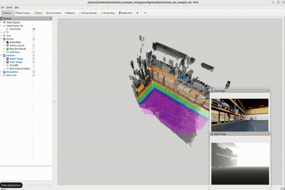
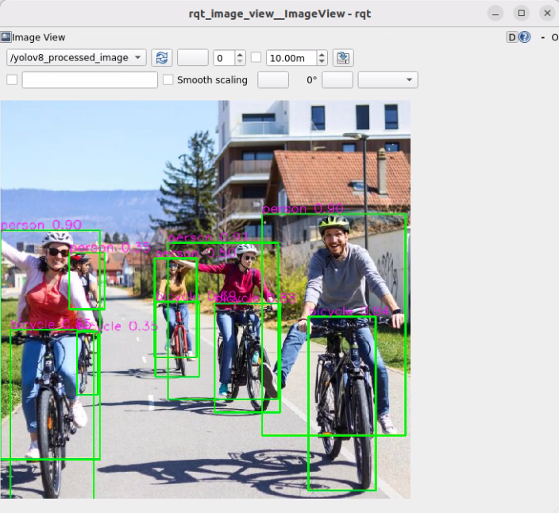
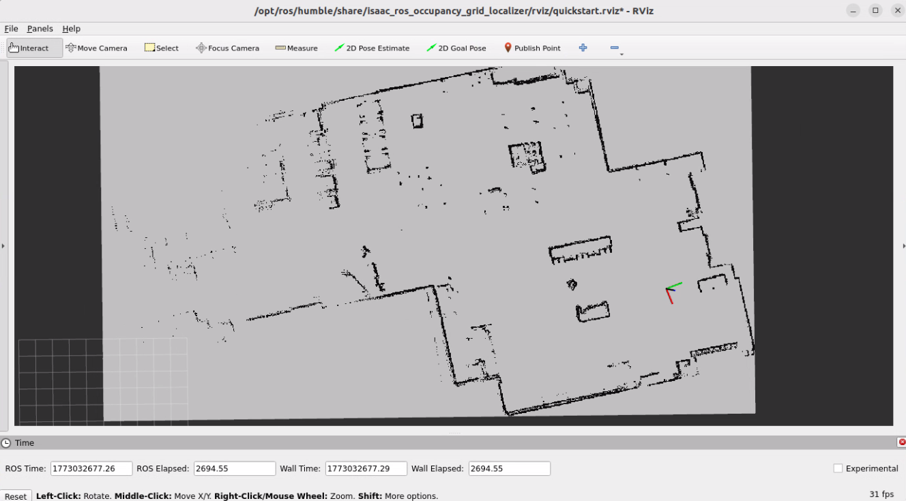

# ISAAC ROS (Advantech Isaac ROS Kit)

This document describes the **isaac_ros_base / Isaac ROS container development and demo framework** we provide. It helps users quickly run NVIDIA Isaac ROS official examples on Advantech platforms, and extend the same framework to build their own applications (apps).

> [!NOTE]
> - When running an example for the first time, it may automatically download/install required resources (e.g., models, datasets, dependencies). This is expected and may take longer.

> [!TIP]
> **Version Information (Default Environment)**
> - Isaac ROS: **v3.2 (release-3.2)**
> - ROS 2: **Humble**

---

## 1. Isaac ROS Overview

**NVIDIA Isaac ROS** is a set of GPU-accelerated packages built on **ROS 2**, providing optimized algorithms and nodes for common robotics workflows such as perception, localization, mapping, and vision inference (e.g., Visual SLAM, Nvblox 3D reconstruction, object detection, and segmentation).

On Jetson/GPU platforms, Isaac ROS is typically delivered via **Docker containers** to provide a consistent runtime environment, reducing dependency and version-compatibility issues so developers can focus on integration and application development.

---

## 2. Why Use This Package (Benefits & What isaac_ros_base Provides)

`isaac_ros_base` provides a ready-to-use Isaac ROS development environment packaged in a Docker container.  
It helps users quickly evaluate Isaac ROS capabilities and build their own robotics applications on top of a consistent, reproducible setup.

Key benefits:
- **Fast bring-up**: start running Isaac ROS examples quickly without spending time on environment setup.
- **Reproducible development environment**: a consistent container-based workflow that reduces "it works on my machine" issues.
- **Lower setup overhead**: common dependencies and runtime prerequisites are prepared within the container workflow.
- **A solid foundation for customization**: users can extend the provided framework to integrate their own pipelines and applications.
- **Easier troubleshooting and maintenance**: environment changes are isolated, making updates and rollbacks more manageable.

Reference:
- Isaac ROS Documentation: https://nvidia-isaac-ros.github.io/
---

## 3. Location and Folder Structure

> [!NOTE]
> **Make sure your target system satisfies the following conditions:**
> - Advantech platforms
> - At least 30 GB hard drive free space
> - An active Internet connection is required
> - Use the English language environment in Ubuntu OS

After selecting and installing **Isaac ROS Development Environment** Function by following the instructions in the installer instructions, you can find the package at:

- Isaac ROS Kit root:
  - `/usr/local/Advantech/ros/container/ros-demokit/isaac_ros_kit`

Common contents:

- Launch entry:
  - `launch_isaac.sh`
- Example apps:
  - `apps/basic_examples` (Isaac official basic examples)
  - `apps/advanced_examples` (advanced integration examples, e.g., nvblox_keep_map)
- Development framework:
  - `apps/develop` (development-container usage and template notes)

---

## 4. Usage: One-Command Example Launch

### Overview

```text
User
  │
  ▼
launch_isaac.sh
  │
  ▼
Docker Container (Isaac ROS environment)
  │
  ├─ (first run / as needed) install_app.sh: download/install required assets & dependencies
  │
  └─ (every run) run_app.sh: start the example (e.g., ros2 launch ...)
```

The usage is:

```bash
cd /usr/local/Advantech/ros/container/ros-demokit/isaac_ros_kit
./launch_isaac.sh <app_folder> [optional parameters...]
```

- `<app_folder>` is the relative path under `apps/`, for example:
  - `basic_examples/isaac_ros_nvblox`
  - `basic_examples/isaac_ros_visual_slam`
  - `advanced_examples/nvblox_keep_map`

The quick start example:

```bash
./launch_isaac.sh basic_examples/isaac_ros_nvblox
```

> [!NOTE]
> **ROS_DOMAIN_ID (Default: 90)**
> - This package uses `ROS_DOMAIN_ID=90` by default.
> - To change it, edit the `ROS_DOMAIN_ID` setting in `launch_isaac.sh`.

---

## 5. basic_examples (Isaac Official Examples)

The examples below are located at:

- `/usr/local/Advantech/ros/container/ros-demokit/isaac_ros_kit/apps/basic_examples`

Primary purposes:

- **Quickly validate** that Isaac ROS official functionality runs correctly on the target platform
- Use as a starting point for further development (extend using the same launch/installation framework)

### 5.1 isaac_ros_nvblox

- Purpose: 3D reconstruction / real-time mapping (TSDF/ESDF). Can be used with a depth camera or dataset to reconstruct and visualize 3D scenes.
- Run:
  ```bash
  ./launch_isaac.sh basic_examples/isaac_ros_nvblox
  ```
- Official docs:
  - https://nvidia-isaac-ros.github.io/v/release-3.2/repositories_and_packages/isaac_ros_nvblox/isaac_ros_nvblox/index.html

<p align="center">
  
</p>

### 5.2 isaac_ros_visual_slam

- Purpose: Visual SLAM (localization and mapping), including common camera/IMU workflows.
- Run:
  ```bash
  ./launch_isaac.sh basic_examples/isaac_ros_visual_slam
  ```
- Official docs:
  - https://nvidia-isaac-ros.github.io/v/release-3.2/repositories_and_packages/isaac_ros_visual_slam/isaac_ros_visual_slam/index.html

<p align="center">
  
</p>

### 5.3 isaac_ros_yolov8

- Purpose: YOLOv8 object detection inference for real-time detection and perception integration.
- Run:
  ```bash
  ./launch_isaac.sh basic_examples/isaac_ros_yolov8
  ```
- Official docs:
  - https://nvidia-isaac-ros.github.io/v/release-3.2/repositories_and_packages/isaac_ros_object_detection/isaac_ros_yolov8/index.html
  
<p align="center">
  
</p>

### 5.4 isaac_ros_unet

- Purpose: UNet-based semantic segmentation workflow, useful for scene understanding, traversability, and foreground/background separation.
- Run:
  ```bash
  ./launch_isaac.sh basic_examples/isaac_ros_unet
  ```
- Official docs:
  - https://nvidia-isaac-ros.github.io/v/release-3.2/repositories_and_packages/isaac_ros_image_segmentation/isaac_ros_unet/index.html

<p align="center">
  
</p>

### 5.5 isaac_ros_centerpose

- Purpose: 6DoF pose estimation, commonly used for grasping, pose tracking, and alignment tasks.
- Run:
  ```bash
  ./launch_isaac.sh basic_examples/isaac_ros_centerpose
  ```
- Official docs:
  - https://nvidia-isaac-ros.github.io/v/release-3.2/repositories_and_packages/isaac_ros_pose_estimation/isaac_ros_centerpose/index.html
  
<p align="center">
  
</p>

### 5.6 isaac_ros_occupancy_grid_localizer

- Purpose: Localization on a 2D occupancy grid map (common in indoor navigation / AMR scenarios) to estimate the robot pose on a known map.
- Run:
  ```bash
  ./launch_isaac.sh basic_examples/isaac_ros_occupancy_grid_localizer
  ```
- Official docs:
  - https://nvidia-isaac-ros.github.io/v/release-3.2/repositories_and_packages/isaac_ros_mapping_and_localization/isaac_ros_occupancy_grid_localizer/index.html
  
<p align="center">
  
</p>

---

## 6. Build Your Own App

Inside each app directory you will find files like:

- `install_app.sh`: for installation/preparation steps (e.g., download assets, install dependencies, initialize the environment)
- `run_app.sh`: for launch/run commands (typically `ros2 launch ...`)

You can build your own app with this pattern:

1. Copy an existing example folder (or use `apps/develop` as a template)
2. Put required setup steps into `install_app.sh`
3. Put your ROS 2 launch/run commands into `run_app.sh`
4. Launch using the same entry point:
   ```bash
   ./launch_isaac.sh <your_app_path>
   ```

