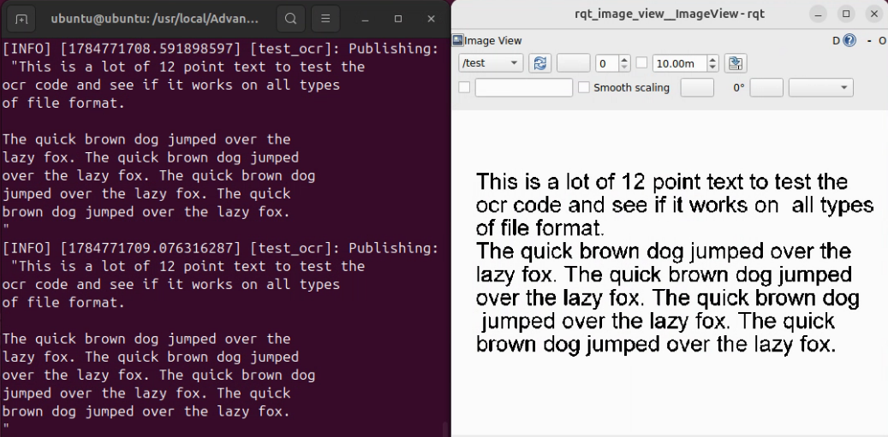
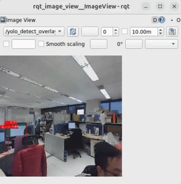
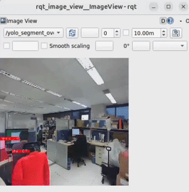

# QIR ROS SDK (Advantech QIR ROS Kit)

This document describes the **qir_ros_base / QIR ROS SDK container development and demo framework** we provide. It helps users quickly run QIR ROS 2 official examples on Advantech Qualcomm-based platforms, and extend the same framework to build their own applications (apps).

> [!NOTE]
> - When running an example for the first time, it may automatically download/install required resources (e.g., Qualcomm Neural Processing SDK models, datasets, dependencies). This is expected and may take longer.

> [!TIP]
> **Version Information (Default Environment)**
> - QIR ROS SDK: **v2.4.3**
> - ROS 2: **Jazzy**

---

## 1. QIR ROS SDK Overview

**QIR ROS SDK** is a set of hardware-accelerated ROS 2 packages optimized for Qualcomm Snapdragon / QRB platforms. It leverages Qualcomm's NPU hardware via Hexagon/Qualcomm Neural Processing Engine (SNPE) and QNN engines to provide high-performance robotics algorithms, including computer vision, AI perception, OCR, depth estimation, and simulation workflows.

On Advantech Qualcomm platforms, the QIR ROS SDK is delivered via **Docker containers** to ensure a reliable runtime environment, eliminating system dependency conflicts so developers can focus on application deployment.

---

## 2. Why Use This Package (Benefits & What qir_ros_base Provides)

`qir_ros_base` provides a ready-to-use QIR ROS SDK development environment packaged in a Docker container.  
It helps users quickly evaluate Qualcomm robotics capabilities and build their own applications on top of a consistent, reproducible setup.

Key benefits:
- **Fast bring-up**: start running QIR ROS examples quickly without spending time on complex driver and SDK environment setup.
- **Reproducible development environment**: a consistent container-based workflow that reduces environment differences.
- **Hardware Acceleration Out-of-The-Box**: pre-configured access to Qualcomm NPU hardware acceleration.
- **A solid foundation for customization**: users can extend the provided framework to integrate their own AI models and pipelines.
- **Easier troubleshooting and maintenance**: isolated environment makes software rollbacks and upgrades straightforward.

Reference:
- QIR ROS SDK Documentation: https://docs.qualcomm.com/doc/80-90441-2/

---

## 3. Location and Folder Structure

> [!NOTE]
> **Make sure your target system satisfies the following conditions:**
> - Advantech Qualcomm platforms
> - At least 20 GB hard drive free space
> - An active Internet connection is required
> - Use the English language environment in Ubuntu OS

> [!IMPORTANT]
> **Host Dependency Check (Qualcomm AI Runtime - QAIRT)**
> - To run AI and NPU features, make sure the **Qualcomm AI Runtime (QAIRT)** is installed on the host system. Otherwise, the NPU hardware resources cannot be accessed.
> - **How to verify on the host:** Check if the library file `/usr/lib/libQnnHtp.so` exists.
>   ```bash
>   ls -l /usr/lib/libQnnHtp.so
>   ```

After selecting and installing **QIR ROS Development Environment** Function by following the installer instructions, you can find the package at:

- QIR ROS Kit root:
  - `/usr/local/Advantech/ros/container/ros-demokit/qir_ros_kit`

Common contents:

- Launch entry:
  - `launch_qir.sh`
- Example apps:
  - `apps/basic_examples` (QIR official basic examples)
  - `apps/advanced_examples` (advanced integration examples)
- Development framework:
  - `apps/develop` (development-container usage and template notes)

---

## 4. Usage: One-Command Example Launch

### Overview

```text
User
  │
  ▼
launch_qir.sh
  │
  ▼
Docker Container (QIR ROS environment)
  │
  ├─ (first run / as needed) install_app.sh: download/install required assets & models
  │
  └─ (every run) run_app.sh: start the example (e.g., ros2 launch ...)
```

The usage is:

```bash
cd /usr/local/Advantech/ros/container/ros-demokit/qir_ros_kit
./launch_qir.sh <app_folder> [optional parameters...]
```

- `<app_folder>` is the relative path under `apps/`, for example:
  - `basic_examples/ocr_service`
  - `basic_examples/sample_object_detection`
  - `basic_examples/simulation_sample_pick_and_place`

The quick start example:

```bash
./launch_qir.sh basic_examples/sample_object_detection
```

> [!NOTE]
> **ROS_DOMAIN_ID (Default: 55)**
> - This package uses `ROS_DOMAIN_ID=55` by default.
> - To change it, edit the `ROS_DOMAIN_ID` setting in `launch_qir.sh`.

---

## 5. basic_examples (QIR Official Examples)

The examples below are located at:

- `/usr/local/Advantech/ros/container/ros-demokit/qir_ros_kit/apps/basic_examples`

Primary purposes:

- **Quickly validate** that QIR NPU hardware acceleration and official nodes run correctly on the target platform
- Use as a starting point for further development

---

### 5.0 Prerequisites for YOLOv8 Examples (Model Export Instructions)

> [!WARNING]
> Due to licensing restrictions associated with **YOLOv8**, the pre-converted YOLOv8 model files (`yolov8_det.bin` and `yolov8_seg.bin`) are **NOT included** in this package.  
> Users must manually export and place the model files into the corresponding example directories before launching `sample_object_detection` or `sample_object_segmentation`.

#### Prerequisites
1. Create a Qualcomm account and request an `api_token` via the [Qualcomm AI Hub](https://aihub.qualcomm.com/).
2. Refer to Qualcomm's official documentation for detailed prerequisites:
   - [Object Detection Prerequisites](https://docs.qualcomm.com/doc/80-90441-2/topic/detect-objects-with-sample_object_detection.html#prerequisites)
   - [Object Segmentation Prerequisites](https://docs.qualcomm.com/doc/80-90441-2/topic/segment-objects-with-sample_object_segmentation.html#prerequisites)

#### Steps to Export Models on Host System

```bash
# Install Python virtual environment dependencies
sudo apt update
sudo apt install -y python3.12-venv

# Create and activate Python virtual environment
python3 -m venv qai_env
source qai_env/bin/activate

# Install required Python packages
pip install --upgrade pip
pip install qai_hub_models
pip install ultralytics

# Configure Qualcomm AI Hub with your API token
qai-hub configure --api_token <YOUR_API_TOKEN>

# Export YOLOv8 Detection model
python3 -m qai_hub_models.models.yolov8_det.export --target-runtime tflite --device "Dragonwing IQ-9075 EVK"

# Export YOLOv8 Segmentation model
python3 -m qai_hub_models.models.yolov8_seg.export --target-runtime tflite --device "Dragonwing IQ-9075 EVK"
```

#### Move Converted Models to App Folders
After successfully exporting the models, copy the output `.bin` files into the respective `model/` directories:

1. **Detection Model:**
   - Copy `yolov8_det.bin` to:  
     `/usr/local/Advantech/ros/container/ros-demokit/qir_ros_kit/apps/basic_examples/sample_object_detection/model/`
2. **Segmentation Model:**
   - Copy `yolov8_seg.bin` to:  
     `/usr/local/Advantech/ros/container/ros-demokit/qir_ros_kit/apps/basic_examples/sample_object_segmentation/model/`

---

### 5.1 ocr_service

- Purpose: Runs optical character recognition (OCR) on input image streams to detect and extract text in real-time using Qualcomm NPU.
- Run:
  ```bash
  ./launch_qir.sh basic_examples/ocr_service
  ```
- Official docs:
  - https://docs.qualcomm.com/doc/80-90441-2/topic/run-basic-ocr-with-ocr_service.html

<p align="center">
  
</p>

### 5.2 sample_object_detection

> [!NOTE]
> Requires `yolov8_det.bin` model file. Please complete [Section 5.0 Prerequisites](#50-prerequisites-for-yolov8-examples-model-export-instructions) first.

- Purpose: Real-time 2D object detection powered by accelerated neural network models on Qualcomm NPU.
- Run:
  ```bash
  ./launch_qir.sh basic_examples/sample_object_detection
  ```
- Official docs:
  - https://docs.qualcomm.com/doc/80-90441-2/topic/detect-objects-with-sample_object_detection.html

<p align="center">
  
</p>

### 5.3 sample_object_segmentation

> [!NOTE]
> Requires `yolov8_seg.bin` model file. Please complete [Section 5.0 Prerequisites](#50-prerequisites-for-yolov8-examples-model-export-instructions) first.

- Purpose: Instance/semantic segmentation workflow providing pixel-level object boundaries for advanced spatial perception using Qualcomm NPU.
- Run:
  ```bash
  ./launch_qir.sh basic_examples/sample_object_segmentation
  ```
- Official docs:
  - https://docs.qualcomm.com/doc/80-90441-2/topic/segment-objects-with-sample_object_segmentation.html

<p align="center">
  
</p>

### 5.4 sample_depth_estimation

- Purpose: Monocular or stereo visual depth estimation to infer per-pixel depth values for obstacle avoidance and 3D perception using Qualcomm NPU.
- Run:
  ```bash
  ./launch_qir.sh basic_examples/sample_depth_estimation
  ```
- Official docs:
  - https://docs.qualcomm.com/doc/80-90441-2/topic/estimate-image-depth-values-with-sample_depth_estimation.html

<p align="center">
  
</p>

### 5.5 simulation_sample_pick_and_place

- Purpose: Simulation pipeline in Gazebo showcasing robotic arm motion planning and pick-and-place task execution.
- Run:
  ```bash
  ./launch_qir.sh basic_examples/simulation_sample_pick_and_place
  ```
- Official docs:
  - https://docs.qualcomm.com/doc/80-90441-2/topic/enable-pick-and-place-in-the-simulator-with-simulation_sample_pick_and_place.html

<p align="center">
  
</p>

### 5.6 simulation_follow_me

- Purpose: Simulation scenario demonstrating target person detection, visual tracking, and autonomous robot following navigation.
- Run:
  ```bash
  ./launch_qir.sh basic_examples/simulation_follow_me
  ```
- Official docs:
  - https://docs.qualcomm.com/doc/80-90441-2/topic/enable-people-tracking-in-the-simulator-with-simulation_follow_me.html

<p align="center">
  
</p>

---

## 6. Build Your Own App

Inside each app directory you will find files like:

- `install_app.sh`: for installation/preparation steps (e.g., download model binaries, install ROS packages, initialize the environment)
- `run_app.sh`: for launch/run commands (typically `ros2 launch ...`)

You can build your own app with this pattern:

1. Copy an existing example folder (or use `apps/develop` as a template)
2. Put required setup steps into `install_app.sh`
3. Put your ROS 2 launch/run commands into `run_app.sh`
4. Launch using the same entry point:
   ```bash
   ./launch_qir.sh <your_app_path>
   ```
