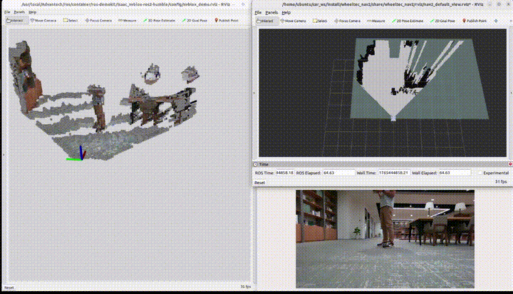
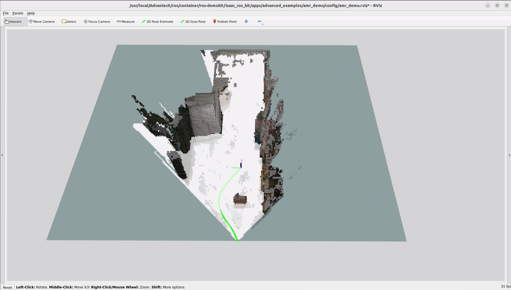

# 3D Camera Obstacle Avoidance

This example demonstrates how to use a 3D camera together with [ISAAC Nvblox](https://github.com/nvidia-isaac/nvblox) and [Nav2](https://github.com/ros-navigation/navigation2) to enable navigation and obstacle avoidance on an AMR platform.

<p align="center">
  
</p>
<p align="center">
  
</p>

# Install

> [!NOTE]
> Make sure your target system satisfies the following conditions:
> - Advantech platforms
> - At least 3 GB hard drive free space  
> - An active Internet connection is required  
> - Use the English language environment in Ubuntu OS  
---

* After selecting and installing 3D Camera Obstacle Avoidance by following the instructions in the installer instructions.
You will find the isaac_ros_kit folder under /usr/local/Advantech/ros/container/ros-demokit/

* Navigate to the folder and run the following command:

```bash
./launch_isaac.sh advanced_examples/amr_demo
```

* The 3D Camera Obstacle Avoidance will be displayed automatically:
> [!NOTE]
> The first time you run this program, it needs to download necessary files, which will take some time.

<p align="center">
    
</p>


# Configuration Guide

This example demonstrates the workflow of using a 3D camera with ISAAC Nvblox and Nav2 for navigation and obstacle avoidance.It utilizes the following components:

* A 3D camera mounted on an AMR
* [isaac_ros_nvblox](https://nvidia-isaac-ros.github.io/v/release-3.2/repositories_and_packages/isaac_ros_nvblox/isaac_ros_nvblox/index.html) as the costmap source
* [Nav2](https://github.com/ros-navigation/navigation2) as the navigation stack
* RViz for visualization and interaction  

This example is intended to help users understand how the key components of Nvblox integrated with Nav2 work together in a navigation pipeline, rather than to provide a configuration that can be directly deployed on any AMR or environment.

## How to use
This example is meant as a conceptual and configuration reference. It uses a predefined robot setup  that match the internal example configuration. Because most users will have different AMR hardware and will operate in a different physical environment, **you should not expect to**:

* Directly run this exact example on your own AMR without modifications, or
* See your real robot moving in your own environment just by launching this demo

Instead, you can use this example to:
* Observe the visualized workflow of Nvblox integrated with Nav2 for navigation and obstacle avoidance  

When the example is executed:
1. RViz will launch with the predefined configuration and display the results
2. Nav2 will generate paths based on the costmap provided by ISAAC Nvblox

Although this example provides a ROS bag, it only contains the essential topics required for visualization:
* /camera_0/color/image : Color image stream from the 3D camera
* /nvblox_node/color_layer : Visualization of the color layer in Nvblox
* /nvblox_node/combined_occupancy_grid : Combined occupancy grid used by Nvblox for mapping and costmaps
* /visual_slam/tracking/vo_path : Estimated robot trajectory from visual odometry

## Reference Configuration

When working with this example, it is recommended that users have a basic understanding of ISAAC Nvblox and Nav2.
Ideally, users should be able to run isaac_ros_nvblox independently and use Nav2 for basic path planning.

This example includes the following key modifications:
1. isaac_ros_nvblox
   * Set mapping_type to dynamic
2. Nav2
  * Updated the YAML configuration to include Nvblox plugins for:
     * local_costmap
     * global_costmap
  * Removed AMCL-related components


This configuration represents only one possible approach provided in this example.It does not imply that ISAAC Nvblox can only be integrated with Nav2 in this way.
