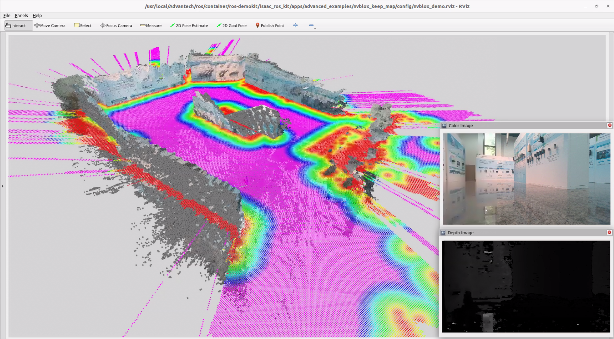
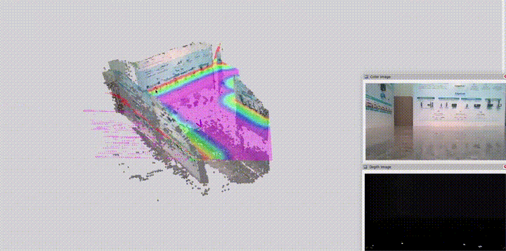

# 3D Scene Persistence

This example demonstrates how to use a 3D camera and adjust [ISAAC Nvblox](https://github.com/nvidia-isaac/nvblox) parameters to retain visualization data.

<p align="center">
  
</p>

# Install

> [!NOTE]
> Make sure your target system satisfies the following conditions:
> - Advantech platforms
> - At least 12 GB hard drive free space  
> - An active Internet connection is required  
> - Use the English language environment in Ubuntu OS  
---

* After selecting and installing 3D Scene Persistence by following the instructions in the installer instructions.
You will find the isaac_ros_kit folder under ` /usr/local/Advantech/ros/container/ros-demokit/ `

* Navigate to the folder and run the following command:

```bash
./launch_isaac.sh advanced_examples/nvblox_keep_map
```

* The 3D Scene Persistence will be displayed automatically:
> [!NOTE]
> The first time you run this program, it needs to download necessary files, which will take some time.

<p align="center">
    
</p>

# Configuration Guide

This example focuses on demonstrating how to quickly adjust [ISAAC Nvblox parameters](https://nvidia-isaac-ros.github.io/repositories_and_packages/isaac_ros_nvblox/isaac_ros_nvblox/api/parameters.html) to preserve visualization data and make the 3D scene “persistent” instead of slowly fading away.

Under the default parameter settings, the map is **continuously decayed and pruned** to save memory and keep only the nearby, recent data.
This is usually desirable for mobile robots, but it means that:
* Surfaces you saw a while ago will gradually disappear
* Voxels that are far away from the robot will be cleared
* The 3D scene will not remain stable in RViz

<p align="center">
  
</p>

To achieve 3D scene persistence, we explicitly disable these “forgetting” behaviors.

## Parameters modified in this example

In this example, we modify two key parameters in isaac_ros_nvblox:

```bash
decay_tsdf_rate_hz:=0.0
```
1. **`decay_tsdf_rate_hz`**
* **Purpose**: Controls how frequently the TSDF (Truncated Signed Distance Field) layer is decayed over time.
* **Default behavior**:
  * decay_tsdf_rate_hz > 0.0
  * Old TSDF values are gradually pushed toward “unknown”, causing old parts of the map to fade out.
* **In this example**:  
  **`decay_tsdf_rate_hz:=0.0`**
  * Disables temporal decay of the TSDF layer.
  * Surfaces you scanned earlier will **stay in the map** and remain visible in RViz as long as the node is running.

```bash
clear_map_outside_radius_rate_hz:=0.0
```
2. **`clear_map_outside_radius_rate_hz`**
* **Purpose**: Controls how often voxels outside a certain radius from the robot are cleared.
* **Default behavior**:
  * clear_map_outside_radius_rate_hz > 0.0
  * The map is periodically truncated to a region around the robot, freeing memory but removing distant data.
* **In this example**:  
  **`clear_map_outside_radius_rate_hz:=0.0`**
  * Disables the periodic clearing of voxels outside the radius.
  * 3D data that you have scanned **will not be removed** even after the robot moves away.

> [!NOTE]
> In summary, setting both parameters to `0.0` tells Nvblox:  
> **"Do not decay old TSDF values and do not clear the map based on distance."**  
> This is what makes the 3D scene appear persistent.


## When to use scene persistence
Use the configuration from this example when you:
* Want to **record and visualize** a stable 3D reconstruction for demos or testing
* Need to **compare before/after parameter changes** without worrying about the map disappearing
* Are building tools that require a **persistent 3D context**, such as inspection or mapping GUIs

Switch back to default (or tuned) decay / clear parameters when:
* Running on memory-constrained platforms
* Operating for long durations
* Deploying on mobile robots that constantly explore new areas

