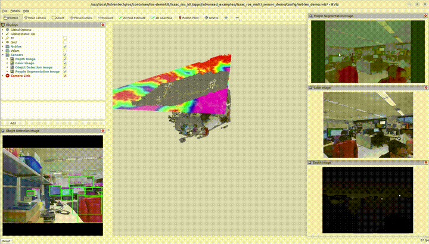
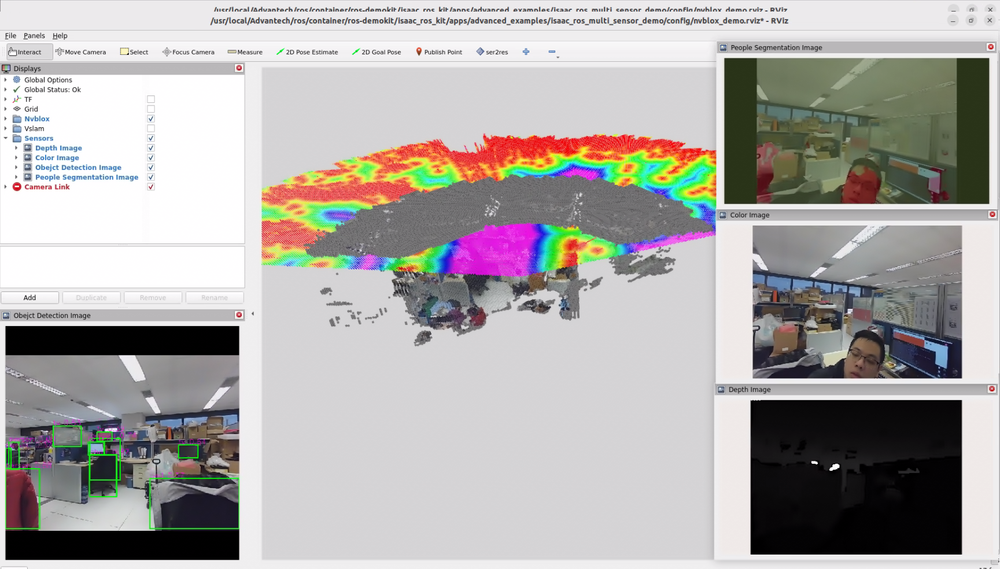

# Multi Sensor Function

This example demonstrates how to use multiple sensor data sources simultaneously while running multiple ISAAC functionalities.

<p align="center">
  
</p>

# Install

> [!NOTE]
> Make sure your target system satisfies the following conditions:
> - Advantech platforms
> - At least 3 GB hard drive free space  
> - An active Internet connection is required  
> - Use the English language environment in Ubuntu OS  
---

* After selecting and installing Multi Sensor Function by following the instructions in the installer instructions.
You will find the isaac_ros_kit folder under /usr/local/Advantech/ros/container/ros-demokit/

* Navigate to the folder and run the following command:

```bash
./launch_isaac.sh advanced_examples/isaac_ros_multi_sensor_demo
```

* The Multi Sensor Function will be displayed automatically:
> [!NOTE]
> The first time you run this program, it needs to download necessary files, which will take some time.

<p align="center">
    
</p>

# Configuration Guide

This demo runs several ISAAC workloads side-by-side—nvblox, yolov8, and unet—using data from two physical cameras. The rendered RViz layout is:

* Bottom-left: [isaac_ros_yolov8](https://nvidia-isaac-ros.github.io/v/release-3.2/repositories_and_packages/isaac_ros_object_detection/isaac_ros_yolov8/index.html)
* Center: [isaac_ros_nvblox](https://nvidia-isaac-ros.github.io/v/release-3.2/repositories_and_packages/isaac_ros_nvblox/isaac_ros_nvblox/index.html)
* Top-right: [isaac_ros_unet](https://nvidia-isaac-ros.github.io/v/release-3.2/repositories_and_packages/isaac_ros_image_segmentation/isaac_ros_unet/index.html)
* Right-center: RGB stream
* Bottom-right: Depth stream

## What this example launches

When you run:
```bash
./launch_isaac.sh advanced_examples/isaac_ros_multi_sensor_demo
```
the following components are started:

* A ROS bag that replays data from two cameras. The recorded topics include:
    * /camera_0/color/image_raw, /camera_0/depth/image_raw, /camera_0/left_ir/image_raw, /camera_0/right_ir/image_raw, plus accompanying /camera_info
    * /camera_1/color/image_raw with its camera_info and metadata
    * /tf_static for the fixed transforms between the sensors and the robot
    * visual_slam: consumes the RGB-D stream, TF, and odometry to estimate pose.
    * nvblox: builds the live 3D reconstruction using the pose from visual_slam and the depth frames.
    * yolov8: performs object detection on the  RGB feed.
    * unet: runs semantic segmentation in parallel with detection to highlight regions of interest.
    * RViz layout: aggregates every output into a tiled dashboard so you can see how each workload reacts to the same scene in real time.

## How to use

Sensor mapping
* Camera 0 provides RGB, depth, and IR streams for visual_slam, UNet and nvBlox.
* Camera 1 supplies an additional RGB view for YOLOv8 to keep inference quality high.

Launch flow
1. Run the launch command above. The script automatically mounts the container, starts the ROS bag, and brings up all four workloads.
2. Watch RViz populate: YOLOv8 detections appear bottom-left, NvBlox in the center, UNet top-right, RGB/Depth streams on the right side.

Extending to your hardware
* Replace the default ROS bag with captures from your own dual-camera rig while keeping the same topic names. That lets you reuse this demo as a validation harness for calibration, synchronization, and GPU load.

## When to use this example  

Use Multi Sensor Function when you:

* Want to showcase multiple ISAAC capabilities driven by the same sensor suite without juggling separate demos.
* Are validating camera synchronization, TF configuration, or launch parameters before deploying to an actual robot.
* Plan to compare perception outputs side-by-side (e.g., detection vs. segmentation vs. 3D reconstruction) for tuning or demo purposes.
