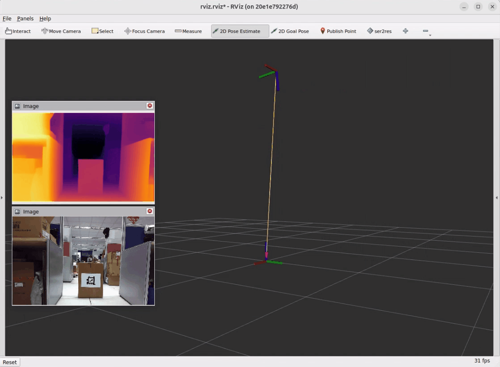
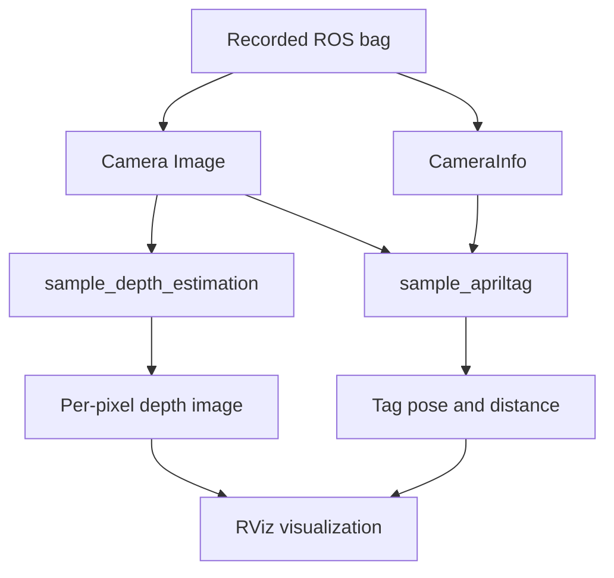

# 2D Object Depth Estimation

This example demonstrates how multiple QIR ROS SDK packages can process the same 2D camera stream simultaneously.

It combines the following QIR ROS pipelines:

- [`sample_depth_estimation`](https://docs.qualcomm.com/doc/80-70030-265/topic/sample_depth_estimation.html) to generate a per-pixel depth map from an RGB image.
- [`sample_apriltag`](https://docs.qualcomm.com/doc/80-70030-265/topic/sample_apriltag.html) to detect an AprilTag and estimate its pose and relative distance from the camera.

A recorded ROS bag containing only the camera image and camera calibration information is used as the input. This allows users to run both pipelines and observe their outputs without connecting a physical camera.

The purpose of this example is to show that QIR ROS SDK packages are not limited to isolated demonstrations. Multiple functions can share the same sensor input and run together as part of a larger perception workflow.

<p align="center">
  
</p>

# Install

> [!NOTE]
> Make sure your target system satisfies the following conditions:
>
> - Advantech platforms
> - At least 4 GB hard drive free space
> - An active Internet connection is required
> - Use the English language environment in Ubuntu OS

After selecting and installing **2D Object Depth Estimation** by following the installer instructions, the QIR ROS Kit will be available under:

```bash
/usr/local/Advantech/ros/container/ros-demokit/qir_ros_kit
```

Navigate to the QIR ROS Kit directory:

```bash
cd /usr/local/Advantech/ros/container/ros-demokit/qir_ros_kit
```

Launch the example:

```bash
./launch_qir.sh advanced_examples/2d_object_depth_estimation
```

<p align="center">
    
</p>

> [!NOTE]
> The first time you run this example, it may need to download or prepare the required models and dependencies. This may take some time.

# Configuration Guide

## Overview

Unlike a depth camera, the input device used in this example is a standard 2D RGB camera.

The recorded RGB image is processed by two QIR ROS pipelines in parallel:

1. `sample_depth_estimation` generates a dense depth image from the RGB image.
2. `sample_apriltag` detects the AprilTag and estimates the tag pose relative to the camera.

Both pipelines use the same recorded camera stream, but they produce different types of depth-related information.



This architecture demonstrates the concept of:

**One camera → Multiple QIR ROS pipelines → Combined visualization**

## What this example launches

When the example is started, the following components run together:

- A ROS bag replays the recorded 2D camera data.
- `sample_depth_estimation` processes the RGB image and generates a depth map.
- `sample_apriltag` detects the AprilTag in the same RGB image.
- Camera calibration information is provided to the AprilTag pipeline.
- The AprilTag result is used to visualize the tag pose and its spatial relationship to the camera.
- RViz displays the original image, estimated depth image, and AprilTag result together.

## ROS bag input

The provided ROS bag contains only the sensor inputs required by the example:

| Recorded data | ROS 2 message type | Purpose |
|---|---|---|
| Camera image | `sensor_msgs/msg/Image` | Shared RGB input for depth estimation and AprilTag detection |
| Camera information | `sensor_msgs/msg/CameraInfo` | Provides camera calibration information for pose estimation |

The ROS bag does not contain a recorded depth image. The depth image is generated at runtime by `sample_depth_estimation`.

The AprilTag detection and pose result are also generated at runtime from the replayed camera data.

## Display layout

The example displays three main results:

- **Top-left: Estimated depth image**  
  Shows the per-pixel depth map generated from the 2D RGB image by `sample_depth_estimation`.

- **Bottom-left: Original camera image**  
  Shows the RGB image replayed from the ROS bag, including the AprilTag used as the target.

- **Center and right: AprilTag spatial visualization**  
  Shows the detected AprilTag coordinate frame and its spatial relationship to the camera frame in RViz.

This layout allows users to observe how the same camera image is interpreted by two different QIR ROS pipelines.

# Understanding the Results

Although both pipelines provide depth-related information, their outputs have different meanings.

## Depth estimation result

`sample_depth_estimation` generates a dense, per-pixel depth representation from a single RGB image.

This allows the user to observe the relative depth structure of the entire scene, including foreground and background regions.

The interpretation and scale of the generated depth values depend on the depth-estimation model. The result should not automatically be treated as a calibrated physical distance unless the selected model and configuration explicitly provide metric depth.

## AprilTag result

`sample_apriltag` detects a known visual marker and estimates its pose relative to the camera using the camera calibration and AprilTag configuration.

The result provides a geometric representation of the tag position and orientation relative to the camera frame.

## Relationship between the two pipelines

The two pipelines share the same camera input and run simultaneously, but they produce independent results:

- Depth estimation provides a dense depth image for the complete scene.
- AprilTag detection provides the pose and relative distance of a known target.

This example focuses on running and visualizing multiple QIR ROS functions together. It does not assume that the depth-estimation output is directly used to calculate the AprilTag pose.

# How to Use

1. Launch the example using the provided command.
2. The launch script starts the Docker container and replays the recorded ROS bag.
3. Wait for the depth-estimation model and AprilTag pipeline to initialize.
4. Observe the three result areas in RViz:
   - Original RGB image
   - Estimated depth image
   - AprilTag pose and relative distance
5. Move through the recorded sequence and compare how both pipelines respond to the same camera frames.

# Extending to Your Hardware

To replace the provided ROS bag with your own 2D camera:

1. Start the camera driver on the host or inside the development environment.
2. Identify the RGB image and CameraInfo topics.
3. Remap the example input topics to your camera topics.
4. Confirm that the camera publishes valid calibration information.
5. Configure the AprilTag family, tag size, and detection parameters for your target.
6. Verify that the input image format and resolution are supported by both pipelines.
7. Update the RViz configuration if your output topic names or frame names are different.

A physical depth camera is not required because the depth image is estimated from the RGB input.

However, the quality of the depth-estimation result can be affected by:

- Lighting conditions
- Scene texture
- Camera image quality
- Objects or scenes that differ from the model training data
- The depth-estimation model and runtime configuration

The AprilTag result can also be affected by:

- Camera calibration accuracy
- AprilTag size configuration
- Viewing angle
- Motion blur
- Image resolution
- Tag visibility

# When to Use This Example

Use 2D Object Depth Estimation when you:

- Want to learn how multiple QIR ROS SDK packages can share the same camera input.
- Want to run depth estimation and AprilTag detection simultaneously.
- Want to explore depth-related perception using only a 2D RGB camera.
- Want to compare dense scene depth estimation with marker-based pose estimation.
- Need a repeatable QIR ROS demonstration without connecting a physical camera.
- Want a reference for building a larger perception pipeline from multiple QIR ROS components.

This example is intended as a teaching and integration reference. It demonstrates how QIR ROS components can work together, rather than providing a calibrated distance-measurement solution for every camera and environment.
