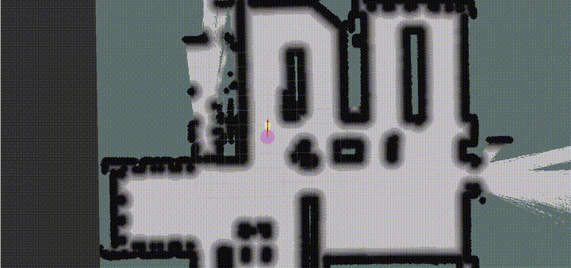
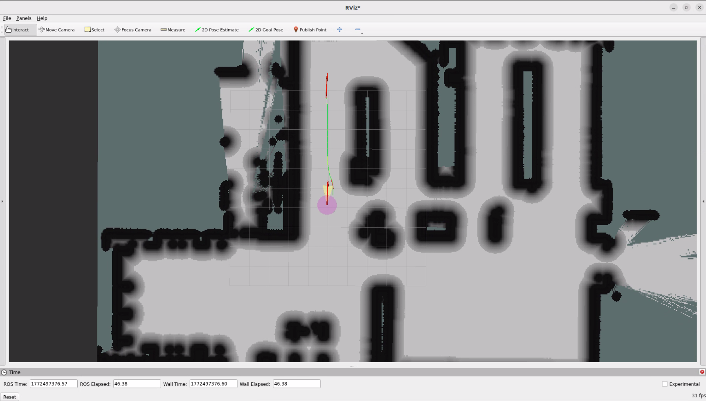

# 2D LiDAR Navigation

This example uses a 2D LiDAR mounted on an AMR together with [Nav2](https://github.com/ros-navigation/navigation2) to demonstrate navigation and obstacle avoidance.

<p align="center">
  
</p>

# Install

> [!NOTE]
> Make sure your target system satisfies the following conditions:
> - Advantech platforms
> - At least 3 GB hard drive free space  
> - An active Internet connection is required  
> - Use the English language environment in Ubuntu OS  
---

* After selecting and installing 2D LiDAR Navigation by following the instructions in the installer instructions.
You will find the 2d-nav2-ros2 folder under /usr/local/Advantech/ros/container/ros-demokit/

* Navigate to the folder and run the following command:


```bash
./launch.sh humble
```

* The 2D LiDAR Navigation will be displayed automatically:
> [!NOTE]
> The first time you run this program, it needs to download necessary files, which will take some time.

<p align="center">
    
</p>

# Configuration Guide
This example demonstrates the basic workflow of 2D LiDAR-based navigation using:

* A 2D LiDAR mounted on an AMR
* [Nav2](https://github.com/ros-navigation/navigation2) as the navigation stack
* RViz for visualization and interaction  

The goal is to help you understand the overall navigation pipeline and how the main Nav2 components work together, rather than to provide a configuration that runs unchanged on any AMR or environment.


## How to use
In Advantech Robotic Suite, Nav2 is already pre-installed inside the host environment, so you don’t need any extra installation steps.

This example is meant as a conceptual and configuration reference. It uses a predefined robot setup and map that match the internal example configuration. Because most users will have different AMR hardware and will operate in a different physical environment, **you should not expect to**:

* Directly run this exact example on your own AMR without modifications, or
* See your real robot moving in your own environment just by launching this demo.

Instead, you can use this example to:

* Observe how a typical Nav2 bring-up looks in RViz (map, robot pose, costmaps, and planned paths).
* Understand the key topics and frames that Nav2 expects, such as:
  * /map – static map
  * /scan – 2D LiDAR data
  * /tf – transforms between map, odom, base_link, and sensor frames
  * /odom – odometry information (if provided)
  * /cmd_vel – velocity commands from Nav2 to the robot base

When you run the example:
1. RViz will load the map according to the example configuration.
2. Nav2 will compute a global path and simulate the navigation behavior through its planners, controllers, and costmaps, which you can observe in RViz.

To apply the same concepts to your own AMR, you would need to:

* Provide your own robot description, TF tree, and sensor setup.
* Ensure your topics (/scan, /odom, /tf, etc.) and frames match what Nav2 expects.
* Adjust Nav2 parameters (costmaps, planners, controllers, etc.) for your robot and environment.  

The example configuration serves as a “template” for understanding how these pieces fit together, rather than a ready‑to‑run configuration for arbitrary hardware.  

For detailed parameter descriptions and advanced configuration, please refer directly to the official [Nav2](https://github.com/ros-navigation/navigation2) documentation and tutorials.

## When to use this example
Use this example when you:

* Are new to Nav2 and want to understand the overall 2D LiDAR navigation pipeline
* Want to see how a typical Nav2 launch and RViz setup looks in practice
* Need a reference for the required topics, frames, and main components (map server, localization, planning, control, and behavior tree)  

This example focuses on the conceptual workflow:

1. Load a 2D map and start the Nav2 stack
2. Localize the robot on the map (e.g., using AMCL)
3. Send a navigation goal in RViz
4. Observe how Nav2 computes a path and uses the 2D LiDAR to avoid obstacles  

Later, you can build on this foundation by:

* Adapting the Nav2 configuration (robot model, costmaps, planners, controllers) to your own AMR.
* Using a map generated from the “2D Mapping With LiDAR” example or from your own mapping pipeline.
* Integrating additional sensors (e.g., IMU, wheel encoders) to improve localization and navigation performance.


