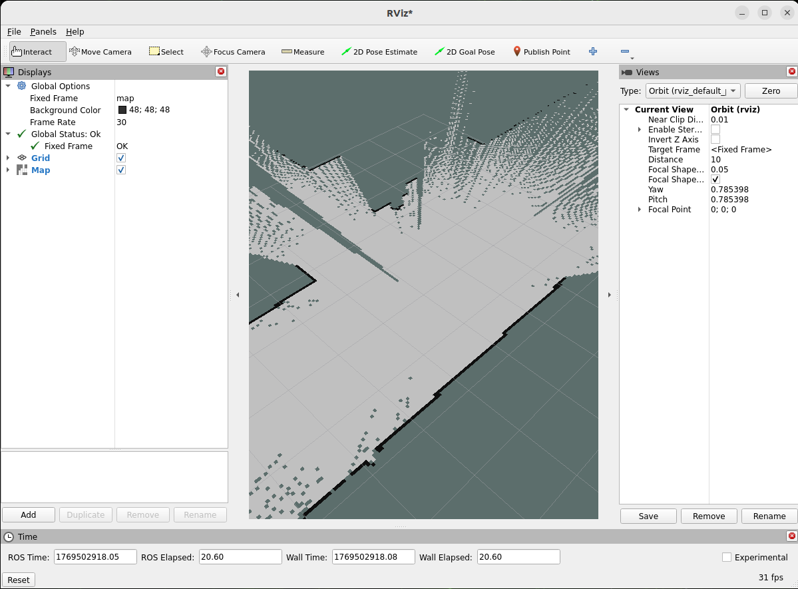

# 2D Mapping With LiDAR

This example uses a 2D LiDAR mounted on an AMR together with [slam_toolbox](https://github.com/SteveMacenski/slam_toolbox) to demonstrate how to generate a 2D map.

<p align="center">
    
</p>

# Install

> [!NOTE]
> Make sure your target system satisfies the following conditions:
> - Advantech platforms
> - At least 3 GB hard drive free space  
> - An active Internet connection is required  
> - Use the English language environment in Ubuntu OS  
---

* After selecting and installing 2D Mapping with LiDAR by following the instructions in the installer instructions.
You will find the 2d-slam-ros2 folder under ` /usr/local/Advantech/ros/container/ros-demokit/ `

* Navigate to the folder and run the following command:


```bash
./launch.sh humble
```

* The 2D Mapping with LiDAR will be displayed automatically:
> [!NOTE]
> The first time you run this program, it needs to download necessary files, which will take some time.

<p align="center">
    
</p>

# Configuration Guide
This example demonstrates the basic workflow of creating a 2D map using:
* A 2D LiDAR mounted on an AMR
* [slam_toolbox](https://github.com/SteveMacenski/slam_toolbox)
* RViz for visualization  

The goal is to help you understand what is running and how to drive the robot to build a map.

## What this example launches
When you run:
```bash
./launch.sh humble
```
the following components are started:
* A ROS bag that publishes the required topics, including:
    *  /scan
    *  /tf
    *  /odom
* A slam_toolbox node that:
    * Subscribes to the LiDAR data and odometry
    * Estimates the robot pose in the map frame
    * Builds a 2D occupancy grid map

## How to use
In Advantech Robotic Suite, slam_toolbox is already pre-installed inside the host environment, so you don’t need any extra installation steps.

To create a 2D map with native slam_toolbox, you essentially only need:
* A 2D LiDAR
* slam_toolbox
* Properly connected ROS 2 topics (for example /scan, /tf, /odom)  

As long as your LiDAR scan topic, TF tree, and odometry topic are correctly configured and match the slam_toolbox parameters, the node can estimate the robot pose and build a 2D occupancy grid map in real time.

This example already includes a ready-to-use ROS bag file.
When the example is executed, the bag is played automatically, allowing you to see slam_toolbox building a map even without any physical hardware.

If you have your own 2D LiDAR and AMR, you can record your own ROS bag with the same topics and replace the default bag used in this example. This allows you to reuse the same ./launch.sh humble workflow to quickly verify your mapping setup and parameter tuning.

Alternatively, you can keep using the provided ROS bag as a “golden sample” when you don’t have access to hardware, for example to test different slam_toolbox parameter configurations in a repeatable way.

For detailed parameter descriptions and advanced configuration, please refer directly to the official [slam_toolbox](https://github.com/SteveMacenski/slam_toolbox) repository.


## When to use this example
Use this example when you:

* Are new to ROS 2 mapping and want a simple, working 2D SLAM setup
* Have an AMR with a 2D LiDAR and want to quickly visualize its surroundings
* Want to generate a baseline 2D map that can be reused for later navigation demos

This example focuses on the basic workflow:
1. Launch slam_toolbox with a 2D LiDAR
2. Drive the robot
3. Watch the map grow in RViz
4. Save the finished map

Later, you can build on this foundation by:  
* Adjusting slam_toolbox parameters for your specific robot and environment
* Switching from “mapping” to “localization” modes
* Integrating the saved map into a full navigation stack (e.g. Nav2)
