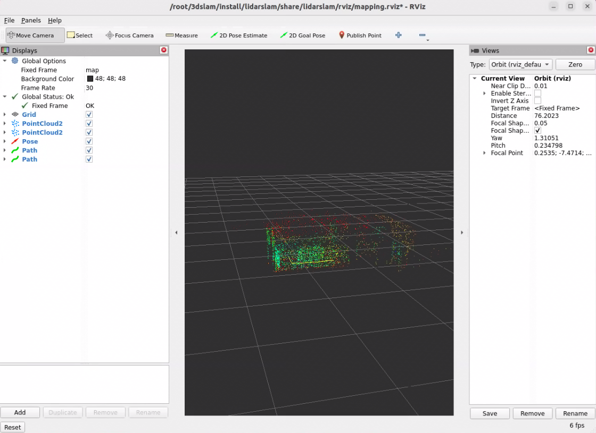

# 3D Mapping With LiDAR

This example uses a 3D LiDAR mounted on an AMR together with [lidarslam_ros2](https://github.com/rsasaki0109/lidarslam_ros2) to demonstrate how to generate a 3D map.

<p align="center">
    
</p>

# Install

> [!NOTE]
> Make sure your target system satisfies the following conditions:
> - Advantech platforms
> - At least 9 GB hard drive free space  
> - An active Internet connection is required  
> - Use the English language environment in Ubuntu OS  
---

* After selecting and installing 3D Mapping with LiDAR by following the instructions in the installer instructions.
You will find the 3d-slam-ros2 folder under /usr/local/Advantech/ros/container/ros-demokit/

* Navigate to the folder and run the following command:


```bash
./launch.sh humble
```

* The 3D Mapping with LiDAR will be displayed automatically:
> [!NOTE]
> The first time you run this program, it needs to download necessary files, which will take some time.

<p align="center">
    
</p>

# Configuration Guide
This example demonstrates the basic workflow of creating a 3D map using:

* A 3D LiDAR mounted on an AMR
* [lidarslam_ros2](https://github.com/rsasaki0109/lidarslam_ros2)
* RViz for visualization

The goal is to help you understand what is running and how to drive the robot to build a 3D map.

## What this example launches
When you run:
```bash
./launch.sh humble
```
the following components are started:

* A ROS bag that publishes the required topics, including (for example):
    * /points
    * /tf
    * /odom (if odometry is used)
* A lidarslam_ros2 node that:
    * Subscribes to the 3D LiDAR data and odometry
    * Estimates the robot pose in the map frame
    * Builds a 3D map (e.g. as a point cloud)
* An RViz configuration for visualizing:
    * The 3D LiDAR points
    * The estimated robot trajectory
    * The accumulated 3D map

## How to use
lidarslam_ros2 is not included in the Advantech Robotic Suite installation.  

Users should install [lidarslam_ros2](https://github.com/rsasaki0109/lidarslam_ros2) separately by following the instructions provided in the official GitHub repository.  

This example provides a container environment that includes lidarslam_ros2 and its dependencies, which will be launched automatically when the example is executed.  

To create a 3D map with native lidarslam_ros2, you essentially only need:
* A 3D LiDAR
* [lidarslam_ros2](https://github.com/rsasaki0109/lidarslam_ros2)
* Properly connected ROS 2 topics
  * 3D LiDAR point cloud (e.g. /points_raw or /lidar_points)
  * /tf
  * /odom

As long as your 3D LiDAR point cloud topic, TF tree, and (optionally) odometry topic are correctly configured and match the lidarslam_ros2 parameters, the node can estimate the robot pose and build a 3D map in real time.

This example already includes a ready-to-use ROS bag file.
When the example is executed, the bag is played automatically, allowing you to see lidarslam_ros2 building a 3D map even without any physical hardware.

If you have your own 3D LiDAR and AMR, you can record your own ROS bag with the same topics and replace the default bag used in this example. This allows you to reuse the same ./launch.sh humble workflow to quickly verify your mapping setup and parameter tuning with your own data.

Alternatively, you can keep using the provided ROS bag as a “golden sample” when you don’t have access to hardware, for example to test different lidarslam_ros2 parameter configurations in a repeatable way.

For detailed parameter descriptions and advanced configuration, please refer directly to the official [lidarslam_ros2](https://github.com/rsasaki0109/lidarslam_ros2) repository.


## When to use this example
Use this example when you:

* Are new to 3D LiDAR-based SLAM and want a simple, working 3D mapping setup
* Have an AMR with a 3D LiDAR and want to quickly visualize a 3D representation of its surroundings
* Want to generate a baseline 3D map that can be reused for later navigation or perception demos  

This example focuses on the basic workflow:
1. Launch lidarslam_ros2 with a 3D LiDAR
2. Watch the 3D map grow in RViz
3. Save the finished map  

Later, you can build on this foundation by:
* Adjusting lidarslam_ros2 parameters for your specific robot, sensor, and environment
* Evaluating different odometry or IMU fusion strategies (if applicable)
* Integrating the generated 3D map into a broader navigation or perception stack


