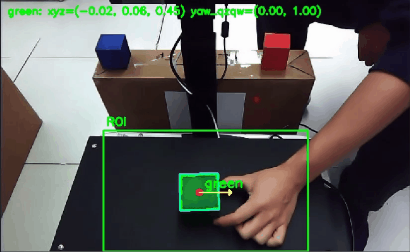

# Manipulator

This example demonstrates a vision-based manipulator workflow using an RGB-D camera, color block detection, position estimation, MoveIt, and a robot arm.

The original demo uses [Color Profile Creation](../../../core_techniques/color_profile_creation) and [Color Block Detection & Position Estimation](../../../core_techniques/color_block_detection_position_estimation) to find colored blocks and estimate their position. A recorded ROS bag is provided so users can observe the perception result and robot-arm motion in RViz without connecting a physical camera or manipulator.

<p align="center">
  
</p>

# Install

> [!NOTE]
> Make sure your target system satisfies the following conditions:
> - Advantech platforms
> - At least 4 GB hard drive free space
> - An active Internet connection is required
> - Use the English language environment in Ubuntu OS

---

* After selecting and installing Manipulator by following the installer instructions, you will find the `manipulator` folder under:

```bash
/usr/local/Advantech/ros/container/ros-demokit/
```

* Navigate to the example folder and launch it by specifying the ROS 2 distribution:

```bash
./launch.sh <ros_distro>
```

Replace `<ros_distro>` with the ROS 2 distribution detected and installed by Robotic Suite during installation.

| ROS 2 distribution | Launch command |
|---|---|
| ROS 2 Humble | `./launch.sh humble` |
| ROS 2 Jazzy | `./launch.sh jazzy` |

For example, to launch the ROS 2 Jazzy environment:

```bash
./launch.sh jazzy
```

> [!NOTE]
> The specified ROS 2 distribution must match the version installed by Robotic Suite. The installed version may vary depending on the ROS 2 distributions supported by the target system.

* The Manipulator example will be displayed automatically in RViz.

> [!NOTE]
> The first time you run this program, it may need to download or prepare necessary files, which will take some time.

# Configuration Guide

This example demonstrates the basic workflow of a vision-based manipulator application using:

* An RGB-D camera for RGB and depth information
* [Color Profile Creation](../../../core_techniques/color_profile_creation) for creating reusable HSV color profiles
* [Color Block Detection & Position Estimation](../../../core_techniques/color_block_detection_position_estimation) for detecting blocks and estimating their position
* MoveIt for robot motion planning in the original live demo
* A robot URDF and mesh files for the manipulator model
* `robot_state_publisher` for generating the robot TF tree
* RViz for displaying the perception result, depth image, and robot-arm motion
* A recorded ROS bag for hardware-independent playback

The goal is to help you understand how perception, position estimation, motion planning, and robot visualization work together. This example is intended as a teaching and configuration reference, rather than a complete control solution that can run unchanged on any manipulator.

## Original demo workflow

The original live manipulator demo follows this concept:

```text
Color Profile Creation
        |
        | color_profiles.json
        v
RGB Image + Aligned Depth + Camera Information
        |
        v
Color Block Detection & Position Estimation
        |
        | detected block position and approximate orientation
        v
Target Pose Generation
        |
        v
MoveIt Motion Planning
        |
        v
Robot Arm Action
```

This pipeline follows the common robotics flow of **Sensing → Perception → Planning → Action**:

* **Sensing** – The RGB-D camera provides the color image, aligned depth image, and camera calibration information.
* **Perception** – The system detects the selected color block and estimates its 3D position and approximate orientation.
* **Planning** – The detected result is converted into a robot target pose and passed to MoveIt.
* **Action** – The robot arm executes the planned motion.

## Core techniques used in this example

### 1. Color Profile Creation

[Color Profile Creation](../../../core_techniques/color_profile_creation) is used before running the detector.

The user selects several points from the target object in the RGB image. The tool collects HSV samples and saves the calculated color range in:

```text
color_profiles.json
```

The generated profile allows the detector to reuse the same color settings instead of placing fixed HSV values directly in the detection code.

<p align="center">
  
</p>

This step teaches users how to:

* Collect color samples from a live image
* Understand why HSV is useful for color-based detection
* Create a reusable color profile
* Adjust the profile for different lighting conditions

### 2. Color Block Detection & Position Estimation

[Color Block Detection & Position Estimation](../../../core_techniques/color_block_detection_position_estimation) uses the generated color profile together with RGB-D data.

The main processing flow is:

```text
RGB image
    |
    v
HSV mask from color_profiles.json
    |
    v
Contour and block center
    |
    +-------------------+
    |                   |
    v                   v
Aligned depth      Rotated rectangle
    |                   |
    v                   v
3D position       Approximate yaw
    |                   |
    +---------+---------+
              |
              v
     Detection result and debug image
```

The detector:

* Finds the target color inside a selected region of interest
* Filters small contours
* Estimates the center point of the detected block
* Reads the median depth around the center point
* Uses camera intrinsics to convert pixel position and depth into a 3D position
* Uses a rotated rectangle to estimate an approximate 2D yaw
* Publishes a debug image to `/color_block/debug_image`
* Publishes the detected pose for the downstream manipulator workflow

<p align="center">
  
</p>

In the original live demo, the detected result is used to prepare the target pose for MoveIt. In this offline example, the perception result and robot motion have already been recorded in the ROS bag and are replayed for teaching.

## What this example launches

When you run:

```bash
./launch.sh jazzy
```

the following components are started:

* A Docker-based ROS 2 environment containing the required dependencies
* The `adv_manipulator` ROS 2 package, including:
    * The robot URDF/Xacro model
    * Robot mesh files
    * A manipulator launch file
    * A predefined RViz configuration
* `robot_state_publisher`, which uses the robot model and `/joint_states` to generate the robot TF tree
* A ROS bag that publishes the recorded topics
* RViz, which displays:
    * The manipulator model and motion
    * The color block detection debug image
    * The recorded depth image

> [!IMPORTANT]
> The offline playback does not run Color Profile Creation or Color Block Detection & Position Estimation again. It replays the debug image and motion produced by the original demo. The two tutorials explain how those recorded results were created.

## Recorded ROS bag

The provided ROS bag is approximately 1.8 GiB and contains about 64 seconds of recorded data.

| Topic | Message type | Purpose |
|---|---|---|
| `/color_block/debug_image` | `sensor_msgs/msg/Image` | Recorded color block detection result |
| `/camera/camera/depth/image_raw` | `sensor_msgs/msg/Image` | Recorded depth image |
| `/camera/camera/depth/camera_info` | `sensor_msgs/msg/CameraInfo` | Depth camera calibration information |
| `/joint_states` | `sensor_msgs/msg/JointState` | Recorded manipulator joint positions |
| `/tf` | `tf2_msgs/msg/TFMessage` | Recorded dynamic coordinate transforms |
| `/tf_static` | `tf2_msgs/msg/TFMessage` | Recorded static coordinate transforms |

The ROS bag allows the same demonstration to be played repeatedly without requiring the original RGB-D camera, MoveIt setup, or physical robot arm.

## How to use

In Advantech Robotic Suite, the required ROS 2 environment and manipulator dependencies are prepared inside the Docker-based sample environment, so you do not need to install the packages manually.

When the example is executed:

1. The Docker environment is prepared.
2. The robot URDF/Xacro model is loaded.
3. `robot_state_publisher` prepares the robot TF tree.
4. RViz opens with the predefined configuration.
5. The ROS bag starts playing with simulation time.
6. `/joint_states` reproduces the recorded robot-arm movement.
7. The color block debug image and depth image are displayed in RViz.
8. Playback stops after the recorded demonstration finishes.

The main motion playback concept is:

```text
Recorded /joint_states
        |
        v
robot_state_publisher
        |
        v
Robot TF tree
        |
        v
RViz RobotModel movement
```

The bag also contains `/tf` and `/tf_static` from the original demo. Depending on your launch design, you can either:

* Replay `/joint_states` and let `robot_state_publisher` generate TF, or
* Replay the recorded `/tf` and `/tf_static` directly

Avoid publishing two copies of the same robot transforms at the same time.

## Using the sample as a reference

This example uses a predefined robot model, topic layout, RViz configuration, and recorded demonstration. Because users may have different manipulators, cameras, controllers, and workspaces, **you should not expect to**:

* Directly control your own robot arm by launching this example
* Execute a new MoveIt plan during offline playback
* Detect a new block without starting the live perception nodes
* Reuse the example with a different robot model without modifying its configuration

Instead, you can use this example to:

* Understand how RGB-D perception is connected to a manipulator workflow
* Observe the output of Color Block Detection & Position Estimation
* Understand how `/joint_states`, URDF, TF, and RViz work together
* Study a repeatable demonstration without physical hardware
* Use the included ROS bag as a reference dataset

To apply the same concepts to your own manipulator, you would need to:

* Create color profiles for your objects and lighting environment
* Configure the RGB, aligned depth, and CameraInfo topics
* Provide the correct camera-to-robot coordinate transform
* Replace the URDF/Xacro and mesh files with your robot model
* Make the joint names match the names in your robot description
* Configure MoveIt and the robot driver for your hardware
* Update the RViz configuration and launch scripts
* Record a new ROS bag if you want to create your own offline teaching sample

The provided configuration serves as a template for understanding how these components fit together, rather than a ready-to-run configuration for arbitrary hardware.

## When to use this example

Use this example when you:

* Are new to vision-based manipulator applications and want to understand the overall workflow
* Want to learn how color profiles and RGB-D data are used to estimate an object's position
* Want to observe a robot-arm demonstration without connecting physical hardware
* Need a reference for ROS 2 image, depth, joint state, TF, URDF, and RViz integration
* Want a repeatable sample for training, presentation, or evaluation

This example focuses on the basic workflow:

1. Create an HSV color profile
2. Detect the target color block
3. Estimate the block position and approximate orientation
4. Convert the result into a robot target pose
5. Plan and execute the manipulator motion in the original live system
6. Replay the recorded perception result and robot motion in the offline sample

Later, you can build on this foundation by:

* Running the perception tutorials with your own RGB-D camera
* Connecting the detection result to your own coordinate transformation and MoveIt pipeline
* Replacing the predefined manipulator with your own robot model
* Recording your own ROS bag for repeatable development and demonstration
