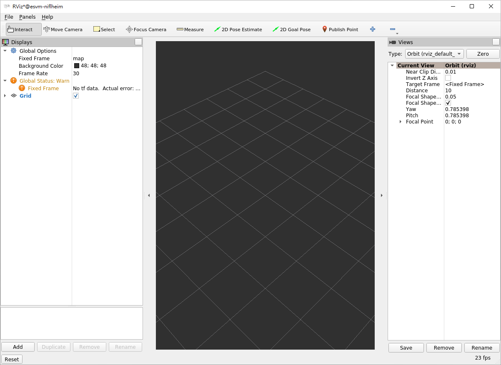

## Introduction

RViz2 is a 3D visualization tool in ROS 2 (Robot Operating System 2)
that enables users to visualize sensor data, robot state, and
environment in real-time. It\'s commonly used for debugging, simulation,
and monitoring, making it essential in robotics development. RViz2
supports a variety of data types, including point clouds, laser scans,
camera images, and robot models. With a flexible plugin-based
architecture, RViz2 allows users to customize the display layout and add
features to meet specific visualization needs. By running RViz2
alongside ROS 2, developers can effectively analyze and interact with
their robotic systems in an intuitive 3D environment.

 

## How To

Startup

    $ ros2 run rviz2 rviz2

( Note:  If using RViz on
EPC-R3720, it needs to use SSH -X method, please follow [Q&A : How to
use RViz on
EPC-R3720](Advantech_Robotic_Suite/Q&A#How_to_use_RViz_on_EPC-R3720 "wikilink").

## Note

If you are using Ubuntu 24.04, please use
[util-ros2-humble](Advantech_Robotic_Suite/Container/Utility_ROS_Container#Launch_RViz2 "wikilink")
container to launch rviz2.
