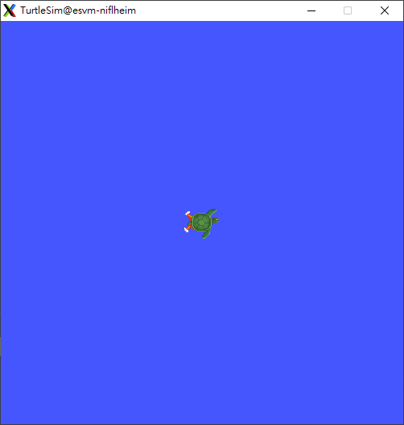
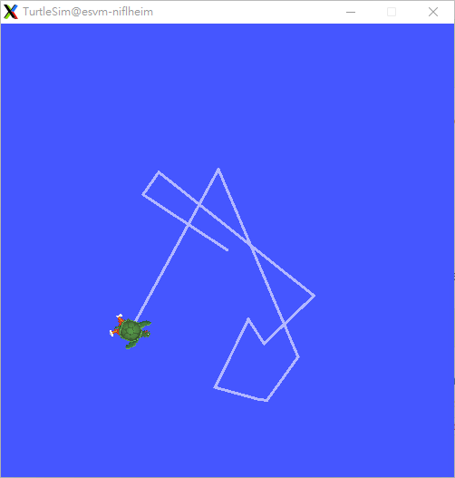

## c++ sample

Run example for subscribe, you can open a terminal to executing command:

    ros2 run demo_nodes_cpp listener

Open a new terminal to executing command to publish:

    ros2 run demo_nodes_cpp talker

 

## rclnodejs sample

Run example for subscribe, you can open a terminal to executing command:

    cd /usr/local/Advantech/ros/${ROS_DISTRO}/sample_code/rclnodejs_sample
    node sub.js

Open a new terminal to executing command to publish:

    cd /usr/local/Advantech/ros/${ROS_DISTRO}/sample_code/rclnodejs_sample
    node pub.js

Note : In this sample rclnodejs
version=0.21.4

 

## rclpy sample

Run example for subscribe, you can open a terminal to executing command:

    cd /usr/local/Advantech/ros/${ROS_DISTRO}/sample_code/rclpy_sample
    python3 subscriber.py

Open a new terminal to executing command to publish:

    cd /usr/local/Advantech/ros/${ROS_DISTRO}/sample_code/rclpy_sample
    python3 publish.py

## turtlesim

Open a terminal to start turtlesim by executing command:

    ros2 run turtlesim turtlesim_node

The simulator window should appear, with a random turtle in the center.

Open a new terminal, run a new node to control the turtle in the first
node by executing command:

    ros2 run turtlesim turtle_teleop_key

Use the arrow keys on your keyboard to control the turtle. It will move
around the screen, using its attached "pen" to draw the path it followed
so far.

## Note

If you are using Ubuntu 24.04, please use
[dev-ros2-foxy](Advantech_Robotic_Suite/Container/Develop_ROS_Container "wikilink")
or
[dev-ros2-humble](Advantech_Robotic_Suite/Container/Develop_ROS_Container "wikilink")
container to test your applications.
