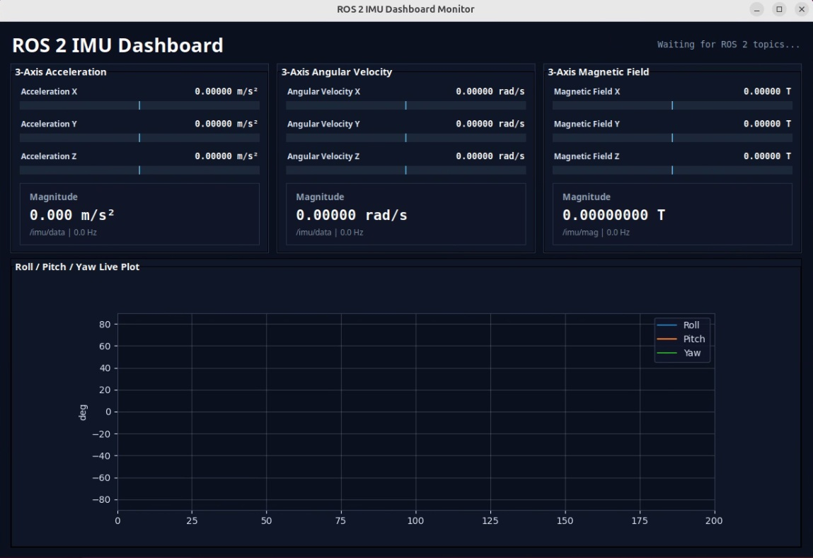

# Not yet released, please do not distribute.
# ROS 2 IMU Dashboard Monitor

A simple ROS 2 dashboard sample for monitoring IMU-related topics in real time.

This sample subscribes to acceleration, angular velocity, magnetic field, and Euler angle topics, then displays the data in a desktop UI with live value bars and a Roll / Pitch / Yaw plot.

It is designed as a lightweight dashboard example for demos, sensor bring-up, and ROS 2 topic monitoring.

<p align="center">
  
</p>


---

## Features

- Subscribe to ROS 2 IMU-related topics
- Display 3-axis acceleration
- Display 3-axis angular velocity
- Display 3-axis magnetic field
- Display Roll / Pitch / Yaw as a live plot
- Show topic update rate in Hz
- Support ROS 2 parameters through `--ros-args`
- Support demo-friendly Euler angle handling:
  - initial zero reference
  - optional periodic auto-zero
  - angle unwrap
  - light smoothing
  - display clipping

---

## Demo Scope

This sample is only a monitor dashboard.

It does **not**:

- publish motor commands
- control hardware
- send MAVLink / PX4 commands
- use a camera
- run an AI model
- modify or republish the source IMU messages

The program only subscribes to ROS 2 topics and visualizes the received data.

---

## System Architecture

```text
ROS 2 IMU Topics
      |
      |  /imu/data
      |  /imu/mag
      |  /filter/euler
      v
ROS 2 Dashboard Node
      |
      |  shared state
      v
Tkinter + Matplotlib UI
      |
      v
Live IMU Dashboard
```

---

## Input Topics

| Topic | Message Type | Used Data |
|---|---|---|
| `/imu/data` | `sensor_msgs/msg/Imu` | linear acceleration, angular velocity |
| `/imu/mag` | `sensor_msgs/msg/MagneticField` | magnetic field |
| `/filter/euler` | `geometry_msgs/msg/Vector3Stamped` | roll, pitch, yaw |

Default topic names can be changed with ROS 2 parameters.

For the Euler topic, this sample assumes:

- `vector.x`: roll
- `vector.y`: pitch
- `vector.z`: yaw

By default, the values are assumed to be in degrees. If the topic publishes
radians, set `euler_rad_to_deg:=true`.

---

## Requirements

Tested target environment:

- Ubuntu 24.04
- ROS 2 Jazzy
- Python 3

Python / ROS 2 dependencies:

- `rclpy`
- `sensor_msgs`
- `geometry_msgs`
- `tkinter`
- `matplotlib`

Install common dependencies:

```bash
sudo apt update
sudo apt install -y \
  python3-tk \
  python3-matplotlib \
  ros-jazzy-rclpy \
  ros-jazzy-sensor-msgs \
  ros-jazzy-geometry-msgs
```

If you are using a different ROS 2 distribution, replace `jazzy` with your ROS 2 distro name.

---

## Run the Sample

Source your ROS 2 environment first:

```bash
source /opt/ros/jazzy/setup.bash
```

Run with default topics:

```bash
python3 ros2_imu_dashboard_monitor.py
```

Run with custom topics:

```bash
python3 ros2_imu_dashboard_monitor.py --ros-args \
  -p imu_topic:=/imu/data \
  -p mag_topic:=/imu/mag \
  -p euler_topic:=/filter/euler
```

Periodic Euler auto-zero is enabled by default with a 10-second interval:

```bash
python3 ros2_imu_dashboard_monitor.py --ros-args \
  -p euler_auto_zero_sec:=10.0
```

Periodic auto-zero resets the current Euler attitude to zero at the configured
interval. This is intended only for demonstration and does not compensate for
or correct IMU drift.

Disable periodic Euler auto-zero:

```bash
python3 ros2_imu_dashboard_monitor.py --ros-args \
  -p euler_auto_zero_sec:=0.0
```

When `euler_auto_zero_sec` is set to `0.0`, the dashboard still uses the first received Euler sample as the zero reference, but it will not re-zero periodically.

---

## ROS 2 Parameters

| Parameter | Default | Description |
|---|---:|---|
| `imu_topic` | `/imu/data` | IMU topic for acceleration and angular velocity |
| `mag_topic` | `/imu/mag` | Magnetic field topic |
| `euler_topic` | `/filter/euler` | Euler angle topic |
| `ui_update_ms` | `100` | UI refresh interval in milliseconds |
| `plot_update_ms` | `150` | Plot refresh interval in milliseconds |
| `plot_buffer_len` | `200` | Number of samples shown in the plot |
| `euler_rad_to_deg` | `false` | Convert Euler input from radians to degrees |
| `euler_auto_zero_sec` | `10.0` | Periodic Euler re-zero interval. Set to `0.0` to disable periodic re-zero |
| `euler_enable_unwrap` | `true` | Avoid visible jumps around the +180 / -180 degree boundary |
| `euler_enable_smoothing` | `true` | Apply light smoothing to Roll / Pitch / Yaw plot |
| `euler_smooth_alpha` | `0.25` | Smoothing factor from `0.0` to `1.0`. Smaller values produce smoother but slower changes; larger values respond faster |
| `rpy_plot_y_limit_deg` | `90.0` | Set the plot Y-axis limits to `-90°` and `+90°` |
| `rpy_display_clip_deg` | `90.0` | Clip displayed Euler values to the range `[-90°, +90°]` |
| `window_title` | `ROS 2 IMU Dashboard Monitor` | Desktop window title |
| `header_title` | `ROS 2 IMU Dashboard` | Main dashboard title |

---

## Example: Euler Topic in Radians

If your `/filter/euler` topic publishes Roll / Pitch / Yaw in radians, enable conversion:

```bash
python3 ros2_imu_dashboard_monitor.py --ros-args \
  -p euler_rad_to_deg:=true
```

If your topic already publishes degrees, keep the default value:

```bash
python3 ros2_imu_dashboard_monitor.py --ros-args \
  -p euler_rad_to_deg:=false
```

---

## Example: More Stable Demo Display

For a live demo, you may want a smoother and more stable plot:

```bash
python3 ros2_imu_dashboard_monitor.py --ros-args \
  -p euler_enable_smoothing:=true \
  -p euler_smooth_alpha:=0.2 \
  -p euler_auto_zero_sec:=10.0
```

Smaller `euler_smooth_alpha` values make the curve smoother, but also slower to respond.

---

## Example: Faster Plot Response

For debugging, you may want a faster response and less smoothing:

```bash
python3 ros2_imu_dashboard_monitor.py --ros-args \
  -p euler_enable_smoothing:=true \
  -p euler_smooth_alpha:=0.6 \
  -p plot_update_ms:=80
```

---

## Check ROS 2 Topics

Before running the dashboard, check which input topics are available:

```bash
ros2 topic list
```

Check IMU topic data:

```bash
ros2 topic echo /imu/data
```

Check magnetic field topic data:

```bash
ros2 topic echo /imu/mag
```

Check Euler topic data:

```bash
ros2 topic echo /filter/euler
```

Check topic frequency:

```bash
ros2 topic hz /imu/data
ros2 topic hz /imu/mag
ros2 topic hz /filter/euler
```

---

## How It Works

### 1. ROS 2 Subscription

The node subscribes to three ROS 2 topics:

```text
/imu/data
/imu/mag
/filter/euler
```

The callback functions update a shared dashboard state.

### 2. Shared State

The ROS 2 thread writes the latest sensor values into a thread-safe shared state.

The UI thread reads a snapshot of this state and updates the dashboard.

This keeps the ROS 2 callbacks and the desktop UI separate.

### 3. UI Dashboard

The UI is built with Tkinter.

Matplotlib is embedded into the Tkinter window to draw the Roll / Pitch / Yaw live plot.

### 4. Demo-Friendly Euler Handling

Euler angles can jump visually when crossing the +180 / -180 degree boundary.

This sample includes optional unwrap logic to make the plotted curve easier to understand during a live demo.

It also supports light smoothing and optional periodic auto-zero for demonstration purposes.

---

## Troubleshooting

### A topic is available, but the dashboard receives no data

This dashboard uses the default ROS 2 subscription QoS profile, which requests
`RELIABLE` reliability. Some IMU and sensor drivers publish data using
`BEST_EFFORT` reliability. A `RELIABLE` subscriber cannot receive data from a
`BEST_EFFORT` publisher.

Check the publisher's QoS settings:

```bash
ros2 topic info /imu/data --verbose
ros2 topic info /imu/mag --verbose
ros2 topic info /filter/euler --verbose
```

Look for the `Reliability` field. If the publisher uses `BEST_EFFORT`, modify
the dashboard to use the ROS 2 sensor-data QoS profile.

Add the following import:

```python
from rclpy.qos import qos_profile_sensor_data
```

Then replace the subscription queue depth (`10`) with
`qos_profile_sensor_data`:

```python
self.create_subscription(
    Imu,
    self.config.imu_topic,
    self.imu_callback,
    qos_profile_sensor_data,
)

self.create_subscription(
    MagneticField,
    self.config.mag_topic,
    self.mag_callback,
    qos_profile_sensor_data,
)

self.create_subscription(
    Vector3Stamped,
    self.config.euler_topic,
    self.euler_callback,
    qos_profile_sensor_data,
)
```

A `BEST_EFFORT` subscriber can receive data from both `BEST_EFFORT` and
`RELIABLE` publishers, making this profile suitable for most real-time sensor
monitoring use cases.

---

### The dashboard window opens, but all values stay at zero

Check whether the ROS 2 topics are publishing:

```bash
ros2 topic list
ros2 topic hz /imu/data
```

Also confirm that your topic names match the parameters used by the dashboard.

---

### The Euler plot does not move

Check whether `/filter/euler` is available:

```bash
ros2 topic echo /filter/euler
```

If your system does not publish Euler angles, the acceleration, gyro, and magnetic field sections can still work, but the Roll / Pitch / Yaw plot will not update.

---

### The Roll / Pitch / Yaw values look too small

The source data may be in radians and has not been converted to degrees.

Set:

```bash
python3 ros2_imu_dashboard_monitor.py --ros-args \
  -p euler_rad_to_deg:=true
```

---

### The Roll / Pitch / Yaw values look too large

The source data may already be in degrees but is being converted again.

Set:

```bash
python3 ros2_imu_dashboard_monitor.py --ros-args \
  -p euler_rad_to_deg:=false
```

---

### Tkinter is missing

Install Tkinter:

```bash
sudo apt install -y python3-tk
```

---

### Matplotlib is missing

Install Matplotlib:

```bash
sudo apt install -y python3-matplotlib
```

---

## Notes

- This sample is intended for learning and demo use.
- The dashboard does not calibrate the IMU.
- The dashboard does not estimate orientation by itself.
- Roll / Pitch / Yaw must come from an existing Euler angle topic.
- Topic names and display behavior can be changed with ROS 2 parameters.

