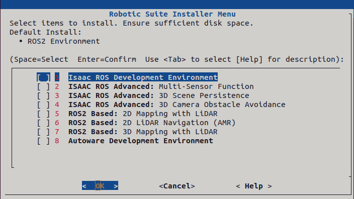
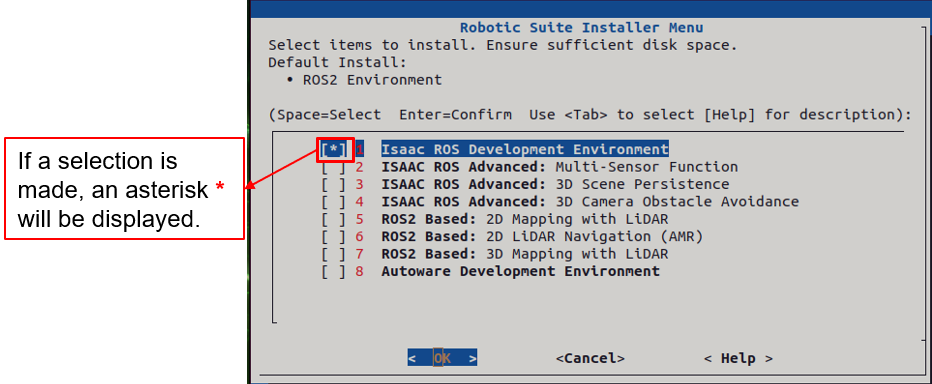
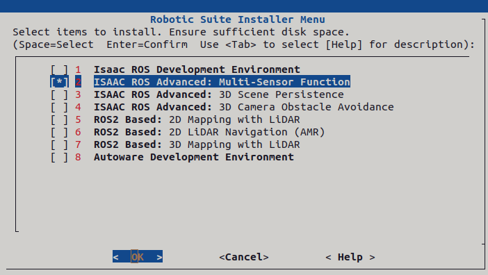
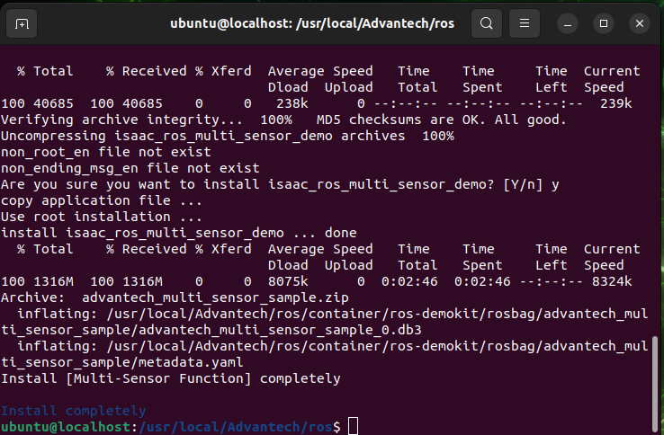

# Download

Download [adv-robotic-suite-installer.run](./adv-robotic-suite-installer.run)

# Install

> [!NOTE]
> Make sure your target system satisfies the following conditions:
> - Advantech platforms
> - At least 10 GB hard drive free space  
> - An active Internet connection is required  
> - Use the English language environment in Ubuntu OS  
---

* Install the Advantech Robotic Suite:

```bash
sudo ./adv-robotic-suite-installer.run
```

* Wait for the Robotic Suite Installer Menu to appear
In the interface, you will see the available options supported by the corresponding platform, including Advantech examples and development environments.

<p align="center">
  
</p>

* Press the Space bar to select the items you want to install.

<p align="center">
  
</p>

* After selecting the items you wish to install, confirm the selection and press Enter on OK.

<p align="center">
  
</p>

* Wait for the installation process to complete.

<p align="center">
  
</p>

> [!NOTE]
> - Make sure you see a message on the last line that the installation is complete, then please restart your computer to complete the environment setup.

## Uninstall

Command to uninstall the Advantech Robotic Suite:

```bash
cd /usr/local/Advantech/ros
./uninstall.sh
```
